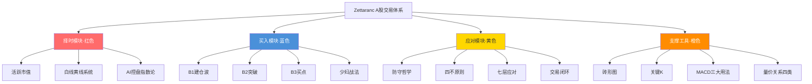

# zettaranc-knowledge

> **Zettaranc（知行小菜鸟）A股交易体系结构化知识库**
> 基于 [Karpathy LLM Wiki 模式](https://gist.github.com/karpathy/442a6bf555914893e9891c11519de94f) 构建，将碎片化的直播/文章/笔记编译为高度互联的 Obsidian 知识图谱。

<p align="center">
  
  
  
  
  
</p>

---

## 📦 获取

```bash
# GitHub（主仓库，完整内容）
git clone https://github.com/lululu811/zettaranc-knowledge.git

# Gitee（国内镜像）
git clone https://gitee.com/chenleizzzz/zettaranc-knowledge.git
```

> ⚠️ Gitee 审核较严，部分 Agent 配置内容暂无法公开。完整访问请用 GitHub。

---

## 🧠 这是什么

一个 **AI 驱动的交易知识库**，将 Zettaranc（Z 哥）散布在公众号、直播、笔记中的 A 股交易体系，编译为结构化、可检索、可交叉引用的 Obsidian Wiki。

**核心理念**：交易知识不缺，缺的是结构。把碎片编译成体系，才能真正"知行合一"。

```
原始素材（raw/）          →    结构化知识（wiki/）
470 篇公众号/直播/笔记         88 个概念 + 6 实体 + 8 来源摘要
分散、口语化、重复              互相链接、有冲突标注、有 Mermaid 流程图
```

---

## 📊 知识库规模

| 类别 | 数量 | 说明 |
|------|------|------|
| **概念页** | 88 个 | 按 8 层目录组织（体系总览/底层工具/买卖信号/战法策略/资金仓位/市场筹码/心法哲学/操作手册） |
| **实体页** | 6 个 | 作者（Zettaranc/渣A小学生/大富翁小菜鸟号）+ 资金画像（国家队/麒麟会/百岁山） |
| **来源摘要** | 8 个 | 从 470 篇原始文章中提炼的批次摘要 |
| **操作手册** | 2 篇 | 短线/长线交易操作手册（跨概念综合研究） |
| **原始素材** | 470 篇 | 5 个来源目录，已处理 ~67% |

---

## 🏗️ 体系总览



### 交易闭环

| 环节 | 核心概念 | 一句话 |
|------|---------|--------|
| 择时 | [[活跃市值]] [[白线黄线系统]] | 先看多空环境，再决定是否开仓 |
| 选股 | [[三最原则]] [[异动选股法]] | 只选最美、只买最强、只拿最硬 |
| 买点 | [[B1建仓波]] [[B2突破]] [[B3买点]] | J 值筛选 + 两个 30% 原则 |
| 卖出 | [[S1信号]] [[DSZ战法]] | 卖出三铁律、半仓放飞 |
| 持仓 | [[去弱留强]] [[底仓与动态仓]] | 底仓守信仰，动态仓守纪律 |
| 风控 | [[防守哲学]] [[四不原则]] | 穿越牛熊靠防守，不靠进攻 |
| 心法 | [[交易心理]] [[分歧与一致]] | 交易到最后，拼的不是技术，是人性 |

> 完整索引见 [wiki/zettaranc/index.md](wiki/zettaranc/index.md)

---

## 📁 目录结构

```
zettaranc-knowledge/
├── wiki/                          # 编译输出层（你看到的 Wiki）
│   ├── index.md                   # 总目录 + Mermaid 结构图
│   ├── log.md                     # 操作日志（append-only）
│   └── zettaranc/                 # Zettaranc 命名空间
│       ├── concepts/              # 88 个概念（8 层目录）
│       │   ├── 01-体系总览/       # 交易模块、框架、闭环
│       │   ├── 02-底层工具/       # 白线黄线、砖形图、MACD
│       │   ├── 03-买卖信号/       # B1/B2/B3、S1、DSZ
│       │   ├── 04-战法策略/       # 少妇、嘀嘀、双线、异动
│       │   ├── 05-资金仓位/       # 底仓动态仓、开超市、空仓
│       │   ├── 06-市场筹码/       # 筹码战争、牛市策略、轮动
│       │   ├── 07-心法哲学/       # 防守、四不、分歧与一致
│       │   └── 08-操作手册/       # 短线/长线操作手册
│       ├── entities/              # 6 个实体
│       ├── sources/               # 8 个来源摘要
│       └── syntheses/             # 综合研究（预留）
│
├── assets/                        # 图片与媒体
├── templates/                     # Obsidian 页面模板
├── CLAUDE.md                      # AI Agent 维护规范
├── CHANGELOG.md                   # 版本变更记录
└── raw/                           # 原始素材（.gitignore 排除，不推送）
```

---

---

## 🚀 使用方式

### Obsidian 打开

1. Obsidian → **Open folder as vault** → 选择本目录
2. 设置 → 文件与链接 → 附件默认存放路径设为 `assets/`
3. 打开 `wiki/index.md`，点击右上角**关系图谱**图标查看知识网络
4. 页面中的 Mermaid 流程图需 Obsidian 内置渲染或安装 Mermaid 插件

### 推荐插件

| 插件 | 用途 |
|------|------|
| **Web Clipper** | 网页剪藏新文章到 raw/ |
| **Dataview** | 基于 YAML frontmatter 动态查询 |
| **Canvas** | 思维导图与概念图 |
| **Excalidraw** | 手绘风格图表 |

### AI Agent 工作流

本项目由 Claude Code 自动维护，支持三个核心工作流：

- **`/ingest <路径>`** — 读取 raw 文件，提炼编入 wiki
- **`/query <问题>`** — 检索 wiki 知识，综合回答并标注引用
- **`/lint`** — 全局健康检查（孤岛/死链/冲突/质量评分）

维护规范详见 [CLAUDE.md](CLAUDE.md)

---

## 📖 版本历史

| 版本 | 日期 | 亮点 |
|------|------|------|
| **v0.7.0** | 2026-06-03 | 全面质量审查 + 大富翁 batch-07（88 concepts） |
| v0.6.0 | 2026-04-26 | 知行小菜鸟第八批抽提（85+ concepts） |
| v0.5.0 | 2026-04-26 | 全量摄入 TANGOO/大富翁/知行延续 305 篇 |
| v0.4.0 | 2026-04-26 | 数据恢复，仅保留 Zettaranc 命名空间 |
| v0.3.0 | 2026-04-19 | Wiki 全面美化：Callout + Mermaid |
| v0.2.0 | 2026-04-19 | 多作者命名空间重构 |
| v0.1.0 | 2026-04-18 | 知识库初始化，40+ 概念 |

详见 [CHANGELOG.md](CHANGELOG.md)

---

## 📬 联系

<p align="center">
  
</p>

<p align="center">扫码关注公众号交流 AI + 金融研究</p>

---

## License

知识内容源自作者公开分享的体系与研报，仅供学习研究使用。
