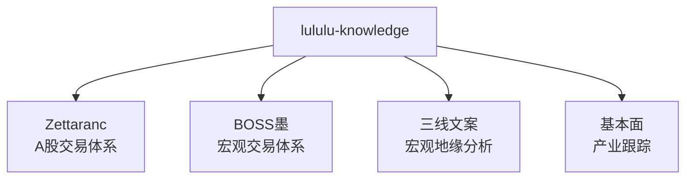

# lululu-knowledge 多作者交易与宏观知识库

基于 [Karpathy Wiki 模式](https://gist.github.com/karpathy/442a6bf555914893e9891c11519de94f) 构建的结构化知识图谱，覆盖 **A股交易体系**、**宏观交易体系**、**宏观地缘分析** 与 **产业基本面跟踪** 四大维度。



## 知识库规模

| 命名空间 | 概念 | 来源 | 实体 | Syntheses | 说明 |
|---------|------|------|------|-----------|------|
| **Zettaranc** | 42 个 | 4 个 | 1 个 | 2 篇 | A股交易体系：短线/长线操作手册 |
| **BOSS墨** | 14 个 | 8 个 | 1 个 | 1 篇 | 宏观交易：盈亏比驱动+刻舟求剑 |
| **三线文案** | 12 个 | 8 个 | 1 个 | 1 篇 | 宏观地缘：版本更新+G2博弈 |
| **基本面** | 15 个 | 1 个 | 1 个 | — | 产业跟踪：AI/新能源/资源/医药 |
| **总计** | **83 个** | **21 个** | **4 个** | **4 篇** | 原始素材约 2600+ 篇 |

## 体系概览

### Zettaranc（A股交易体系）

以 **白线黄线系统** 和 **砖形图** 为两大核心工具，围绕以下流程构建：

| 环节 | 核心工具 | 关键概念 |
|------|---------|---------|
| 择时 | [[活跃市值]]、[[白线黄线系统]] | 择时永远大于选股 |
| 选股 | [[三最原则]]、[[顺周期轮动]] | 只选最美、只买最强、只拿最硬 |
| 买点 | [[B1建仓波]]、[[B2突破]]、[[B3买点]] | J值筛选、两个30%原则 |
| 卖出 | [[S1信号]]、[[DSZ战法]] | 卖出三铁律、半仓放飞 |
| 持仓 | [[去弱留强]]、[[底仓与动态仓]] | 底仓守信仰，动态仓守纪律 |
| 风控 | [[防守哲学]]、[[交易闭环]] | 穿越牛熊靠防守，不靠进攻 |
| 心法 | [[交易心理]]、[[周期与人性]] | 装睡的拔河，周线格局定方向 |

> 完整索引见 [wiki/zettaranc/index.md](wiki/zettaranc/index.md)

### BOSS墨（宏观交易体系）

以 **盈亏比驱动** 和 **刻舟求剑** 为核心方法论：

| 环节 | 核心工具 | 关键概念 |
|------|---------|---------|
| 预判 | [[刻舟求剑-BossMo]] | 历史走势嫁接，预判2-3种方案 |
| 决策 | [[盈亏比-BossMo]]、[[正期望值-BossMo]] | 40%胜率+3:1盈亏比=正期望 |
| 建仓 | [[金字塔加仓-BossMo]]、[[均价管理-BossMo]] | 底部重仓、越上越轻 |
| 风控 | [[止损纪律-BossMo]]、[[分水-BossMo]] | 买定离手，触发止损无条件出场 |
| 轮动 | [[换车理论-BossMo]]、[[水涨船高-BossMo]] | 到站下车换车，不吊死一棵树上 |

> 完整索引见 [wiki/boss_mo/index.md](wiki/boss_mo/index.md)

### 三线文案大锅饭（宏观地缘分析）

以 **版本更新** 和 **苦甜分离** 为底层世界观：

| 维度 | 核心概念 | 分析框架 |
|------|---------|---------|
| 世界观 | [[苦甜分离-SanXian]]、[[版本更新-SanXian]] | 零和博弈，国际格局版本迭代 |
| 金融 | [[石油美元锚定-SanXian]]、[[明斯基时刻-SanXian]] | 去美元化轨迹，庞氏融资风险 |
| 政策 | [[撒钱牛-SanXian]]、[[政策连锁预判-SanXian]] | 放水驱动牛市，多层因果推演 |
| 产业 | [[黑灯工厂-SanXian]]、[[缺氧经济-SanXian]] | 制造业升级，结构性窒息感 |

> 完整索引见 [wiki/sanxian/index.md](wiki/sanxian/index.md)

### 基本面（知识星球 · 产业跟踪）

覆盖15个核心产业，提供 **产业链图 + 受益标的 + 风险提示** 三层结构：

| 板块 | 覆盖领域 |
|------|---------|
| AI与科技 | AI链、算力、半导体、商业航天、游戏、脑机接口、稳定币 |
| 新能源与制造 | 固态电池、可控核聚变、人形机器人、军工 |
| 资源与医药 | 稀土、有色金属、创新药 |
| 策略 | 策略宏观 |

> 完整索引见 [wiki/index.md](wiki/index.md)

## 目录结构

```
├── raw/                          # 原始素材层（只读，不可修改）
│   ├── 01-zettaranc/             # Zettaranc原始文章（185篇）
│   ├── 02-boss_mo/               # BOSS墨原始视频字幕（257个）
│   ├── 03-sanxian-wenan/         # 三线文案原始字幕（352个）
│   └── 99-report/                # 知识星球研报（2378篇）
│
├── wiki/                         # 结构化知识库（编译输出层）
│   ├── zettaranc/                # Zettaranc命名空间
│   │   ├── concepts/             # 42个概念
│   │   ├── entities/             # Zettaranc实体
│   │   ├── sources/              # 4个来源摘要
│   │   ├── syntheses/            # 短线/长线操作手册
│   │   ├── index.md
│   │   └── log.md
│   │
│   ├── boss_mo/                  # BOSS墨命名空间
│   │   ├── concepts/             # 14个概念
│   │   ├── entities/             # BOSS墨实体
│   │   ├── sources/              # 8个来源摘要
│   │   ├── syntheses/            # 盈亏比驱动交易操作手册
│   │   ├── index.md
│   │   └── log.md
│   │
│   ├── sanxian/                  # 三线文案命名空间
│   │   ├── concepts/             # 12个概念
│   │   ├── entities/             # 三线文案实体
│   │   ├── sources/              # 8个来源摘要
│   │   ├── syntheses/            # 宏观地缘分析框架综合报告
│   │   ├── index.md
│   │   └── log.md
│   │
│   ├── jibenmian/                # 基本面命名空间
│   │   ├── concepts/             # 15个产业概念
│   │   ├── entities/             # 知识星球实体
│   │   ├── index.md
│   │   └── log.md
│   │
│   ├── index.md                  # 总目录（按作者分组）
│   └── log.md                    # 全局操作日志
│
├── assets/                       # 图片与媒体资产
├── CLAUDE.md                     # 维护规范（AI Agent 指令）
└── CHANGELOG.md                  # 版本变更记录
```

## 来源权重规则

### Zettaranc 来源优先级

当不同来源对同一概念描述存在差异时，按以下优先级处理：

1. **精水流深** — 核心体系输出，最权威
2. **空谷幽兰** — 深度教程，详细解释
3. **知行课代表** — 付费笔记整理，体系化但为二手
4. **复盘专用z** — 直播复盘，实战性强但口语化

冲突标注示例见 `wiki/zettaranc/concepts/B1建仓波.md` 中的 `## 知识冲突` 区块。

### 跨作者引用规则

- Zettaranc 概念保持原名（如 `[[B1建仓波]]`）
- BOSS墨 概念使用 `-BossMo` 后缀（如 `[[盈亏比-BossMo]]`）
- 三线文案 概念使用 `-SanXian` 后缀（如 `[[苦甜分离-SanXian]]`）
- 基本面 概念使用 `-基本面` 后缀（如 `[[AI链-基本面]]`）

## 使用方式

### Obsidian

1. **打开知识库**：Obsidian → Open folder as vault → 选择本目录
2. **附件设置**：设置 → 文件与链接 → 附件默认存放路径设为 `assets/`
3. **关系图谱**：打开 `wiki/index.md` → 点击右上角关系图谱图标，查看知识网络连接
4. **Mermaid 图**：安装 Mermaid 插件或使用 Obsidian 内置渲染（需开启安全模式允许本地渲染）

详见 [obsidian-config.md](obsidian-config.md)

### 推荐插件

| 插件 | 用途 |
|------|------|
| Web Clipper | 网页剪藏新文章到 raw/ 目录 |
| Dataview | 基于 YAML frontmatter 查询 |
| Canvas | 思维导图与概念图 |
| Excalidraw | 手绘风格图表 |
| Advanced Tables | Markdown 表格增强编辑 |

## 知识库维护

本项目由 Claude Code 自动维护，遵循以下规范：

- 新增知识后自动更新对应命名空间的 `index.md` 和 `log.md`
- 知识冲突时保留双方说法，在 `## 知识冲突` 区块对比（使用 `[!caution]` Callout）
- 所有 wiki 页面必须包含 `## 关联连接` 区域，使用 `[[双链]]` 链接
- 新增概念页面后必须同步更新总目录 `wiki/index.md`
- 所有页面包含 YAML frontmatter（title, type, tags, sources, last_updated）

维护规范详见 [CLAUDE.md](CLAUDE.md)

## 版本历史

| 版本 | 日期 | 内容 |
|------|------|------|
| v0.3.0 | 2026-04-19 | Wiki全面美化：Callout + Mermaid + 受益标的表格 |
| v0.2.0 | 2026-04-19 | 多作者命名空间重构：新增BOSS墨/三线文案/基本面 |
| v0.1.0 | 2026-04-18 | 知识库初始化，151篇文章提炼40+概念 |

详见 [CHANGELOG.md](CHANGELOG.md)

## License

知识内容源自各作者公开分享的体系与研报，仅供学习研究使用。
