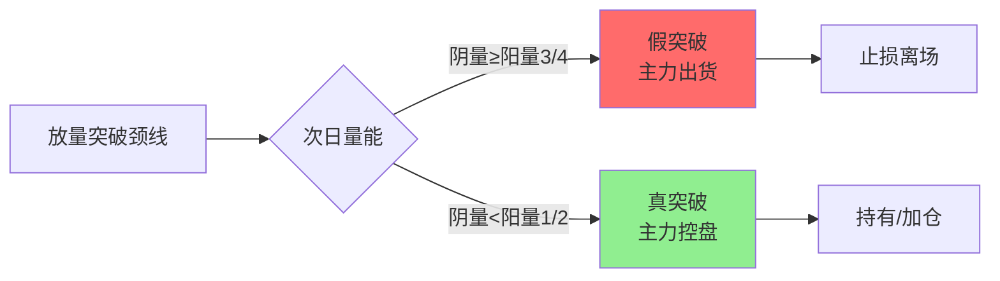
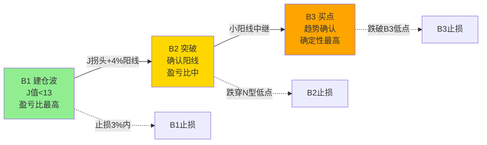
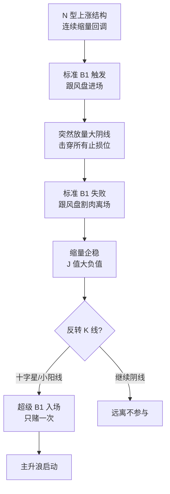
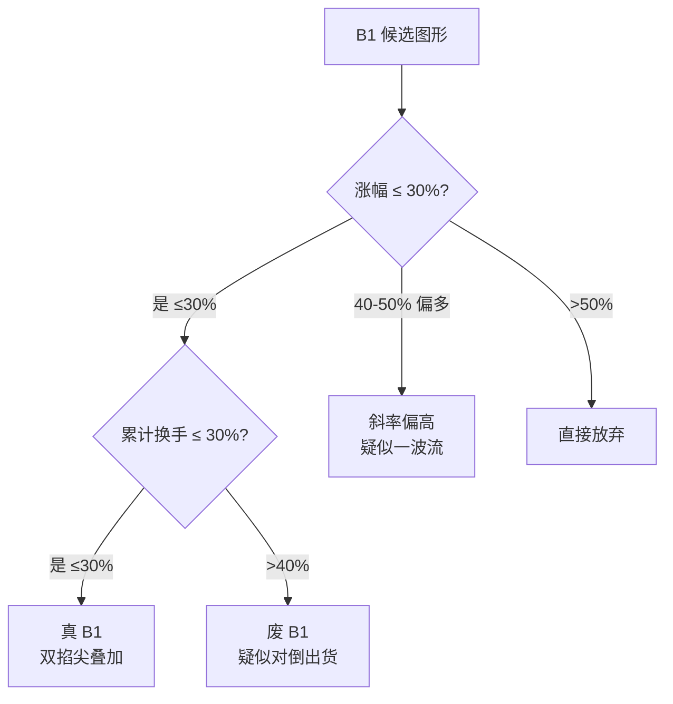
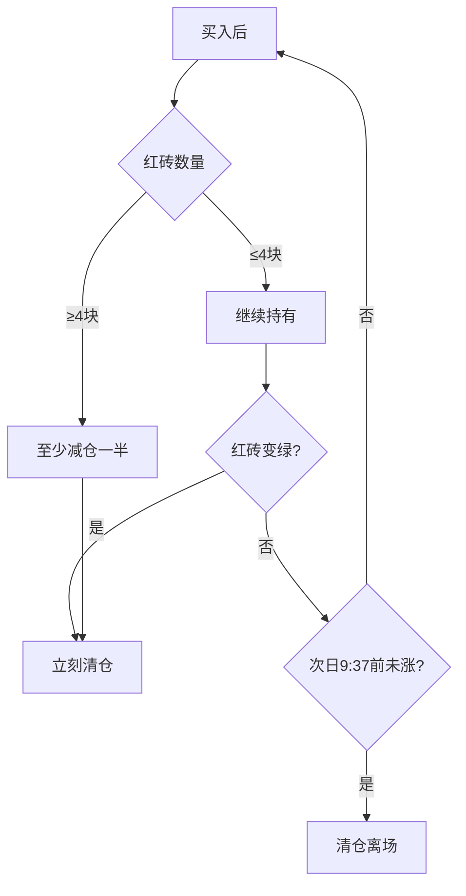

> 本文件从 wiki/zettaranc/concepts/03-买卖信号/ 提炼而成，供 Zettaranc Skill 按需加载。

---

# Zettaranc 信号系统 Reference

## 一、三波总框架

三波理论是 B1/B2/B3 的叙事化总框架，也是牛市三阶段的映射：

| 阶段 | 信号 | 牛市别名 | 主力行为 | 操作纪律 |
|------|------|----------|----------|----------|
| 建仓波 | B1 | 挖掘牛 | 静默吸筹 | 重仓建底，盈亏比最高 |
| 拉升波 | B2 | 确认牛 | 放量突破 | 中仓追入，设好止损 |
| 冲刺波 | B3 | 不得不发牛 | 加速派发 | 只减不加，逐步兑现 |

> 三波不是必经关系，可能 B1 直接跳到 B3；也可能反复出现 B1（主力多次洗盘）。"三波不做"铁律：宁可看着上去，也不把自己送到高位博命局里。

---

## 二、B1 建仓波

**一句话定义**：识别主力建仓痕迹的核心买入信号，KDJ 的 J 值 < 13。

### 核心判断条件
- J 值 < 13（数值越低越好，-10、-14 都算）
- 周期越大信号越稳：周线 B1 > 日线 B1
- 主线票优先等周 B1，主题票日线 B1 即可

### 两个 30% 原则（真假 B1 筛选）
1. **涨幅原则**：建仓波涨幅一般 30% 左右，40% 以上偏多，50% 以上直接放弃
2. **换手率原则**：中阳/大阳累计换手率不超过 30%，高于 40% 视为废 B1
3. 背后逻辑：建仓是收集筹码（筹码集中），换手率过高说明筹码多次交换

### B1 完美图五大铁律
1. 必须是 N 型结构（只做上涨趋势中的回调）
2. 左半边有异动放量（主力真金白银进场），顶部惜售（缩量见顶）
3. 右半边洗盘干净：成交量阶梯式萎缩至地量，小阴小阳波动 ±2% 以内
4. 止损极小（-3% ~ -5%），空间极大
5. 不做：下跌趋势反弹、A 杀后第一个企稳、K 线杂乱无章

### 四大经典门类
- **标准型**：建仓强、圆弧缩量回调、踩线精准 → 新手首选
- **变量型**：洗盘不极致，长时间横盘 → 需耐心
- **横盘压缩型**：回调不深，高位箱体震荡"红肥绿瘦" → 追求爆发力
- **高控盘激进型**：牛市后期锁仓缩量上涨 → 激进型，严格止损

### 进场规则
- B1 是"守株待兔"的核心买点，第二天开盘用量比战法精细化建仓
- B1 不是每日任务，有瑕疵就不干

### 止损规则
- 买入 K 线最低点向下 3-5 个价位，或前 N 型结构低点
- 幅度控制在 3% 以内

### 持仓纪律
- 3 天内必须恢复上涨，低位不涨必有妖
- 3 天不涨但没大跌：最多再看 1-2 天，不行就减仓
- 跌穿止损：直接全卖

### 注意事项
- 跳空建仓不做（跳空是进攻信号，不是建仓信号）
- 连续堆量但股价滞涨不做（智障无功图）
- 建仓波位置太高（底部起来已 75%+）不做
- "没呼吸"的 B1 不干：前面没有异动放量再缩下来的票不选

---

## 三、B2 突破

**一句话定义**：接在 B1 后面的确认阳线，确认 B1 有效性。B2 不独立存在。

### 五条铁律（缺一不可）
1. 必须在 B1 之后（KDJ 的 J 值已拐头向上）
2. 涨幅 ≥ 4%（差 0.04% 也不行）
3. 比前一日放量（今日量 > 昨日量，不必倍量）
4. J 值 < 55（核心中的核心，> 55 抛压重）
5. 无上影线最好（光头阳线最佳）

### 三大暴力图形
- **平行重炮（双枪战法）**：两根大阳线在相对平行位置放量起爆，主力"时不我待"
- **灾后重建**：连续上涨后缩量长阴下杀 15%-20%，精准打到黄线后止跌，迅速拉放量中长阳
- **跃跃欲试（红肥绿瘦）**：横盘阳线多实体长、阴线少实体短，第三次/第四次放量突破往往是真启动

### 进场规则
- B2 确认后买入，盈亏比约 2:1

### 止损规则
- 设前 N 型结构的低点（不是 B2 阳线最低点）
- 幅度可能达 5% 左右

### 持仓纪律
- 2 个交易日内必须大幅拉升
- 两天没涨：先卖 50%，第 3 天不涨全清
- 跌穿 N 型低点：直接全卖

---

## 四、B3 买点

**一句话定义**：B2 之后的趋势中继确认点。确定性最高，盈亏比最低。

### 判断条件
- B2 确认后，再出现一根小阳线（不管缩量放量，保持上涨）即为 B3
- B1 → B2 → B3 必须依次出现

### 进场规则
- 仓位 2w 一个，当天不能高开太多，平开最佳

### 止损规则
- 保守派：B3 阳线最低点
- 激进派：B2 大阳线中间值

### 持仓纪律
- 不破止损就一直拿，要有钝感力

### B1/B2/B3 选谁
- 小资金高弹性 → B1（盈亏比高，止损浅）
- 稳健资金 → B2（确认后再上车）
- 追涨型 → B3（确定性最高，但需要钝感力）

---

## 五、超级 B1

**一句话定义**：B1 的高级形态 — N 型上涨中缩量回调到极致后，突然放量击穿所有止损位，再缩量企稳且 J 值大负值。主升浪启动前的终极洗盘。

### 形态特征
1. N 型上涨结构中连续缩量回调
2. 突然出现放量破位大阴线（击穿止损位）
3. 继续缩量企稳，J 值出现大负值
4. 可能伴随反转小十字星确认

### 进场规则
- 等反转 K 线（小十字星）确认 N 型底部后入场
- 只赌一次，不可重复博弈

### 止损规则
- 放量下跌 K 线最低点或更前 N 型低点
- 越是"超级"B1，越考验严格止损

### 注意事项
- 破位阴线不急着进，等反转确认
- 先服从纪律止损，才有资格再上车

---

## 六、SB1 假摔战法

**一句话定义**：B1 的反向博弈版 — 主力诱空假摔后反手买入。先有 B1 形态、再有假摔、最后才反手。

### 假摔识别条件（三条同时成立）
1. 跌破前低（先有标准破位动作，诱空）
2. 次日强势反包（K 线收复前低，阳包阴）
3. 反包伴随放量（确认主力承接，非散户抢反弹）

### 止损三铁律
1. 跌破关键 K 低点立即止损 — 无条件、无理由、不许找借口
2. 不补仓不摊薄 — 补仓是赌徒思维
3. 止损位只下移不上移 — 防被假摔骗下车

### 进场规则
- 反包关键 K 高点附近重入，不追当日大阳
- 重入仓位上限不超过原 B1 计划仓位

### 注意事项
- SB1 不是抄底，必须先有 B1 形态
- 缩量反包大概率是反弹而非反转
- 与嘀嘀战法方向相反（嘀嘀止损只上移，SB1 止损只下移），阶段不同规则不同

---

## 七、双枪战法

**一句话定义**：两根放量阳柱中间夹一堆缩量阴线的图形形态，本质是主力建仓确认信号。

### 图形结构
- 第一根放量阳柱 = 试盘
- 中间缩量小阴小阳 = 洗盘清筹
- 第二根放量阳柱 = 确认
- 第三天小阳/B3 = 趋势确认

### 与 B1B2B3 的关系
- 第二根阳柱前一天是 B1，紧接着 B2 确认，第三天 B3 确认
- 本质是 B2 的"平行重炮"形态

### 止损规则
- 完美图形设白线为止损
- 大盘暴跌允许被误杀，但第二天必须直接反包

---

## 八、DSZ 砖形图战法（超短线卖出）

**一句话定义**：基于砖形图的超短线卖出战法，用"数砖"量化持仓风险。

### 三条铁律
1. **数完四块红砖必须减仓**：至少卖一半，红砖变绿立刻走，不做 4+4
2. **收盘前三分钟红砖变绿立刻走**：最后决策窗口
3. **买入后不涨次日 9:37 前清仓**：市场没证明你对，你就是错的

### 止损规则
- 买入当天被套：止损位设在买入 K 线最低价往下 3-5 个价位
- 跌破止损位立刻卖，不等收盘确认

### 选股标准
- 只做 N 型结构（下跌-下蹲-爆发）
- 白线之上，黄线在白线之上
- 不做：长上影线、跳空、三波（走了两波上涨的第三波不碰）

---

## 九、S1 信号（卖出预警）

**一句话定义**：阶段性顶部的预警信号 — 高位放巨量的 K 线（无论阴阳）提示主力可能出货。

### 识别标准
- 相对高位出现不该放的量（放巨量）
- 无论阳线还是阴线，高位放量就是预警
- 放量后股价滞涨更是确认信号

### 三档处理
1. **稳健**：直接清仓，彻底锁定利润
2. **平衡**：先卖一半，留半仓观察
3. **博弈**：等跌破白线再走，趋势确认反转

### 例外情况
- 后续股价带量把 S1 放量阴线"盖过去"，S1 信号失效
- 但普通交易者一律按 S1 处理最稳妥

### 核心原则
- **宁可信其有，不可信其无**
- S1 是整个体系优先级最高的保命信号

---

## 十、逃顶艺术（S1~S5 绝杀图谱）

**一句话定义**：主力出货的五种绝杀图谱，从量价/人性博弈角度识别顶部派发。

### S1：加速后单日放天量大阴
- 连续加速上涨后，顶端单日放出历史天量收大阴线
- 阴线成交量 > 建仓期任何一根阳线
- 应对：当天无脑减仓至少一半

### S2：次高点放巨量长阴（二次冲顶失败）
- 第一次回调后再冲高，未创新高即放巨量长阴
- 次高点成交量 > 最高点成交量（量价背离）
- 应对：不幻想"洗盘"，直接跑

### S3：新高后阶梯放量下跌（温水煮青蛙）
- 创新高后阶梯式放量下跌，每跌一阶都放量
- 阴线放量 > 阳线缩量，持续多日
- 应对：第一根阶梯阴线就减仓

### S4：双头双放量巨阴（M 头确认）
- 两个相近高点都伴随放量长阴，中间颈线被破
- 应对：颈线破位即确认，清仓

### S5：顶部绿肥红瘦（温水出货）
- 顶部连续多日小阴小阳，但阴线量 > 阳线量
- 不涨不跌每天缩量阴跌，日 K 振幅越来越小
- 应对：识别后即减仓

### 出货后纪律
- 不抄底、不补仓、不幻想"洗盘"
- 废除"假阴真阳"概念：阴线就是阴线，看量不看色

---

## 十一、十张死亡 K 线图（保命底线）

**一句话定义**：四类死亡图形 + 四条保命铁律。靠保守活下来，不靠激进赚快钱。

### 四类死亡图形

**第一类：周线空头排列的下跌趋势票**
- 周线级别最短周期均线在最下面，依次往下排
- 周线空头趋势下，破位第一时间走，所有日线"击穿对手盘"说法都不成立

**第二类：历史高位的破位信号**
- 黄线破掉后的弱反弹一定要拍掉
- 跌破黄线第一天或第二天必须走
- 共同路径：跌破黄线 → 反弹遇阻 → 确认压制 → 破位下跌

**第三类：加速上涨后的高位发散**
- 历史高位突然跳空下杀打到周线趋势线 → 必须走，不抄底
- 半年三倍以上均线完全开花，白线开始往下拐就确认压力位立刻走

**第四类：高位横盘破位的双重确认**
- 高位横盘很久，突然跌破黄线 + 白线同步下行 = 双保险破位
- 永远只跟白线在黄线上方的票玩

### 四条保命铁律
1. 周线空头排列的票绝对不碰
2. 高位黄线跌破必须走，最多等一根收回
3. 加速上涨后的大发散绝对不碰，不接最后一棒
4. 永远不要在下跌趋势里抄底

---

## 十二、娜娜图（极品建仓形态）

**一句话定义**：最完美的建仓图形态，可遇不可求。

### 特征
- 股价创新高但阳线缩量
- 次高点阴线也突然缩量
- 底部堆大量，上方量能递减

### 核心逻辑
- 创新高 + 缩量 = 主力没卖，筹码锁定好
- 如果是主力出货，高位一定放大量

---

## 附：四分之三阴量假突破识别法

**适用场景**：判断突破真假，回溯验证成功率 90%+。

### 判断四步法
1. 识别有效突破：放量阳线站上颈线位，成交量比近期均量大 50%+
2. 观察次日走势：重点看 K 线形态和成交量
3. 量能对比下结论：
   - 阴量 ≈ 阳量的 3/4 → **假突破**，立刻设止损
   - 阴量 < 阳量的 1/2 → **真洗盘**，可持有甚至加仓
4. 止损执行：止损位设在次日阴线最低点，跌破即走

### 底层逻辑

### 不同市场环境
- 牛市：真突破概率约 50%，出现四分之三阴量先离场，确认再回来
- 熊市/震荡市：真突破概率约 10%，宁错过不做错，出现即止损

---

## 附：B1 → B2 → B3 信号链全景

---

## 附：超级 B1 极致洗盘流程

---

## 附：双掐尖筛选流程

---

## 附：DSZ 卖出决策流程

