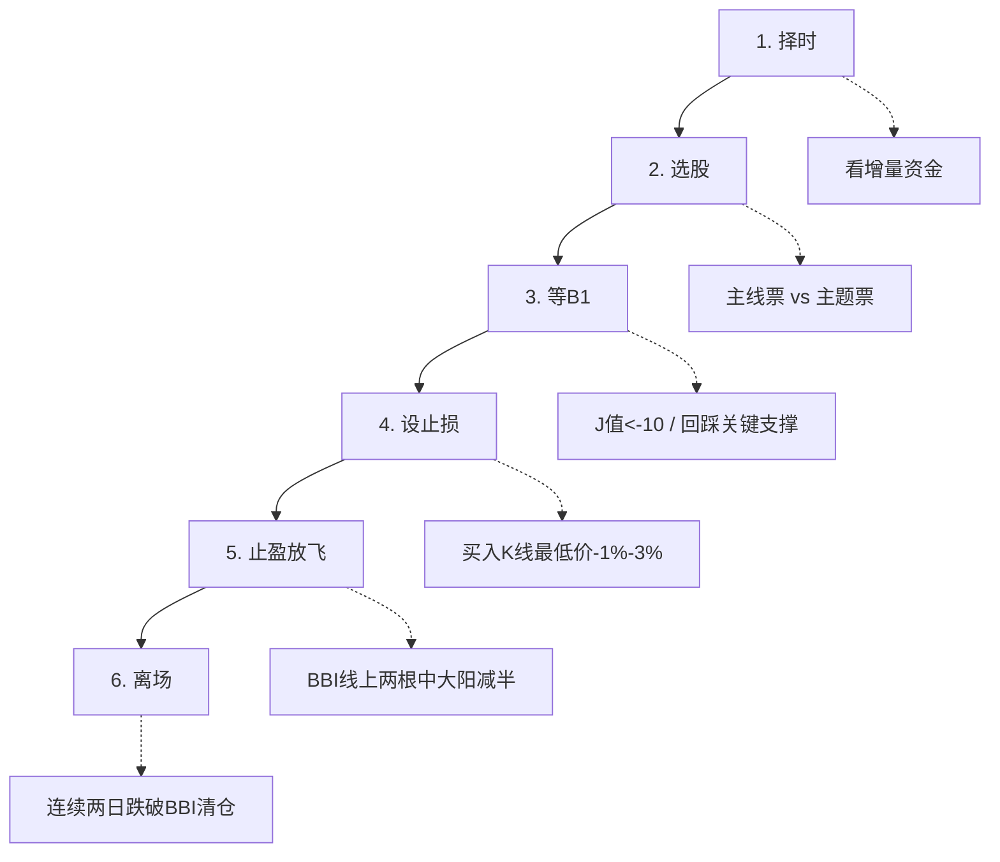
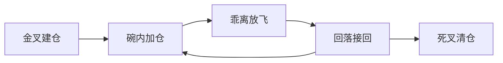
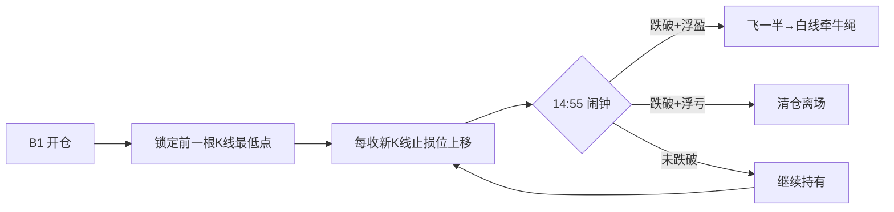
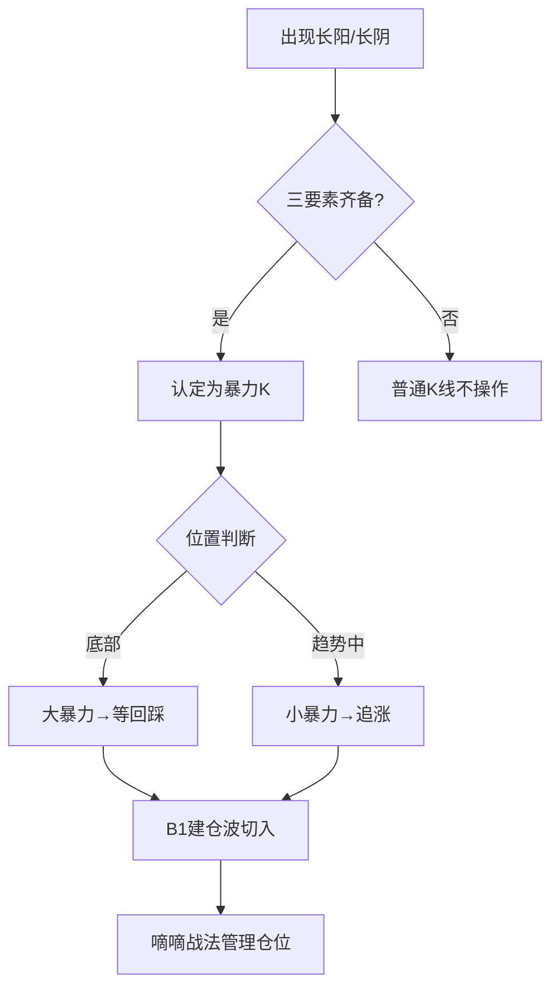
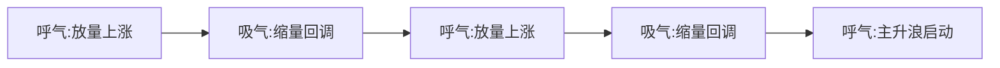
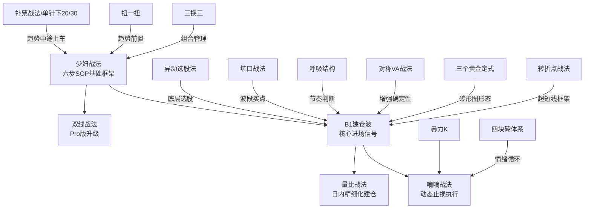

> 本文件从 wiki/zettaranc/concepts/04-战法策略/ 提炼而成，供 Zettaranc Skill 按需加载。

# 战法策略参考手册

---

## 1. 少妇战法

**一句话定义**：系统性交易策略，核心是"极度风险厌恶、落袋为安、顺势而为"，通过六步 SOP 实现"永不套牢"。

**适用场景**：资金量 100 万以下的中小投资者，任何市场环境。

**六步 SOP**：
1. **择时**：看增量资金，不见兔子不撒鹰
2. **选股**：主线票（中长线）vs 主题票（短线）
3. **等 B1**：KDJ J 值 < -10，回踩关键支撑位
4. **设止损**：买入 K 线最低价向下 1%-3%
5. **止盈放飞**：BBI 线上两根中大阳线减半（卤煮策略）
6. **离场**：连续两日收盘跌破 BBI 线清仓

**止损规则**：只输一根 K 线，止损空间 2%-3%。

**三大铁律**：
- 不频繁交易（一周最多两枪）
- 只做主线和主题投资
- Z 哥走了就不看了

**盈亏比**：止损 2-3%，向上空间 20%+，盈亏比约 10:1。

**与其他战法的关系**：双线战法是其 Pro 版；B1 信号是核心进场点；补票战法是趋势中途的上车工具。

---

## 2. 双线战法

**一句话定义**：少妇战法 Pro 版，通过白线（BBI/短期趋势）和黄线（多空分界/大哥线）配合，在强趋势中把握完整波段。

**适用场景**：强趋势行情，白线在黄线之上的股票。

**进场条件**：
- 白线金叉黄线 = 上涨趋势确立，可买入
- 放量金叉后缩量回踩黄线 = 极致买点（连续拉升前最后震仓）
- 回踩"黄金碗"（白黄线之间区域）= 加仓机会

**出场/止盈**：
- 乖离过大（白线远离黄线）→ 放飞减仓
- 白线死叉黄线 = 主力弃盘，最后离场时机

**止损规则**：白线跌破黄线必须清仓。

**铁律**：只做白线在黄线之上的票，黄线之下的上涨都是耍流氓。

**循环操作**：金叉建仓 → 碗内加仓 → 乖离放飞 → 回落接回 → 死叉清仓。

---

## 3. 嘀嘀战法

**一句话定义**：B1 执行层动态止损战法——"嘀=止损 / 嘀=止盈"双信号，以前一根 K 线最低点为动态滚动止损位。

**适用场景**：B1 开仓后的持有阶段，不适用于追高接力。

**进场条件**：已通过 B1 建仓。

**出场/止盈**：
- 爆发后按半仓放飞策略减半
- 剩余仓位改用白线作为止损依据（白线下方就拍）

**止损规则**：
- 止损位 = 前一根 K 线最低点
- 每收一根新 K 线，止损位只上移、不下移
- 14:55 闹钟：跌破前低 + 浮盈 → 飞一半；跌破前低 + 浮亏 → 清仓
- 未跌破 → 继续持有到次日

**与其他战法的关系**：B1 建仓后的执行工具；暴力 K 跌破低点时按此离场；爆发后切换到白线黄线系统跟踪。

---

## 4. 暴力 K

**一句话定义**：关键 K 的高阶形态——底部出现、突兀、伴随倍量/天量的破坏性长阳或长阴，是趋势扭转或主升浪启动的"战术冲锋"信号。

**适用场景**：底部反转或主升浪加速。

**进场条件（三要素缺一不可）**：
1. **位置在底部**：相对前期累计跌幅充分
2. **突兀**：打破前期 K 线节奏，与前几根不同步
3. **倍量/天量**：量能至少是前期均量 2 倍以上

**大暴力 vs 小暴力**：
- 大暴力（底部）：趋势扭转信号，观察等回踩，不追
- 小暴力（趋势中）：趋势延续信号，可直接追，结合 B2 突破

**出场/止盈**：配合 B1 建仓波 / B2 突破切入，用嘀嘀战法管理仓位。

**止损规则**：跌破暴力 K 低点 = 战法作废，无条件离场。

**选股四要素**：位置（底部）、力度（倍量）、形态（实体大）、心理（莫名其妙）。

**铁律**：不追当天；没有倍量的长阳不是暴力 K；黄线之下定义为反弹不重仓。

---

## 5. 补票战法（深 V 战法）

**一句话定义**：专门针对强势股中途洗盘的超短线策略，利用机构与散户的资金分歧在"列车"减速时安全上车。低胜率(40%)、高赔率(1:3)。

**适用场景**：强势股上涨途中的洗盘阶段，右侧交易。

**进场条件**：
1. 趋势向上：N 型结构连续上升通道
2. 资金背离：机构资金线 > 60（最好 > 80），散户线 < 20
3. 形态：长下影线、单日急跌后快速收回（深 V）或双 V/W 底

**执行**：前夜复盘选出信号票，次日早盘果断买入。不在下跌途中徒手接飞刀。

**出场/止盈**：
- 不涨即错：买入后当天或次日必须上涨
- 脱离成本线 3% 以上可减仓一半
- 剩余参考 BBI 趋势线持有

**止损规则**：-2% 左右，一击不中全身而退。

**与其他战法的关系**：单针下 20/30 是其核心信号触发条件；少妇战法是基础框架。

---

## 6. 单针下 20

**一句话定义**：补票战法的核心信号——通过红线(主力)>80 + 白线(散户)<20 监控主力洗盘状态，捕捉洗盘后的短期反弹。

**适用场景**：连续上涨的强势股，右侧交易。

**进场条件**：红线 > 80，白线 < 20。经典形态：深 V（单针）、双 V（W 形态）、多叉戟。

**执行**：激进派尾盘确认信号介入，稳健派次日早盘观察。

**出场/止盈**：短线重仓，买入后第二天没有预期爆发必须离场。

**止损规则**：不涨就走，严格执行去弱留强。

---

## 7. 单针下 30

**一句话定义**：单针下 20 的实战迭代版，因量化资金介入将阈值上移（红线 > 85，白线 < 30），舍弃部分低位空间换取更高确定性。

**适用场景**：极强趋势中的短暂停歇，给已启动列车"补票"上车。

**进场条件**：红线 > 85，白线 < 30。

**出场/止盈**：要么大肉要么走人，一击不中全身而退。

**与其他战法的关系**：单针下 20 的升级版，适配量化资金时代。

---

## 8. 异动选股法

**一句话定义**：通过识别"莫名其妙突然放量 + 价随量升 + 从 60 日线下方起来"的异动信号选牛股，是一切战法的底层选股心法。

**适用场景**：每日选股，寻找强势股的建仓信号。

**异动三要素**：
1. **突然**：没利好没新闻，突然放量
2. **价随量升**：价格跟量上去，不能放量滞涨
3. **位置**：从 60 日均线（市场平均成本线）下方或附近起来

**进场条件**：
1. 异动出现 → 先标记
2. 等洗盘缩量 → 量能到阶段最低（地量）
3. 价格回踩 60 日线且不破 → B1 信号，进场

**止损规则**：跌破地量当天最低价或 60 日线必须立刻走。

**建仓波 vs 一波流**：
- 建仓波（真）：连续温和放量，一波比一波强，从 60 日线附近起来
- 一波流（假）：单根巨量后无持续量能，远离 60 日线的高位放量

**NBA 选秀理论**：只找"最强壮的宝宝"——詹姆斯级（大开大合、巨量、反包）vs 徐杰级（孤零零一根放量）。

**三大禁区**：高位异动别碰；止损是生命线；只适合 A 股股票。

---

## 9. 量比战法

**一句话定义**：通过开盘量比（当前成交量 / 过去 5 天均量）判断主力资金意图的日内交易策略，用于 B1 后的精细化建仓。

**适用场景**：B1 信号确认后的次日开盘决策。

**五种情况**：
| 量比 | 开盘 | 操作 |
|------|------|------|
| < 10 | - | 等回调，当天不抱期待 |
| > 20 | 高开 | 高概率上攻，直接干 |
| > 10 | 低开 > -2% | 可能熄火，择机买入 |
| 10-20 | - | 稳一手，贴均线买或等分时 KDJ 金叉 |
| 直线上升 | - | 拼手速，建仓日不能踏空 |

**止损规则**：赚钱的票有过上涨行为后马上回落到成本价，必须砍掉或减半。

**前提**：先有完美图形（B1/B2 点），再有盘中爆量。

---

## 10. 坑口战法

**一句话定义**：基于"挖坑-填坑"过程的波段交易方法，通过公式计算主力拉升空间。

**适用场景**：波段交易，识别黄金坑。

**目标价公式**：(颈线位价格 - 坑底价格) + 颈线位价格 = 目标价

**三种假坑不能做**：
1. 没有开始"填坑"的无底洞
2. 基本面完全不了解的盲盒
3. 不属于当前主线题材的"孤魂野鬼"

**三种完美进场模式**：
1. 大坑套中坑，已填完中型坑，回调不破前低
2. 填大坑过程中 N 型结构完美，每次回踩不破前低
3. 机构共识主线，突破坑沿后的回踩确认（经典 B1 买点）

**止损规则**：破位看缩量和位置，缩量破位可能是假摔。

---

## 11. 对称 VA 战法

**一句话定义**：基于价格图形的对称性原理判断买卖点，通过识别历史图形中的对称结构预测未来价格走向。

**适用场景**：技术分析辅助工具，与 B1 信号配合使用。

**进场条件**：对称位置与 B1 信号重合时确定性最高。

**止损规则**：对称结构被打破时必须止损。

**纯理论版 vs 实战版**：纯理论版受杨振宁"对称性支配相互作用"启发，是思想实验；实战版（VA）以单针下 20/30 为基础的可执行模型。老粉学 VA 即可。

---

## 12. 呼吸结构

**一句话定义**：股价在 N 型上涨过程中的量价节奏——放量上涨(呼气) → 缩量回调(吸气) → 再放量上涨(呼气)。

**适用场景**：判断主力洗盘节奏和主升浪启动时机。

**核心心法**：
- N 型上涨找缩量（缩量难作假，卖盘枯竭 = 安全）
- N 型下跌找放量（买盘枯竭 = 不能碰）
- 结构 > 量能：N 型完美的高位放量也可能是换手不是出货

**运作机制**：
1. 第一波拉升吸引跟风盘
2. 回调洗盘让获利盘出局
3. 新资金换手提高市场平均成本
4. 收集足够筹码后开启主升浪

---

## 13. 三个黄金定式

**一句话定义**：砖形图体系下胜率最高的三种进场形态——N 型起跳、横盘起跳、上升波段延续。

**适用场景**：砖形图辅助选股。

**定式一：N 型起跳**：价格先跌 → 反弹 → 回调到前低附近 → 一根大红砖拉起，等第二块红砖确认再进。

**定式二：横盘起跳**：横盘时间越长主力吸筹越充分，横盘期间不能有 S1 出货信号。

**定式三：上升波段延续**：每次回调最多一根绿砖，马上翻红继续涨，只要不连续翻绿就一直拿。

---

## 14. 四块砖交易体系

**一句话定义**：基于 A 股 4 天情绪循环的完整交易体系，用红砖/绿砖判断变盘点。

**适用场景**：短线交易，覆盖买入、持有、卖出全流程。

**操作规则**：
- 红砖：数满 4 块减仓至少一半
- 绿砖：绝不抄底，先数 4 块
- 模糊的正确 > 精确的错误
- 反转精确度 70%+，用仓位管理应对不确定性

**底层逻辑**：源自威尔斯·威尔德三角洲战法，A 股每 4 天完成一次情绪循环，参数 4 和 6 经回测验证。

**与其他战法的关系**：四块砖交易体系是完整流程，砖形图是底层视觉工具；DSZ 战法是超短版应用。

---

## 15. 扭一扭

**一句话定义**：均线从纠缠状态扭转为多头排列的过程，是趋势启动的前置信号。

**适用场景**：判断趋势启动，配合其他战法使用。

**核心要点**：
- 只看低位多头排列，高位多头排列没价值
- 均线不是支撑，是市场平均成本线
- 周线级别扭好后更可靠

**位置铁律**：低位（从地量启动）多头排列 = 建仓信号；高位（连涨数月）多头排列 = 出货陷阱。

**周线北伐战法**：突破长期压制后两种走法——生拉硬拽法 / 时间换空间法。

---

## 16. 三换三

**一句话定义**：最高效的超短线玩法——在持仓和候选池之间滚动切换，防止踏空，摊薄单点暴毙损失。

**适用场景**：超短线组合管理，分散配置。

**核心逻辑**：每天选票形成候选池 → 第二天根据强弱 → 持仓里一部分换到更强方向。不是为了换而换，强的留着。

**分仓配置铁律**：
- 100 万 = 8~10 票，分散 3~5 板块
- 进攻靠命，防守靠体系
- 怕踏空只是不赚钱，跌得比大盘多是实打实亏钱

**与其他战法的关系**：开超市策略的具体执行方式；本质是去弱留强的滚动切换。

---

## 17. 转折点战法

**一句话定义**：只赚趋势转折点的钱，用爆发力吃掉最肥的一段，目标让小资金(2-10万)做到 100 万。

**适用场景**：超短线，小资金做大。

**核心心法**：
- 不追已涨起来的票，只等转折点爆发那一刻介入
- 转折点 = 从下跌/横盘 → 爆发的切换瞬间
- 小资金做大的唯一路径：高频止损换低频大赚

**超短线铁律**：市场没有证明你是对的，你就是错的，立刻认错离场。

**六大散户误区**：周期模糊、无依据入场、不预设离场点、迷信强者恒强、永远满仓、套住装死。

**与其他战法的关系**：B1 就是转折点的具体形态；四块砖体系确认转折后的爆发力；少妇战法是 SOP 执行框架。

---

# 战法关系总览

