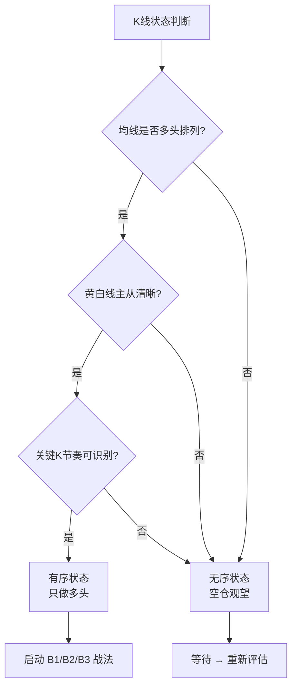
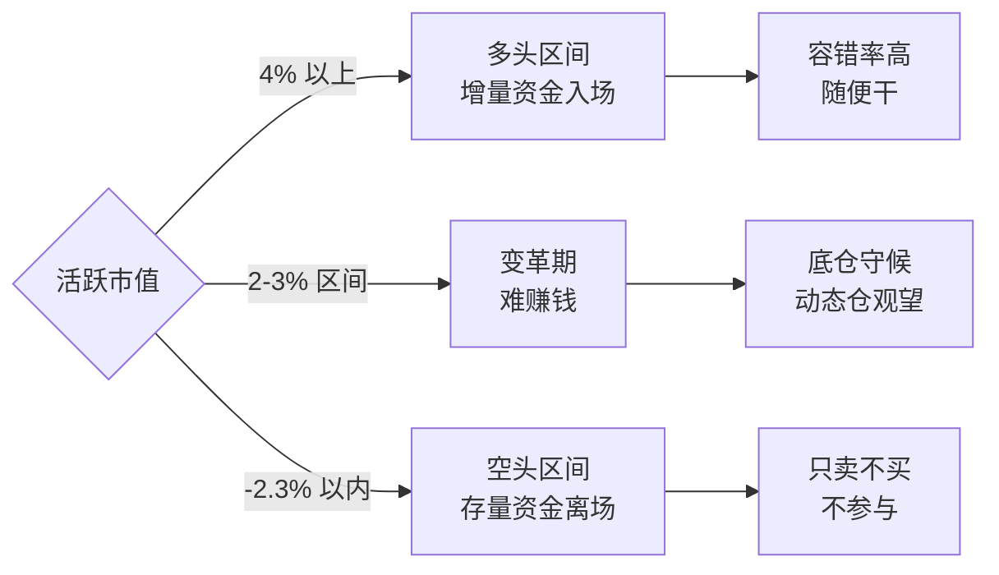
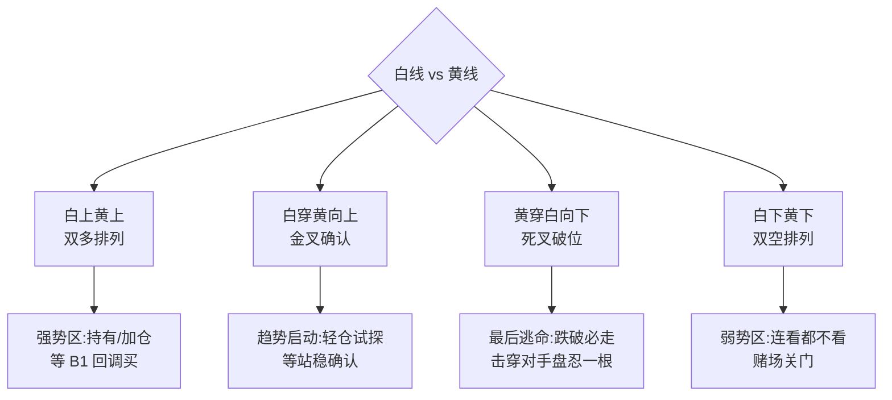
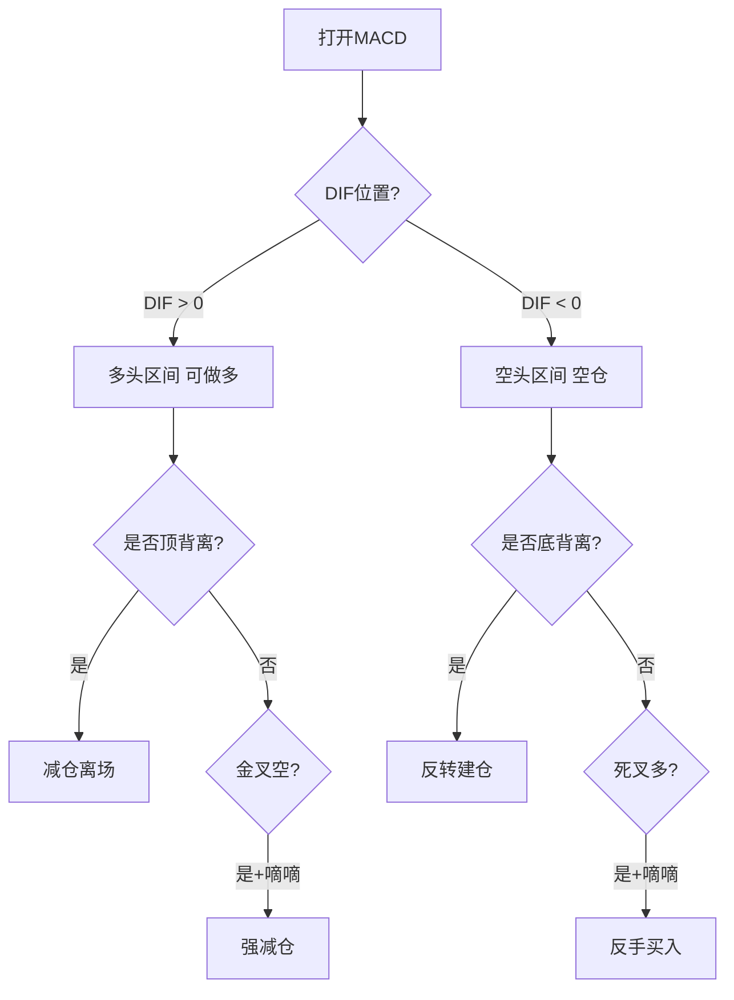

> 本文件从 wiki/zettaranc/concepts/02-底层工具/ 提炼而成，供 Zettaranc Skill 按需加载。

# Zettaranc 工具体系 Reference

---

## 1. N 型结构

> 市场一切走势的本质形态 — 只做高点低点双双抬高的上涨 N 型。

**核心参数/指标**
- 三种形态：上涨（高低点抬高）、横盘（区间震荡）、下跌（高低点降低）
- 无具体数值参数，是定性判断框架

**使用场景**
- 判断趋势方向（上涨/横盘/下跌）
- 持股信心支撑：只要 N 型上涨结构未破坏就安心持有
- 止损判断：N 型结构被破坏即触发止损

**关键判断标准**
- 唯一参与：高点和低点**双双抬高**的上涨 N 型
- 横盘 N 型：不参与，无赚钱效应
- 下跌 N 型：绝对不碰，抄底 = 接飞刀

**常见误区**
- 上涨回调未到止损位就慌张卖出，卖飞后又追高买回（SB 战法死循环）
- 误以为"好股票会直线上涨"，不理解 N 型回调是常态

---

## 2. 有序与无序（元理论）

> 技术分析第一性原理：有序 = 主力控盘 + 指标生效；无序 = 筹码松散 + 指标全废。只做有序多头。

**核心参数/指标**
- 有序：多周期均线多头排列、黄白线主从清晰、关键 K 节奏可识别、筹码峰收敛
- 无序：均线纠缠粘合、筹码峰扁平、K 线阴阳随机分布

**使用场景**
- 作为所有战法的前置判断：有序才启动 B1/B2/B3，无序则空仓观望
- 判断何时入场、何时兑现、何时回避

**关键判断标准**
- 三步识别流程：均线多头排列？→ 黄白线主从清晰？→ 关键 K 可识别？
- 三个条件全部满足 = 有序 → 启动战法
- 任一条件不满足 = 无序 → 空仓等待

**常见误区**
- 在无序状态用有序时代的指标（散户最大错误）
- 把均线短暂上穿误判为有序，忽略多周期共振验证

---

## 3. 关键 K

> 全图 90% 的 K 线是噪音，真正决定走势的只是少数几根位置关键 + 量能匹配的 K 线。

**核心参数/指标**
- 三要素同时满足：位置关键（平台突破/跌破/前高前低）+ 放量（显著高于前序均量）+ 长阳/长阴（实体足够大）
- 缺少任一要素 = 普通 K 线，不构成关键 K

**使用场景**
- 判断趋势反转与走势衰竭
- 关键 K 后回踩不破其低点 = B1/B2 最佳介入位
- 看盘核心心法：找出 2-3 根指挥走势的关键 K，其余都是注脚

**关键判断标准**
- 关键 K 低点（多头）是不可击穿的生命线
- 跌破关键 K 低点 = 原有判断作废，立即离场
- 6 种典型排列：V 型反转、紧急刹车、平地惊雷、丢盔弃甲、A 杀反转、一拍拍死

**常见误区**
- 事后命名关键 K，而非事中识别（三要素必须现场齐备）
- 看 100 根 K 线找形态，而非找 2-3 根指挥官

---

## 4. 活跃市值（择时指标）

> 判断市场多空环境的核心择时指标，反映增量资金入场程度。择时永远大于选股。

**核心参数/指标**
- 多头区间：活跃市值 **4% 以上** → 增量资金入场，容错率极高
- 变革期：**2-3% 区间** → 难赚钱，底仓守候
- 空头区间：**-2.3% 以内** → 存量资金离场，只卖不买

**使用场景**
- 所有交易的前置判断：先看大盘活跃市值，再决定是否操作
- 空头区间一切短线信号失效

**关键判断标准**
- 活跃市值没有连续 2-3% 增量时，很难赚钱
- 跌破 -2.3% = 空头区间，敢拉涨停就有人敢砸

**常见误区**
- 忽视择时直接选股，在空头区间反复被套
- 把变革期（2-3%）当多头区间操作

---

## 5. 白线黄线系统

> 基于白线（短期/大盘股）和黄线（中期/中小盘）相对位置判断趋势强弱的基础工具。

**核心参数/指标**
- 白线：代表大盘股走势 / BBI 线（牵牛绳）
- 黄线：代表中小盘走势 / 大哥线（多空分界线）
- 金叉：白线上穿黄线 = 上涨趋势确立
- 死叉：白线下穿黄线 = 主力弃盘，最后离场时机

**使用场景**
- 强势股筛选：白线在黄线之上 + 股价在黄线之上
- 买入条件：只在白线在黄线之上时进场
- 止损条件：跌破黄线必须走

**关键判断标准**
- 白线在黄线之下 = 赌场关门，不参与
- 白线站上黄线 = 赌场开门，可以进场
- 死叉 = 走错也要走的最后时机
- 金叉空（金叉次日死叉）= 主力最恶毒诱多陷阱
- 死叉多（死叉次日反包）= 主力假摔吸筹

**常见误区**
- 把金叉当买入信号提前埋伏（金叉只是确认信号，不是买入信号）
- 只看大盘白黄线，忽略个股自身白黄线状态
- 死叉后抱有侥幸心理不走

---

## 6. 知行趋势线

> 少妇战法 BBI 的重大升级 — 白线/黄线双线配合，在右侧行情中把握波段机会。

**核心参数/指标**
- 白线：短期趋势线（牵牛绳）
- 黄线：多空分界线（大哥线），也是最终止损线

**使用场景**
- 四种情形判断与操作
- 终极 B1 选股：白上黄上 + B1 信号 = 终极买点

**关键判断标准**
- 白上黄上：强势区，持有/加仓，等 B1 回调买
- 白穿黄向上：趋势启动，轻仓试探，等站稳确认
- 黄穿白向下：最后逃命，跌破必走
- 白下黄下：弱势区，连看都不看

**常见误区**
- 在白下黄下时逆势抄底
- 跌破黄线后心存侥幸不走

---

## 7. MACD 三大用法

> MACD 三种核心用法：DIF 零轴判多空 / 顶底背离判顶底 / 金叉空+死叉多判陷阱。交易体系最后一道防线。

**核心参数/指标**
- 默认参数（12,26,9），不要改
- DIF（白线）/ DEA（黄线）/ 柱体（红绿）
- 零轴：多空分界线

**使用场景**
- 用法 1：DIF > 0 = 多头区间可做多；DIF < 0 = 空头区间空仓
- 用法 2：价格新高 DIF 不新高 = 顶背离减仓；价格新低 DIF 不创新低 = 底背离建仓
- 用法 3：金叉空 + 嘀嘀 = 强减仓；死叉多 + 嘀嘀 = 反手买

**关键判断标准**
- 一票否决权：所有战法支持买入但 MACD 说不能买 → 绝对不买
- 周线 MACD 跌破 0 轴 = 清仓信号
- 白线位置的第一个 B1 绝对不做（高位白线是红柱转绿柱临界点）
- 黄线位置的 B1 = 黄金买点（止损小利润大，最多亏 3-4%）

**常见误区**
- 改 MACD 参数（默认值经几十年验证，改了 = 增加噪音）
- 追求实时性而忽视 MACD 滞后性恰恰是其灵魂（过滤 90% 噪音）
- 在顺周期行情中盲目找背离（90% 行情是顺周期，背离仅判异常）

---

## 8. 顶底背离体系

> MACD 完整方法论 — 90% 行情是顺周期，背离仅判异常，配合金叉空/死叉多识别主力陷阱。

**核心参数/指标**
- 顺周期：DIF 上 0 轴 + 红柱放大 = 主升浪持有；DIF 下 0 轴 + 绿柱放大 = 主跌浪空仓
- 顶背离：价格新高 + DIF 不创新高
- 底背离：价格新低 + DIF 不创新低

**使用场景**
- 顺周期主战场（90%）：持有不动或空仓
- 背离判异常（10%）：识别趋势衰竭与反转

**关键判断标准**
- 金叉空：金叉次日马上死叉 = 诱多陷阱，反手出货
- 死叉多：死叉次日反包 = 诱空陷阱，假摔吸筹
- 白线之上 = 高危区（临近顶背离）
- 黄线附近 = 机会区（底背离反转启动点）

**常见误区**
- 顺周期中频繁找背离，自找麻烦
- 看到金叉就追、看到死叉就割（被金叉空/死叉多反复收割）
- 不结合嘀嘀战法单独使用金叉/死叉信号

---

## 9. MACD 共振战法

> 砖形图与 MACD 形成共振 = A 股胜率最高的战法。双保险确认，单独使用任一工具都容易被骗。

**核心参数/指标**
- 共振条件：MACD 红柱区间 + 砖形图红砖
- 绿柱区间：能不做就不做，最多 1/10 仓位试错

**使用场景**
- 多头区间（MACD 白线在黄线上、零轴上）+ 砖形图红砖 = 正常仓位参与
- 死叉多信号：MACD 刚死叉次日金叉 = 最强多头信号（空中加油）
- 金叉空信号：MACD 刚金叉次日死叉 = 最恶毒诱多

**关键判断标准**
- 第一步：先看 MACD 是不是红的，绿的直接跳过
- 高位白线位置 B1 绝对不做
- 黄线位置 B1 = 黄金买点（止损 3-4%，上涨空间几十个点甚至翻倍）
- S1 信号优先级高于一切：放量大跌阴线（成交量绿+放量）= 一个字"走"

**常见误区**
- 只看砖形图不看 MACD（绿柱区间涨停板次日低开跌停 = 典型诱多）
- 看到金叉马上冲、看到死叉马上割（应多等一天观察是否变金叉空/死叉多）

---

## 10. 量价关系四类

> 量价四态识别：放量/缩量/平量/地量，核心关注异动后的回调缩量。

**核心参数/指标**

| 状态 | 量比区间 | 含义 | 操作 |
|---|---|---|---|
| 放量 | > 1.5 | 主力介入或离场 | 看方向：放量上=买，放量下=卖 |
| 缩量 | < 0.7 | 无主力或洗盘 | 异动后缩量回调 = 加仓机会 |
| 平量 | 0.7-1.5 | 无方向 | 不操作，等异动 |
| 地量 | 极致缩量 | 底部前夜 | 警惕反转，关注 B1 |

- 倍量柱：当日成交量 ≥ 前一日 2 倍 → B1 信号确认
- 天量柱：倍量后再倍量（4-5 倍以上）→ 应放飞（全员参与 = 分歧最大化）
- 铁蝴蝶量比：1.5-2.5 温和介入 / 3-5 明显发力 / >5 极端介入

**使用场景**
- 最赚钱信号：放量异动后次日回调缩量（主力洗盘标志 = B1 加仓最佳时机）
- 长阴短柱（大幅下跌 + 缩量）= 主力没跑，可能是假摔

**关键判断标准**
- 放量异动 → 回调缩量（散户割肉主力不卖）→ 二次放量（主升浪启动）
- 天量 = 全员参与 = 分歧最大化 = 短期没人接得住

**常见误区**
- 下跌过程中看量做判断（下跌段量能参考价值有限）
- 把放量本身当信号（赚钱的是放量后缩量回调的二次买点）

---

## 11. 砖形图

> 基于 A 股 4 天情绪循环的 K 线压缩图表工具，参数 4 和 6，Z 哥超短战法的底层视觉密码。

**核心参数/指标**
- 参数：4（情绪循环周期）、6（压缩参数）
- 红砖 = 上涨压缩，绿砖 = 下跌压缩
- 底层逻辑：源自威尔斯·威尔德三角洲战法，A 股每 4 天完成一次短期情绪循环

**使用场景**
- 超短线交易：3 天不涨就走，最多拿 4 天
- 数砖判断变盘点：红砖数满 4 块必须减仓（至少卖一半）

**关键判断标准**
- 不数 K 线，只数砖（砖形已过滤噪音）
- 红砖翻绿 = 立刻止损
- 股价跌破黄线 = 立刻止损
- 买入当天被套 → 次日 9:33/9:37 止损
- 买入后 3 天不涨 = 立刻止损
- 绝对不做：锤子图、缩量涨停庄股、开盘 30 秒冲高 5 个点、高开 4 个点以上

**常见误区**
- 在绿砖下跌区间抄底（先数 4 块再说）
- 寄希望"再等一下"而不执行红翻绿止损
- 在空头区间（MACD 绿柱）使用砖形图（任何砖形都是诱多）

---

## 工具层级关系总览

| 层级 | 工具 | 定位 |
|---|---|---|
| 元理论层 | 有序与无序 | 所有战法的前置判断，有序才入场 |
| 结构层 | N 型结构 | 趋势的底层形态框架 |
| 择时层 | 活跃市值 | 大盘多空环境判断 |
| 趋势层 | 白线黄线系统 / 知行趋势线 | 个股趋势强弱判断 |
| 指标层 | MACD 三大用法 / 顶底背离体系 | 多空区间 + 背离 + 陷阱识别 |
| 共振层 | MACD 共振战法 | 砖形图 + MACD 双保险 |
| 量价层 | 量价关系四类 | 主力行为识别 |
| K 线层 | 关键 K | 单根 K 线的战略意义判断 |
| 超短层 | 砖形图 | 4 天情绪循环的压缩视觉工具 |

**使用顺序**：活跃市值（择时）→ 有序/无序（元判断）→ N 型结构（趋势确认）→ 白黄线/趋势线（个股筛选）→ MACD/背离（多空确认）→ 关键 K/量价/砖形图（入场时机）
