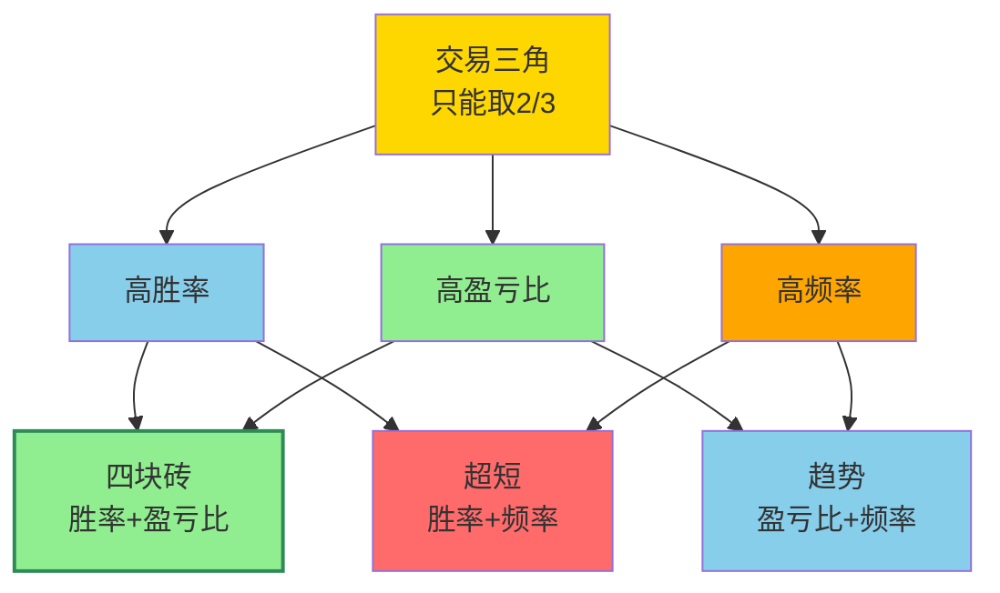
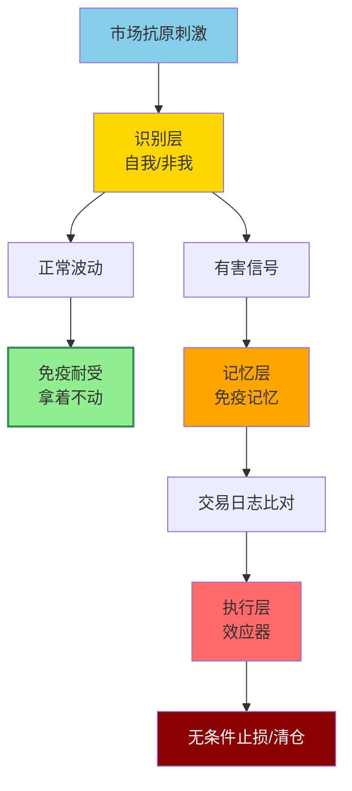
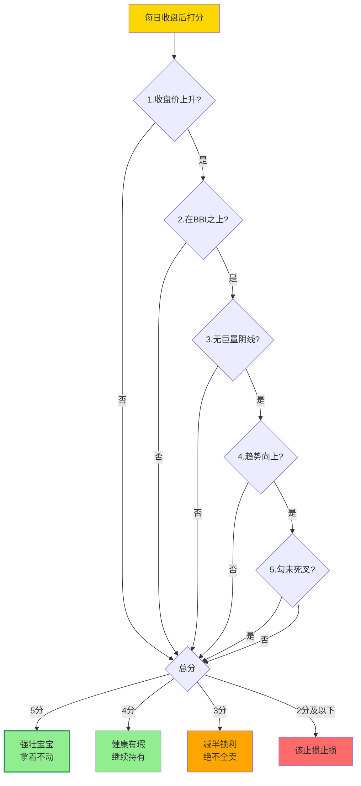

> 本文件从 wiki/zettaranc/concepts/07-心法哲学/ 提炼而成，供 Zettaranc Skill 按需加载。

---

# 一、不可能三角

**核心观点**：交易中不可能同时满足 高胜率 + 高盈亏比 + 高频率，只能取其中两个。

**详细要点**：
- 四块砖取的是高盈亏比（胜率+盈亏比）
- 超短取的是高频率（胜率+频率）
- 趋势取的是盈亏比+频率
- 什么都想要的人最后什么都得不到

**实操建议**：
- 选定一个策略就接受其固有缺陷
- 选了四块砖就要接受频率低
- 选了超短就要接受赔率小

**常见违反场景**：
- 既想做短线高频交易，又想每次都抓到大牛股
- 既想高胜率，又不想放弃任何机会

---

# 二、四不原则

**核心观点**：散户风控的最低纪律线——不追、不动、不慌、不乱摸。

**详细要点**：
- **不追**：涨停板/突破日不追高，必须等回调到B1信号再介入
- **不动**：有把握就拿（核心资产），没把握就等（空仓或低仓位）
- **不慌**：遇大阴线先看止损位再做决策，慌乱止损代价远高于浮亏
- **不乱摸**：不熟悉的板块/题材绝不碰，只在能力圈内做

**实操建议**：
- 大A从来没有"踏空"这回事，死得最快的是天天追高的人
- 365天，看懂哪天做哪天
- 只输一根K线：跌破止损位立马卖，绝不多亏

**常见违反场景**：
- 924行情追B2/B3/B4仓位赚了钱，下次追更高，行情一回头全吐回去
- 看到别人赚钱眼红，手痒去摸"骚票"
- 被自媒体噪音吓住，慌乱止损

---

# 三、防守哲学

**核心观点**：穿越牛熊的核心不是进攻（赚多少），而是防守（亏多少时能守住）。

**详细要点**：
- 进攻靠命，防守靠体系
- 真正拉开差距的，不是进攻期谁多赚了几天，而是防守期谁少亏
- 赚100%回撤50% = 利润归零
- 翻倍又腰斩 = 攻击力强 + 防守体系薄

**实操建议**：
- 三层防火墙：仓位上限 ≤ 5%、时间止损3日内、绝对价位止损破前低无条件出
- 防守纪律 > 进攻纪律 > 择时判断

**常见违反场景**：
- 赚了钱就飘，放松风控
- 止损位设了不执行，死扛变套牢
- 牛市末期追高，被情绪绞肉机收割

---

# 四、择时大于选股

**核心观点**：先判断市场环境（多空区间），再决定是否选股开仓。空头区间里再完美的B1也会失败。

**详细要点**：
- 择时永远大于选股
- 先学会择时，再学选股，再学买卖点，再学仓位管理
- 多头区间满仓轮动，空头区间只卖不买

**实操建议**：
- 多头区间：有信号就干
- 空头区间：原则上不做交易，手痒非要做就降到最低仓位
- 空头区间最重要的事是学习加复盘，绝对不是忙着交易

**常见违反场景**：
- 熊市里逆势抄底，越抄越套
- 不看大盘环境，只盯着个股形态

---

# 五、盈亏比与胜率

**核心观点**：胜率不重要，盈亏比才是核心——错7次每次亏5%，对3次每次赚30%，最终仍然盈利。

**详细要点**：
- 300次止损不可怕，可怕的是1次不止损
- 坚决买入，严格止损
- 完美图形出现就干，错了止损就完了
- 市场永远有意外，接受不确定性

**实操建议**：
- 止损位：买入K线最低点向下3-5个价位
- 别高估自己的扛跌能力，99%的人都会高估
- 机械化操作，别带情绪

**常见违反场景**：
- 小赚就跑，大亏死扛
- 止损位设了不执行，心存侥幸

---

# 六、击穿对手盘

**核心观点**：买入或持仓中挺过最难受的一段反向冲击，完成情绪洗刷。精髓是"忍一根"。

**详细要点**：
- 买入后三种剧本：即涨（顺风局）、即套（逆风局）、即磨（消耗战）
- 在难受的缩量大阴线出现时，不止损、不补仓，只观察下一根关键K
- 情绪洗刷完成后往往迎来反包，这是主力洗盘的标准节奏
- 适用场景：B1买入后第一次反向考验、磨底末段最后一跌、主力洗盘期

**实操建议**：
- 忍一根 ≠ 硬扛破止损位
- 一旦跌破预设止损位仍然硬扛 → "套瓷实"，违背盈亏同源原则

**常见违反场景**：
- 缩量大阴线恐慌卖出，正好交出筹码
- 把"忍一根"理解成"死扛"，破止损位还不走

---

# 七、交易免疫系统

**核心观点**：从生物学免疫耐受机制借喻——市场充满"抗原"，交易者需建立识别+记忆+执行三层免疫架构。

**详细要点**：
- **识别层**：区分正常波动（自身抗原）和有害信号（外来抗原）
- **记忆层**：记住曾让自己亏钱的图形和心态，交易日志是载体
- **执行层**：识别到有害信号后无条件执行，不犹豫不侥幸
- 免疫耐受 ≠ 死扛，区别在于是否触及止损线/破BBI/评分跌破2分

**实操建议**：
- 正常波动 → 免疫耐受（拿着不动）
- 有害信号 → 免疫攻击（果断止损）

**常见违反场景**：
- 免疫缺陷：没有交易纪律，被所有波动牵着走
- 自身免疫病：过度交易，把正常波动当成危险信号

---

# 八、交易心理

**核心观点**：90%亏损来自忍不住的手痒和听不完的噪音。技术简单执行难，把规则刻进骨子里才是真本事。

**详细要点**：
- 亏了心态崩，赚了飘；套了死扛，卖了怕踏空
- 超短线9:33与9:37两条生死线，30秒诱多识别
- 止损锁主动权：今天止损亏5个点，换来明天涨跌都有主动权
- 仓位不超过三个月工资，五年内先想着不亏钱

**实操建议**：
- 不要跟股票谈恋爱
- 市场淘汰赛，最后拼的是意志品质
- 随便就能听到的消息99%都是噪音

**常见违反场景**：
- 超短线变波段：套了安慰自己"拿一拿做波段"
- 被朋友圈/自媒体消息吓住，慌乱操作

---

# 九、分歧与一致

**核心观点**：健康的趋势是"分歧→一致→分歧"的循环，如同人的呼吸。搞懂这个节奏，就赢了一半散户。

**详细要点**：
- 分歧 ≠ 跌：多空博弈，是上车/拿住的机会
- 一致 ≠ 涨：方向统一，该减仓就减仓
- 上涨中分歧不可怕，是主力在"洗浮筹"
- 连续涨停、所有人都说"还能涨"时，警惕主力找接盘侠

**实操建议**：
- 分歧后的一致信号：缩量小阴/小阳 + 回踩白线或黄线 + 反转K线
- 别天天盯着日内分时看，收盘看一眼K线、看一眼两根趋势线就够了
- 遇到分歧别慌，遇到一致别贪

**常见违反场景**：
- 分歧没结束就急着进场
- 一致后追高，接在一致尾巴上

---

# 十、斗牛士三属性

**核心观点**：牛市心理三要素——勇气（Courage）/ 决心（Determination）/ 技巧（Skill）。

**详细要点**：
- **勇气**：B1信号出现时敢于开仓，克服踏空恐惧
- **决心**：出现破位信号敢于止损，把系统输出当军令
- **技巧**：用白线黄线/关键K/N型结构把决策机械化
- 有勇无谋=赌徒，有谋无勇=空仓踏空，有勇有谋无技=方向对但点位错

**实操建议**：
- 牛市三阶段：挖掘牛→最需勇气，确认牛→最需技巧，不得不发牛→最需决心
- 放飞换取"永久居留权"：爆发后卖一半，即使明天跌停依然赚钱
- "一手"练心法：只买一手练习"能不能拿到牛市见顶"

**常见违反场景**：
- 看见B1信号不敢下手，错过整波行情
- 破位信号出现不忍心止损，小亏变大亏

---

# 十一、周期与人性

**核心观点**：A股运行遵循周期性规律，周期背后是人性的循环——绝望→见底→上涨→狂欢→见顶→下跌→绝望。

**详细要点**：
- 磨底不死，杀尽人性方见牛
- 市场在绝望中见底，在狂欢中见顶
- 相信周期 = 相信人性不变
- 与大多数人逆向才能赚钱

**实操建议**：
- 在绝望处建仓，在狂欢处清仓
- 不要试图预测精确底部，等待信号出现

**常见违反场景**：
- 绝望时割肉，狂欢时追高
- 不相信周期会轮回，线性外推涨或跌

---

# 十二、三种波段路径

**核心观点**：A股波段交易分左侧低估、超跌反弹、多头控盘三种模式——难度、确定性、适配人群天差地别。

**详细要点**：

| 维度 | 左侧低估 | 超跌反弹 | 多头控盘 |
|------|---------|---------|---------|
| 确定性 | 高（输时间不输钱） | 最低（刀口舔血） | 最高（强者恒强） |
| 操作难度 | 人性门槛极高 | 技术门槛极高 | 操作难度最低 |
| 适配人群 | 有认知+耐心+资金 | 专业短线高手 | 所有人 |
| Z哥态度 | 新手不碰 | 自己从来不碰 | 全力以赴唯一主战场 |

**实操建议**：
- 2026-2027主战场是多头控盘
- 多头控盘核心心法：因为上涨所以上涨，因为强所以强
- 超跌反弹最大坑：把反弹当反转，拿着不动套死

**常见违反场景**：
- 新手去碰左侧低估，人性扛不住
- 把超跌反弹当反转，买进去不动

---

# 十三、价投真相与实操法则

**核心观点**：A股真做价投的不超1%，值得价投的标的不超50家；2026年只做右侧+止损第一。

**详细要点**：
- 价投只有四种形态：估值足够低、基本面彻底改变、全球通胀硬通货、宏观周期低点
- 价投卖出取决于核心逻辑被破坏的那一刻，而非股价涨跌
- 只能做右侧，绝不抄底
- A股每年2-3波完整波段，年化收益17%-24%

**实操建议**：
- 空头区间该做的事：休息沉淀、整理错误、研究赛道
- 空头区间最重要的事是学习加复盘，绝对不是忙着交易
- 做滑头，不做死多头也不做死空头

**常见违反场景**：
- 伪价投：被套了就说是价值投资
- 空头区间逆势抄底，越抄越套

---

# 十四、少妇战法1.3 每日持股检查手册

**核心观点**：五分制评分系统——收盘后给持仓打分，4-5分死拿/3分减半锁利/≤2分离场。只看收盘价抬升+不破BBI=神。

**详细要点**：
- 卖飞四心理病灶：利润回撤恐惧症、日内波动惊吓症、仓位强迫症、完美主义洁癖
- 六条铁律：无视盘中冲高回落、验证尾盘黄金修复力、严禁无厘头急杀交筹码、大盘下杀看相对强度、缩量小阴再等一天、不破BBI线就是神
- 终极奥义：唯一指标是今天收盘价 > 昨天收盘价

**实操建议**：
- 每日收盘后五分制打分：收盘价上升+1、在BBI之上+1、无巨量阴线+1、趋势向上+1、勾未死叉+1
- 5分拿着不动，4分继续持有，3分减半仓锁利润，2分及以下止损离场

**常见违反场景**：
- 盘中冲高回落恐慌卖出
- 缩量小阴线就急着跑

