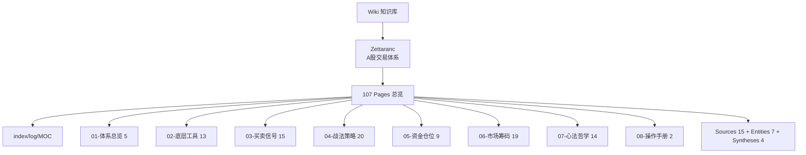

# 📚 Wiki Index — Zettaranc 知识库

> ⚠️ **2026-04-26 数据丢失**:BOSS墨 / 三线文案 / 基本面 命名空间已移除,仅保留 **Zettaranc**。详见 [README.md](../README.md) 与 [CHANGELOG.md](../CHANGELOG.md)。
> 📂 **2026-04-26 分层重构**:概念页重构为 8 层目录结构。
> 🗺️ **2026-05-05 模板对齐**:接入 Dataview 仪表盘 + MOC 主题地图。

> **使用模式**:
> - 🟢 **Dataview 模式**:Obsidian 已安装 Dataview 插件 → 下方查询块动态渲染
> - 🟡 **静态模式**:打开 GitHub 或 Dataview 不可用 → 直接看「📚 静态目录」与 Mermaid 总览图

---

## 🗺️ 知识体系总览



---

## 🩺 健康度仪表盘

> [!warning]+ Dataview:最近更新 Top 15
> ```dataview
> TABLE WITHOUT ID
>   file.link AS "页面",
>   type AS "类型",
>   "📄 " + length(file.inlinks) AS "入链",
>   length(file.outlinks) AS "出链",
>   last_updated AS "更新"
> FROM "wiki/zettaranc"
> WHERE type != null AND type != "index"
> SORT last_updated DESC
> LIMIT 15
> ```

> [!info]+ Dataview:类型分布统计
> ```dataview
> TABLE WITHOUT ID
>   type AS "类型",
>   length(rows) AS "数量"
> FROM "wiki/zettaranc"
> WHERE type != null
> GROUP BY type
> SORT length(rows) DESC
> ```

---

## 📥 最新摄入的来源

> [!abstract]+ Dataview:Sources 列表
> ```dataview
> TABLE
>   source_type AS "类型",
>   credibility AS "可信度",
>   last_updated AS "更新"
> FROM "wiki/zettaranc/sources"
> SORT last_updated DESC
> ```

---

## 🧠 概念库

> [!abstract]+ Dataview:Concepts(按更新日期 Top 20)
> ```dataview
> TABLE
>   complexity AS "复杂度",
>   last_updated AS "更新",
>   status AS "状态"
> FROM "wiki/zettaranc/concepts"
> WHERE type = "concept"
> SORT last_updated DESC
> LIMIT 20
> ```

---

## 🏢 实体库

> [!abstract]+ Dataview:Entities
> ```dataview
> TABLE
>   entity_type AS "类型",
>   last_updated AS "更新",
>   status AS "状态"
> FROM "wiki/zettaranc/entities"
> SORT entity_type ASC, file.name ASC
> ```

---

## 🔬 综合分析

> [!abstract]+ Dataview:Syntheses
> ```dataview
> TABLE
>   confidence AS "置信度",
>   last_updated AS "更新",
>   status AS "状态"
> FROM "wiki/zettaranc"
> WHERE type = "synthesis"
> SORT last_updated DESC
> ```

---

## ⚠️ 待处理

### 📝 草稿状态页面

> [!warning]+ Dataview:草稿
> ```dataview
> LIST
> FROM "wiki/zettaranc"
> WHERE status = "draft"
> SORT last_updated DESC
> ```

### 🔗 无来源的页面(需补充溯源)

> [!danger]+ Dataview:来源缺失
> ```dataview
> LIST
> FROM "wiki/zettaranc"
> WHERE type = "concept" AND (!sources OR length(sources) = 0)
> SORT file.name ASC
> ```

### ⏰ 长期草稿(>30 天未完成)

> [!warning]+ Dataview:长期草稿
> ```dataview
> LIST
> FROM "wiki/zettaranc"
> WHERE status = "draft" AND last_updated < date(today) - dur(30 days)
> SORT last_updated ASC
> ```

---

## 🗺️ 主题地图(MOC)

> 按领域浏览知识。Dataview 不可用时使用手动链接。

- [[MOC-战法策略]] — 03-买卖信号 + 04-战法策略(33 个具体战法)
- [[MOC-工具体系]] — 02-底层工具(白线黄线/砖形图/MACD/N型)
- [[MOC-资金筹码]] — 05-资金仓位 + 06-市场筹码(仓位/资金画像/筹码博弈)
- [[MOC-心法哲学]] — 01-体系总览 + 07-心法哲学 + 08-操作手册
- [[MOC-待整理]] — 孤儿页面/缺字段/长期草稿质检中心

---

## 📚 静态目录(Dataview Fallback)

### Sources

**高可信度(系统整理)**:[[摘要-zhihang-精水流深-batch-01]]、[[摘要-zhihang-空谷幽兰-batch-03]]、[[batch-09-zhixing-extension]]、[[batch-06-dafuweng-systems]]、[[batch-10-zge-recordings-2025-collection]]、[[batch-11-zge-recordings-2026-01]]、[[batch-12-zge-recordings-2026-02]]、[[batch-13-zge-recordings-2026-03]]、[[batch-14-zge-recordings-2026-04]]、[[batch-15-gutan-9-essays]]

**中可信度(课程/直播整理)**:[[摘要-zhihang-知行课代表-batch-02]]、[[摘要-zhihang-复盘专用z-batch-04]]

**补充参考(学生笔记)**:[[batch-05-tangoo-notes]]

**外部参考(非Z哥本人作品,作为元理论参考)**:[[batch-16-shi-nian-yi-meng]]、[[batch-17-chi-xu-mai-ru]]

### Entities

**作者与整理者**:[[Zettaranc]]、[[渣A小学生]]、[[大富翁小菜鸟号]]

**资金画像**:[[国家队]]、[[麒麟会]]、[[百岁山]]、[[村委会]]

### Concepts(8 层结构)

**01-体系总览**:[[知行交易模块]]、[[框架式交易]]、[[交易闭环]]、[[Z家军每日五步工作流]]、[[七层应对]]

**02-底层工具**:[[白线黄线系统]]、[[砖形图]]、[[知行趋势线]]、[[MACD三大用法]]、[[量价关系四类]]、[[顶底背离体系]]、[[N型结构]]、[[关键K]]、[[活跃市值]]、[[有序与无序]]、[[MACD共振战法]]、[[倍量柱]]、[[天量柱]]

**03-买卖信号**:[[B1建仓波]]、[[B2突破]]、[[B3买点]]、[[超级B1]]、[[SB1假摔战法]]、[[S1信号]]、[[DSZ战法]]、[[双枪战法]]、[[娜娜图]]、[[两个30%原则]]、[[三波理论]]、[[B2战法]]、[[B1完美图]]、[[逃顶艺术]]、[[十张死亡K线图]]

**04-战法策略**:[[少妇战法]]、[[少妇战法1.3每日持股检查手册]]、[[少妇战法激进版]]、[[波段战法关键7步]]、[[嘀嘀战法]]、[[量比战法]]、[[双线战法]]、[[对称VA战法]]、[[坑口战法]]、[[补票战法]]、[[单针下20]]、[[单针下30]]、[[呼吸结构]]、[[扭一扭]]、[[异动选股法]]、[[暴力K]]、[[三个黄金定式]]、[[四块砖交易体系]]、[[转折点战法]]、[[三换三]]

**05-资金仓位**:[[底仓与动态仓]]、[[半仓放飞策略]]、[[去弱留强]]、[[五分制持仓评分系统]]、[[交易松紧手]]、[[新曼城阵容]]、[[三最原则]]、[[开超市策略]]、[[空仓策略]]

**06-市场筹码**:[[筹码战争]]、[[筹码三段论]]、[[AI控盘指数论]]、[[五类资金画像]]、[[顺周期轮动]]、[[绝对主线]]、[[A股博弈本质]]、[[穿越火线]]、[[牛市策略]]、[[牛市ETF躺平策略]]、[[黄金坑三大分类]]、[[主力出货五种经典方式]]、[[指数贡献策略]]、[[主题交易的三层防火墙]]、[[慢牛密码论]]、[[卡节奏论]]、[[产业视角投资法]]、[[战略回撤]]、[[散户不死牛市不止]]

**07-心法哲学**:[[防守哲学]]、[[交易心理]]、[[交易免疫系统]]、[[四不原则]]、[[击穿对手盘]]、[[不可能三角]]、[[盈亏比与胜率]]、[[斗牛士三属性]]、[[周期与人性]]、[[择时大于选股]]、[[价投真相与实操法则]]、[[三种波段路径]]、[[看得懂输得起]]、[[490别把送分题做成送命题]]

**08-操作手册**:[[短线交易操作手册]]、[[长线交易操作手册]]

### Syntheses

- [[短线交易操作手册]] — 持仓 1-5 天的六步交易闭环
- [[长线交易操作手册]] — 持仓 1-3 个月+ 的资产配置与波段管理
- [[反心理九篇心法]] — 2017 反心理九篇文字源头 + 9 年后的现代体系演化
- [[Z哥黑话词典]] — Z 哥语境下所有黑话/暗号/拟人化术语的索引(60+ 词条 × 7 大分类)

> 详细说明与一句话描述见 [zettaranc/index.md](zettaranc/index.md)

---

## 🛠️ 维护指南

> [!tip]+ 如何使用本页面
> 1. **日常查询**:通过上方 Dataview 表格快速浏览各类页面
> 2. **主题探索**:通过 MOC 入口进入特定领域的知识网络
> 3. **待办跟进**:定期查看「⚠️ 待处理」区块,清理草稿和孤儿页面
> 4. **Dataview 不可用时**:回退到「📚 静态目录」进行人工维护
>
> **维护频率建议**:
> - 每周:检查待处理页面,清理草稿
> - 每月:运行 `/lint` 全局巡检,更新手动目录

---

*本页面由 Dataview 自动维护(当插件可用时)。最后更新:`=date(now)`*
