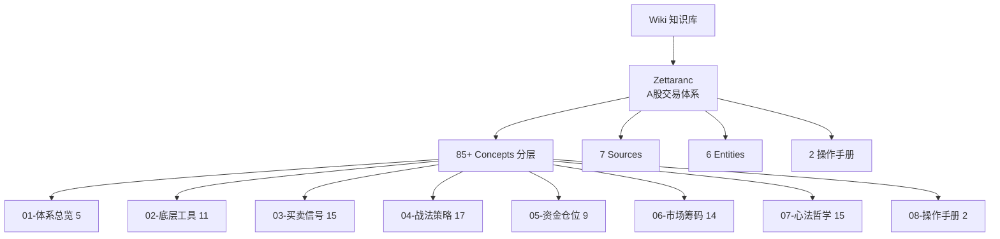

# Wiki Index

> ⚠️ **2026-04-26 数据丢失说明**:BOSS墨 / 三线文案 / 基本面 命名空间已移除,仅保留 **Zettaranc**。详见 [README.md](../README.md) 与 [CHANGELOG.md](../CHANGELOG.md)。
> 📈 **2026-04-26 数据扩容**:接入 TANGOO(渣A小学生)/ 大富翁小菜鸟号 / 知行小菜鸟延续共 305 篇,新增 21 概念 + 5 实体 + 3 source。
> 📂 **2026-04-26 分层重构**:概念页从平铺重构为 8 层目录结构,体系总览/底层工具/买卖信号/战法策略/资金仓位/市场筹码/心法哲学/操作手册。
> 📚 **2026-04-26 知识抽提**:从 raw 阅读高价值文件,新增 11 概念(B1完美图/B2战法/补票战法/异动选股法等),概念总数 63→75。
> 🔥 **2026-04-26 知行小菜鸟续读(第八批)**:新增主题交易的三层防火墙/牛市ETF躺平策略/三种波段路径,概念总数 82→85。

## Zettaranc(A股交易体系)

### Sources

**高可信度(系统整理)**:[[摘要-zhihang-精水流深-batch-01]]、[[摘要-zhihang-空谷幽兰-batch-03]]、[[batch-09-zhixing-extension]]、[[batch-06-dafuweng-systems]]

**中可信度(课程/直播整理)**:[[摘要-zhihang-知行课代表-batch-02]]、[[摘要-zhihang-复盘专用z-batch-04]]

**补充参考(学生笔记)**:[[batch-05-tangoo-notes]]

### Entities

**作者与整理者**:[[Zettaranc]]、[[渣A小学生]]、[[大富翁小菜鸟号]]

**资金画像**:[[国家队]]、[[麒麟会]]、[[百岁山]]

### Concepts (8层结构)

**01-体系总览**:[[知行交易模块]]、[[框架式交易]]、[[交易闭环]]、[[Z家军每日五步工作流]]、[[七层应对]]

**02-底层工具**:[[白线黄线系统]]、[[砖形图]]、[[知行趋势线]]、[[MACD三大用法]]、[[量价关系四类]]、[[顶底背离体系]]、[[N型结构]]、[[关键K]]、[[活跃市值]]、[[有序与无序]]、[[MACD共振战法]]

**03-买卖信号**:[[B1建仓波]]、[[B2突破]]、[[B3买点]]、[[超级B1]]、[[SB1假摔战法]]、[[S1信号]]、[[DSZ战法]]、[[双枪战法]]、[[娜娜图]]、[[两个30%原则]]、[[三波理论]]、[[B2战法]]、[[B1完美图]]、[[逃顶艺术]]、[[十张死亡K线图]]

**04-战法策略**:[[少妇战法]]、[[少妇战法1.3 每日持股检查手册]]、[[嘀嘀战法]]、[[量比战法]]、[[双线战法]]、[[对称VA战法]]、[[坑口战法]]、[[补票战法]]、[[单针下20]]、[[单针下30]]、[[呼吸结构]]、[[扭一扭]]、[[异动选股法]]、[[暴力K]]、[[三个黄金定式]]、[[四块砖交易体系]]、[[转折点战法]]

**05-资金仓位**:[[底仓与动态仓]]、[[半仓放飞策略]]、[[去弱留强]]、[[五分制持仓评分系统]]、[[交易松紧手]]、[[新曼城阵容]]、[[三最原则]]、[[开超市策略]]、[[空仓策略]]

**06-市场筹码**:[[筹码战争]]、[[筹码三段论]]、[[AI控盘指数论]]、[[五类资金画像]]、[[顺周期轮动]]、[[绝对主线]]、[[穿越火线]]、[[牛市策略]]、[[牛市ETF躺平策略]]、[[黄金坑三大分类]]、[[主力出货五种经典方式]]、[[指数贡献策略]]、[[主题交易的三层防火墙]]

**07-心法哲学**:[[防守哲学]]、[[交易心理]]、[[交易免疫系统]]、[[四不原则]]、[[击穿对手盘]]、[[不可能三角]]、[[盈亏比与胜率]]、[[斗牛士三属性]]、[[周期与人性]]、[[择时大于选股]]、[[三最原则]]、[[价投真相与实操法则]]、[[三种波段路径]]、[[价投真相与实操法则]]

**08-操作手册**:[[短线交易操作手册]]、[[长线交易操作手册]]

> 完整子目录与一句话描述见 [zettaranc/index.md](zettaranc/index.md)
