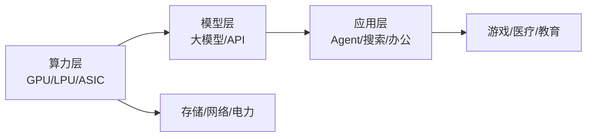

## 定义
AI链覆盖从底层算力到上层应用的完整产业链，大模型Token调用斜率持续抬升，云厂商AI定价集体上调，LPU/ASIC新架构崛起，AI从周期走向成长。

> [!info] 核心观点摘要
> Agent AI驱动Token消费爆发，算力从"训练驱动"转向"推理驱动"，LPU/ASIC等新架构挑战GPU主导地位，产业链从周期走向成长。

## 关键信息
- **核心观点1**：全球大模型Token调用量呈指数级增长，AI基础设施从建设阶段转向消费阶段，算力需求从训练侧向推理侧转移。
- **核心观点2**：LPU（Language Processing Unit）和ASIC等新型AI芯片架构崛起，挑战GPU在推理场景的主导地位。云厂商AI定价集体上调反映供需紧张。
- **核心观点3**：AI产业链从周期走向成长，Token经济的爆炸式增长带动存储、网络、电力等全链条需求。行业正在经历从"供给创造需求"到"需求驱动供给"的转折。
- **最新进展（2024年底至2026年）**：
  - 各类新模型和新应用加速落地，全球大模型Token调用斜率抬升
  - 云厂商AI定价集体上调
  - LPU/ASIC新架构在推理场景加速渗透
  - Agent AI成为Token消耗新增长极
  - 算力租赁商业模式从卖GPU转向卖Token
- **关键催化事件**：新模型发布、Token消耗数据、云厂商财报、AI应用商业化里程碑

> [!warning] 主要风险
> - AI应用变现不及预期，商业化落地慢于预期
> - 算力投资过热导致阶段性产能过剩
> - 技术路线变化（如ASIC替代GPU）导致存量资产贬值

## 核心受益标的（示例）

| 细分领域 | 代表标的 | 催化逻辑 |
|---------|---------|---------|
| 算力芯片 | 寒武纪、海光信息 | 国产AI芯片替代，推理场景需求爆发 |
| AI服务器 | 浪潮信息、中科曙光 | 云厂商资本开支扩张直接受益 |
| 大模型 | 百度、阿里、商汤 | 模型调用量增长，API收入提升 |
| AI应用 | 金山办公、科大讯飞 | Agent嵌入办公/教育场景，ARPU提升 |
| 光模块 | 中际旭创、新易盛 | 算力集群互联需求，800G/1.6T升级 |

> [!tip] 标注说明
> 上表仅作产业链映射示例，不构成投资建议。具体标的需结合财报、估值和交易信号综合判断。

## 关联连接
- [[算力-基本面]] — AI链的核心基础设施环节
- [[半导体-基本面]] — AI芯片是半导体最大增量市场
- [[人形机器人-基本面]] — 人形机器人需要AI模型与端侧算力
- [[游戏-基本面]] — AI技术驱动游戏内容生成
