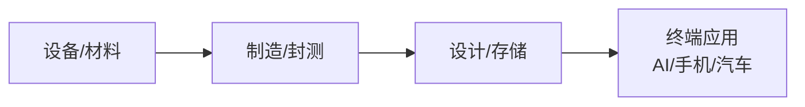

## 定义
半导体行业处于存储超级周期与国产替代共振阶段，AI驱动HBM/先进封装需求爆发，国产设备材料持续突破，2026年行业景气度高位运行。

> [!info] 核心观点摘要
> 存储超级周期兑现（DRAM/NAND价格上行），HBM扩产刚需驱动EUV光刻强度提升；先进封装成为国产突破核心路径；国产设备/材料加速替代，MATCH法案政策风险需关注。

## 关键信息
- **核心观点1**：存储超级周期兑现，DRAM/NAND价格持续上行，HBM扩产刚需驱动EUV光刻强度提升。韩国1Q26年化出货113亿欧元接近FY25全年近2倍。佰维存储Q1净利29亿环比增252%验证周期爆发。
- **核心观点2**：ASML全年营收指引上调至360-400亿欧元，毛利率51%-53%。韩国区收入占比45%创历史新高，中国大陆占比19%回归正常化但需关注MATCH法案政策风险。
- **核心观点3**：先进封装成为国产突破核心路径，长电科技资本开支新高，盛合晶微即将上市。AI和HBM驱动测试复杂度大幅提升，国产封装/测试设备订单创新高。
- **最新进展（2024年底至2026年）**：
  - ASML 1Q26营收87.7亿欧元超预期，全年指引上调，Low NA EUV目标2026年至少60台
  - 佰维存储Q1净利29亿，签订2年15亿美金保供协议
  - 台积电2026年先进封装产能持续扩张
  - 存储周期有望持续至27年上半年，行业正从周期走向成长
  - 模拟芯片进入复苏周期，TI、ADI法说会口径乐观
  - 半导体设备/材料国产化加速推进
- **关键催化事件**：存储合约涨价超预期、先进封装产能释放、国产设备验证突破、半导体龙头财报

> [!warning] 主要风险
> - MATCH法案对华出口管制升级，先进设备获取受限
> - 存储价格增速放缓，周期顶点预期提前
> - LTA长期协议约束力不及预期，客户砍单风险

## 核心受益标的（示例）

| 细分领域 | 代表标的 | 催化逻辑 |
|---------|---------|---------|
| 存储芯片 | 佰维存储、兆易创新、江波龙 | 存储超级周期，DRAM/NAND价格上行 |
| 先进封装 | 长电科技、通富微电 | 长电资本开支新高，AI/HBM驱动测试复杂度提升 |
| 半导体设备 | 北方华创、中微公司、拓荆科技 | 国产替代加速，设备订单创新高 |
| 模拟芯片 | 圣邦股份、思瑞浦、艾为电子 | 模拟芯片进入复苏周期，TI/ADI口径乐观 |
| 封测设备 | 华峰测控、长川科技 | 先进封装产能扩张拉动测试设备需求 |

> [!tip] 标注说明
> 上表仅作产业链映射示例，不构成投资建议。具体标的需结合财报、估值和交易信号综合判断。

## 关联连接
- [[AI链-基本面]] — AI算力需求驱动HBM/存储/先进封装爆发
- [[算力-基本面]] — GPU算力扩张直接拉动半导体需求
- [[人形机器人-基本面]] — 端侧AI芯片（AI5）为人形机器人大脑
- [[有色金属-基本面]] — 半导体制造依赖高纯度金属材料
- [[军工-基本面]] — 军用芯片自主可控需求
