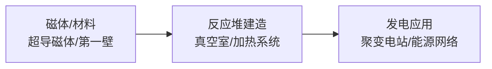

## 定义
可控核聚变处于从实验室向工程化跨越的关键阶段，Helion与OpenAI合作推进商业化，国内项目多点布局，产业链招标规模快速增长。

> [!info] 核心观点摘要
> 从科学验证转向工程实践，国内合肥/江西/成都多点布局；产业链招标规模预计5倍增长，核心设备与材料需求爆发。

## 关键信息
- **核心观点1**：Helion与OpenAI达成合作推进聚变能源商业化，BEST项目进入关键建设阶段，可控核聚变从科学验证转向工程实践。
- **核心观点2**：国内可控核聚变项目在合肥、江西、成都等地多点布局，产业链招标规模预计实现5倍增长，核心设备与材料需求爆发。
- **核心观点3**：聚变产业链涵盖超导磁体、第一壁材料、真空室、加热系统等核心环节，国产化率持续提升。
- **最新进展（2024年底至2026年）**：
  - Helion与OpenAI合作推进聚变商业化
  - BEST项目进入关键建设阶段
  - 国内项目在合肥、江西、成都等地布局
  - 产业链招标规模预计5倍增长
  - 超导磁体、第一壁材料等核心环节持续突破
- **关键催化事件**：Helion里程碑进展、BEST项目建设节点、国内项目招标、技术突破
> [!warning] 主要风险
> - 技术成熟度不及预期
> - 建设周期超预期
> - 资金投入不足

## 核心受益标的（示例）

| 细分领域 | 代表标的 | 催化逻辑 |
|---------|---------|---------|
| 海外聚变商业化 | Helion | 与OpenAI合作推进聚变能源商业化 |
| 国内核心项目 | BEST项目 | 进入关键建设阶段，工程化里程碑 |
| AI赋能 | OpenAI | 与Helion合作，AI辅助聚变能源商业化 |
| 超导磁体 | 西部超导（行业常识） | 国内超导材料龙头，聚变装置核心供应商 |
| 第一壁材料 | 安泰科技（行业常识） | 钨铜复合材料等聚变关键材料 |

> [!tip] 标注说明
> 上表仅作产业链映射示例，不构成投资建议。具体标的需结合财报、估值和交易信号综合判断。

## 关联连接
- [[固态电池-基本面]] — 同为新能源技术路线
- [[有色金属-基本面]] — 聚变装置依赖钨、铍等特种金属
- [[半导体-基本面]] — 聚变控制设备需要高可靠性芯片
- [[商业航天-基本面]] — 航天技术与聚变工程有协同
