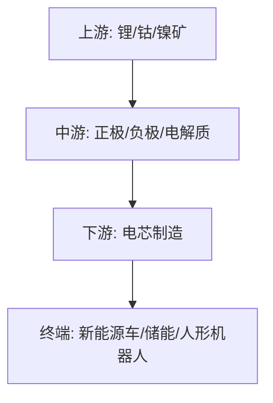

## 定义
固态电池处于产业化爆发前夜，固液混合电池率先商业化放量，全固态电池量产期滞后3-5年，预计2026-2030年全球固态电池CAGR达177.2%，至2030年出货量约605GWh。

> [!info] 核心观点摘要
> 固液混合电池率先商业化（清陶能源全球份额33.6%），全固态量产滞后3-5年；技术路线多元并行（硫化物/卤化物/聚合物）；锂电排产持续高增，碳酸锂价格趋稳。

## 关键信息
- **核心观点1**：固液混合电池正处于产业爆发前夜，全固态因技术成熟度问题量产期滞后3-5年。清陶能源2025年全球固态电池份额占比33.6%全球第一，已递表港交所。
- **核心观点2**：技术路线多元化，硫化物、卤化物、聚合物等路线并行。清陶采用有机-无机复合路线，在4.8V电压平台下达到400Wh/kg能量密度，动力电芯价格0.3元/Wh。
- **核心观点3**：固态电池与锂电、储能、光伏、风电形成协同生态，地缘冲突加速能源安全战略，新能源转型步伐加快，锂电排产持续高增。
- **最新进展（2024年底至2026年）**：
  - 清陶能源递表港交所，固液混合电池龙头
  - 大众发布固态电池版ID.7
  - 宁德时代持续推进固态电池研发与量产
  - 冠盛股份2GWh固液混合电池2026年投产爬坡
  - 锂电头部厂商4月排产超90%，5月超100%，二季度环增20%-25%
  - 碳酸锂价格趋稳，津巴布韦出口配额管理
- **关键催化事件**：清陶IPO上市、全固态关键技术突破、头部企业量产进展、十五五规划新能源政策

> [!warning] 主要风险
> - 产业进展不及预期，全固态量产时间延后
> - 全固态技术路线尚未收敛（硫化物/卤化物/聚合物），赢家难判
> - 成本下降速度不及预期，难以与液态锂电竞争

## 核心受益标的（示例）

| 细分领域 | 代表标的 | 催化逻辑 |
|---------|---------|---------|
| 固液混合电芯 | 清陶能源（拟上市）、宁德时代 | 清陶全球份额33.6%，固液混合率先放量 |
| 锂电材料 | 当升科技、容百科技 | 高镍正极、固态电解质材料需求增长 |
| 设备制造 | 先导智能、赢合科技 | 固态电池产线设备需求 |
| 储能集成 | 冠盛股份、亿纬锂能 | 冠盛2GWh固液混合电池2026年投产 |
| 上游矿产 | 赣锋锂业、天齐锂业 | 碳酸锂价格趋稳，津巴布韦出口配额管理 |

> [!tip] 标注说明
> 上表仅作产业链映射示例，不构成投资建议。具体标的需结合财报、估值和交易信号综合判断。

## 关联连接
- [[AI链-基本面]] — AI驱动算力电力需求，带动储能与电池需求
- [[算力-基本面]] — 算电协同趋势下，电池是储能核心环节
- [[人形机器人-基本面]] — 固态电池可作为人形机器人动力解决方案
- [[有色金属-基本面]] — 锂、钴、镍等上游矿产是电池核心原材料
