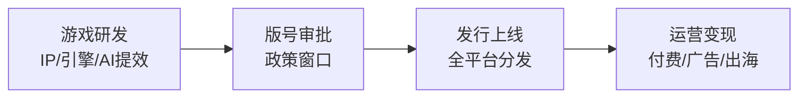

## 定义
游戏行业Q2进入新品释放期，2月版号152款密集发放，板块估值处于历史低位（龙头PE不足15x），AI技术提升内容制作效率，行业景气度延续。

> [!info] 核心观点摘要
> Q2新品密集释放（腾讯/完美/恺英），版号政策友好，板块估值历史低位；AI提效+华流出海形成合力，行业景气度延续。

## 关键信息
- **核心观点1**：Q2多款重磅新游密集定档，腾讯《王者荣耀世界》PC端上线、完美世界《异环》定档4月23日、恺英网络EVE上线进入iOS下载榜TOP2，板块催化密集。
- **核心观点2**：2026年2月版号发放152款，政策环境友好，游戏板块维持高景气度。板块龙头对应26年PE不足15x，处于历史低位，具备估值修复空间。
- **核心观点3**：AI多模态技术持续突破，PixVerse V6、World Labs等视频生成/世界模型迭代，AI在提效基础上赋能商业化变现。华流出海（网文/短剧/游戏）形成合力。
- **最新进展（2024年底至2026年）**：
  - 腾讯《王者荣耀世界》PC端上线，恺英EVE上线
  - 完美世界《异环》定档4月23日全平台
  - 网易《燕云十六声》海外表现亮眼
  - 2026年2月152款游戏版号发放
  - AI视频生成模型持续突破
  - 板块估值处于历史低位
- **关键催化事件**：新品上线数据、Q2财报披露、版号持续发放、AI应用落地
> [!warning] 主要风险
> - 新品上线持续性低于预期
> - 监管政策变化
> - 宏观景气度低于预期

## 核心受益标的（示例）

| 细分领域 | 代表标的 | 催化逻辑 |
|---------|---------|---------|
| 头部平台 | 腾讯 | 《王者荣耀世界》PC端上线，头部IP持续释放 |
| 新品催化 | 完美世界 | 《异环》定档4月23日全平台，估值修复弹性大 |
| 新品催化 | 恺英网络 | EVE上线进入iOS下载榜TOP2 |
| 出海/运营 | 网易 | 《燕云十六声》海外表现亮眼 |

> [!tip] 标注说明
> 上表仅作产业链映射示例，不构成投资建议。具体标的需结合财报、估值和交易信号综合判断。

## 关联连接
- [[AI链-基本面]] — AI技术驱动游戏内容生成效率提升
- [[算力-基本面]] — 游戏AI需要算力支持
- [[人形机器人-基本面]] — 游戏引擎技术可迁移至机器人仿真
- [[半导体-基本面]] — 游戏GPU是半导体重要下游
