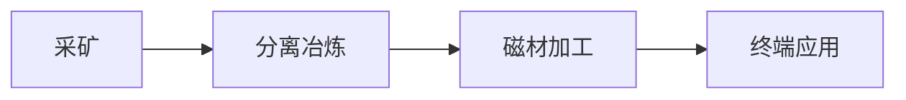

## 定义
稀土行业处于供改政策收紧与需求恢复共振期，包钢Q2稀土精矿价格环比上涨约45%至3.88万元/吨，中稀有色Q1净利预增217%-281%，稀土基本面紧平衡格局有望全年维持。

> [!info] 核心观点摘要
> 供改政策持续收紧叠加需求逐步恢复，稀土价格修复趋势明确；配额管理成为价格核心变量，战略资源属性凸显。

## 关键信息
- **核心观点1**：包钢股份Q2稀土精矿交易价格调整为3.88万元/吨，环比上涨约45%。中稀有色Q1净利预增217%-281%，稀土产品业绩稳步提升。
- **核心观点2**：供改政策持续收紧，行业内减产预期支撑，叠加需求逐步恢复，稀土价格将逐步修复。配额管理成为关键政策工具。
- **核心观点3**：重稀土价格较为稳定，轻稀土价格波动较大。稀土作为中国战略资源，在贸易博弈中具有反制工具属性。
- **最新进展（2024年底至2026年）**：
  - 包钢Q2稀土精矿价格环比+45%
  - 中稀有色Q1净利同比预增217%-281%
  - 稀土供改政策持续收紧
  - 配额博弈成为价格核心变量
  - 稀土出口管制政策持续推进
- **关键催化事件**：稀土配额政策、出口管制升级、特朗普访华、需求端磁材放量
> [!warning] 主要风险
> - 配额超预期释放
> - 替代材料技术突破
> - 海外稀土矿山投产

## 核心受益标的（示例）

| 细分领域 | 代表标的 | 催化逻辑 |
|---------|---------|---------|
| 采矿/冶炼 | 北方稀土、中国稀土 | 配额管理收紧，精矿价格环比+45% |
| 磁材加工 | 金力永磁、中科三环 | 新能源车与机器人电机磁材需求放量 |

> [!tip] 标注说明
> 上表仅作产业链映射示例，不构成投资建议。具体标的需结合财报、估值和交易信号综合判断。

## 关联连接
- [[有色金属-基本面]] — 稀土属于有色金属重要细分
- [[军工-基本面]] — 稀土是军工磁性材料核心原料
- [[人形机器人-基本面]] — 稀土永磁是机器人电机核心材料
- [[半导体-基本面]] — 稀土材料用于半导体制造
