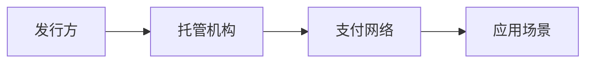

## 定义
稳定币产业在监管框架下加速发展，香港首批稳定币牌照发放（渣打、汇丰等），Web3市场规模约3110亿美元，第二批牌照预计9月发放，香港加速布局加密资产枢纽地位。

> [!info] 核心观点摘要
> 香港首批牌照标志稳定币从加密原生走向传统金融体系，Web3市场超3000亿美元下稳定币作为基础设施需求持续增长。

## 关键信息
- **核心观点1**：香港首批稳定币牌照发放给渣打银行、汇丰银行等传统金融机构，标志稳定币从加密原生走向传统金融体系。
- **核心观点2**：Web3市场规模约3110亿美元，稳定币作为加密货币市场的基础设施，需求持续增长。
- **核心观点3**：第二批稳定币牌照预计9月发放，更多参与者入场，香港加密资产监管框架持续完善。
- **最新进展（2024年底至2026年）**：
  - 香港首批稳定币牌照发放（渣打、汇丰）
  - Web3市场规模约3110亿美元
  - 第二批牌照预计9月发放
  - 全球稳定币监管框架加速完善
  - 传统金融机构加速布局加密业务
- **关键催化事件**：第二批牌照发放、Web3政策推进、传统金融机构入场、全球监管协调
> [!warning] 主要风险
> - 监管政策变化
> - 加密市场波动
> - 合规成本上升

## 核心受益标的（示例）

| 细分领域 | 代表标的 | 催化逻辑 |
|---------|---------|---------|
| 香港牌照银行 | 渣打银行、汇丰银行 | 香港首批稳定币牌照获得者，传统金融入场 |
| 稳定币发行 | Circle（USDC） | 全球主要稳定币发行方，监管合规领先 |
| 交易所 | Coinbase | 加密资产交易基础设施，稳定币交易对核心平台 |

> [!tip] 标注说明
> 上表仅作产业链映射示例，不构成投资建议。具体标的需结合财报、估值和交易信号综合判断。

## 关联连接
- [[AI链-基本面]] — AI与Web3技术融合趋势
- [[策略宏观-基本面]] — 加密资产对全球货币政策的影响
- [[算力-基本面]] — 区块链网络运行需要算力支撑
