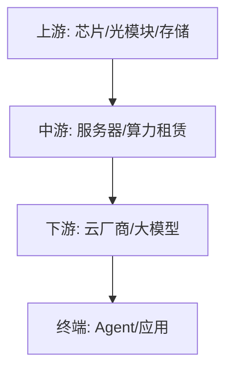

## 定义
算力是AI基础设施的核心，Agent AI驱动Token消费爆发，GPU算力持续紧缺，模型价值随推理需求抬升而提升，算力产业链处于高景气周期。

> [!info] 核心观点摘要
> Agent AI从"单次对话"转向"自主执行"，Token消耗量级跃升；算力租赁从"卖GPU"转向"卖Token"，商业模式升级；新型推理芯片（LPU/ASIC）加速渗透，技术路线多元化。

## 关键信息
- **核心观点1**：Agent AI成为算力需求新增长极，从单次对话转向自主执行任务，Token消耗量级跃升，带动推理算力需求爆发。
- **核心观点2**：GPU算力持续紧缺，算力租赁商业模式从卖GPU转向卖Token，算力供给成为制约AI应用放量的关键瓶颈。
- **核心观点3**：模型价值随推理需求抬升而提升，算力从周期属性转向成长属性，长期需求确定性增强。
- **最新进展（2024年底至2026年）**：
  - Agent AI商业化加速，Token调用斜率持续抬升
  - 算力租赁紧缺推动价格上涨
  - 新型推理芯片（LPU/ASIC）加速渗透
  - 云厂商AI定价集体上调反映供需紧张
  - 算力与存储、网络形成协同需求
- **关键催化事件**：算力需求数据、GPU供应缓解、新型芯片发布、云厂商财报

> [!warning] 主要风险
> - 算力投资过热导致阶段性产能过剩，租赁价格回落
> - 技术路线变更（ASIC/LPU替代GPU）导致存量资产贬值
> - 地缘政治供应链风险，先进制程受限

## 核心受益标的（示例）

| 细分领域 | 代表标的 | 催化逻辑 |
|---------|---------|---------|
| AI服务器 | 浪潮信息、中科曙光、紫光股份 | 云厂商资本开支扩张，服务器出货量高增 |
| 光模块 | 中际旭创、新易盛、天孚通信 | 800G/1.6T升级周期，算力集群互联刚需 |
| 算力租赁 | 鸿博股份、恒润股份 | 从卖GPU转向卖Token，商业模式升级 |
| 液冷散热 | 英维克、高澜股份 | 高密度算力集群散热需求爆发 |
| 国产芯片 | 海光信息、寒武纪 | 推理场景国产替代加速 |

> [!tip] 标注说明
> 上表仅作产业链映射示例，不构成投资建议。具体标的需结合财报、估值和交易信号综合判断。

## 关联连接
- [[AI链-基本面]] — 算力是AI链的底层基础设施
- [[半导体-基本面]] — AI芯片是半导体最大增量市场
- [[人形机器人-基本面]] — 端侧AI芯片为人形机器人提供算力
- [[游戏-基本面]] — 游戏AI需要算力支持
