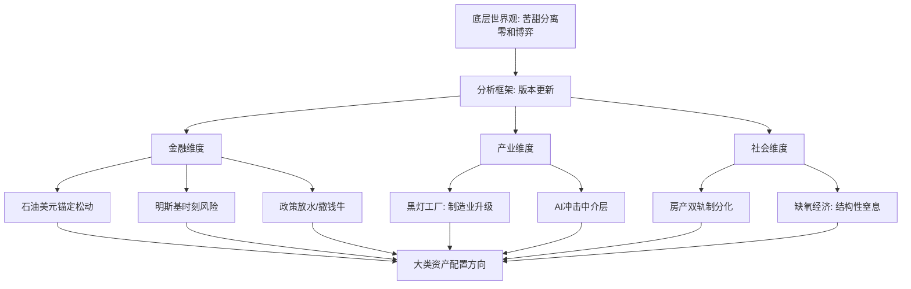

## 研究问题
三线文案大锅饭的宏观地缘分析体系如何构成？其核心世界观、金融判断、产业/社会分析如何形成一个连贯的认知框架？

## 核心结论

> [!abstract] 五句话概括
> 1. **世界是零和博弈，苦甜分离**：好日子和苦日子不在同一个人身上，这是所有分析的底层世界观
> 2. **国际格局用"版本更新"理解**：每个大变化都是一次版本升级，旧版本的优势可能成为新版本的劣势
> 3. **AI是G2的第一场正式测试**：中美格局的第一场博弈，将决定下一版本的权力分配
> 4. **石油美元锚定正在松动**：去美元化不是口号而是轨迹，明斯基时刻的阴影渐近
> 5. **金池长老（中介寻租层）是AI冲击的第一波**：习惯性中介的护城河最先被AI代理摧毁

## 分析框架图

## 详细论证

### 一、核心世界观：苦甜分离的版本叙事

> [!quote] 底层世界观
> 世界是零和博弈，好日子和苦日子不在同一个人身上。任何"双赢"叙事背后都有第三方在承担代价。

**零和博弈底层**
- **[[苦甜分离-SanXian]]**：世界是零和博弈，好日子和苦日子不在同一个人身上
- 不是悲观主义，而是对资源有限性和利益冲突的冷静认知
- 任何"双赢"叙事背后都有第三方在承担代价

**版本更新思维**
- **[[版本更新-SanXian]]**：国际格局/经济周期的大变化用游戏版本比喻
- 每个版本有不同的规则、赢家、输家
- 用旧版本的经验应对新版本 = 刻舟求剑（与BOSS墨的刻舟求剑恰好相反：三线认为历史不重复，因为版本变了）

> [!tip] 版本思维要点
> - 用旧版本的经验应对新版本 = 刻舟求剑
> - 每个版本有不同的规则、赢家、输家
> - 旧版本的优势可能成为新版本的劣势
- **[[历史五阶段论-SanXian]]**：中国近现代发展的五个"版本"演变轨迹

**地缘博弈框架**
- **[[G2先行测试服-SanXian]]**：AI是中美格局的第一场正式测试
- G2（中美）的竞争是贯穿多个版本的主线
- 测试服的结果会影响正式服的权力分配

### 二、金融分析：锚定松动与政策放水

**美元体系分析**
- **[[石油美元锚定-SanXian]]**：石油是美元的锚，去美元化 = 锚松动
- 锚松动不是一夜之间，而是渐进轨迹
- 但锚松动的预期本身就会加速去美元化

**庞氏融资框架**
- **[[明斯基时刻-SanXian]]**：美元体系从庞氏融资走向崩盘
- 债务增长超过收入增长 → 借新还旧 → 崩盘
- 明斯基时刻的标志性特征：流动性枯竭、资产价格断崖

**A股政策驱动**
- **[[撒钱牛-SanXian]]**：政策放水驱动的A股牛市
- 政策放水 → 流动性充裕 → 资产价格上涨
- 撒钱牛的特征：来势凶猛，但基础不牢

**政策连锁推演**
- **[[政策连锁预判-SanXian]]**：政策A→影响B→影响C的多层推演
- 不只看政策本身，更看政策的连锁反应
- 多层推演能力是宏观分析的核心竞争力

### 三、产业与社会：AI冲击与制造业升级

**制造业升级**
- **[[黑灯工厂-SanXian]]**：全自动化无灯工厂，制造业升级的核心
- 黑灯工厂不是替代工人，而是替代整个生产组织方式
- 制造业升级是中美竞争的关键战场

**经济窒息感**
- **[[缺氧经济-SanXian]]**：当前经济的窒息感，缺油而非缺氧
- 不是总量问题，而是结构性问题
- 某些环节"缺氧"，某些环节"富氧"

**AI对中介的冲击**
- **[[金池长老隐喻-SanXian]]**：西游记金池长老隐喻寻租中间层/腐败中介
- AI代理将首先摧毁"习惯性中介"的护城河
- 房产中介、金融中介等是AI冲击的第一波
- "真正引发危机的从来不是损失本身，而是对损失的认知"

### 四、房产与民生：双轨制分化

**房产双轨制**
- **[[馒头免费鲍鱼更贵-SanXian]]**：保障房便宜，改善房更贵
- 不是房价涨跌的简单叙事，而是结构性分化
- 保障房满足基本需求，改善房成为奢侈品

## 三线文案体系与交易体系的差异

| 维度 | 三线文案（宏观地缘） | Zettaranc/BOSS墨（交易体系） |
|-----|-------------------|-------------------------|
| 核心问题 | "世界在发生什么" | "我该什么时候买卖" |
| 时间尺度 | 年/十年 | 天/周/月 |
| 方法论 | 版本更新、政策连锁推演 | 技术形态、盈亏比计算 |
| 确定性观 | 版本变了历史不重演 | 刻舟求剑/历史会重复 |
| 输出物 | 认知框架、趋势判断 | 买卖信号、仓位管理 |
| 适用场景 | 大类资产配置方向 | 具体品种交易执行 |

三线文案不直接产生交易信号，但为**大类资产配置方向**提供宏观判断。其"版本更新"思维与"政策连锁预判"能力可以作为交易体系的顶层过滤器。

## 关联连接
- [[苦甜分离-SanXian]] — 零和博弈底层世界观
- [[版本更新-SanXian]] — 国际格局变化的版本叙事
- [[G2先行测试服-SanXian]] — AI作为中美博弈的测试场
- [[石油美元锚定-SanXian]] — 去美元化的锚定轨迹
- [[明斯基时刻-SanXian]] — 庞氏融资走向崩盘
- [[撒钱牛-SanXian]] — 政策放水驱动的牛市
- [[政策连锁预判-SanXian]] — 多层因果推演能力
- [[黑灯工厂-SanXian]] — 制造业升级方向
- [[缺氧经济-SanXian]] — 结构性经济窒息感
- [[金池长老隐喻-SanXian]] — AI对中介层的冲击
- [[历史五阶段论-SanXian]] — 中国发展的版本演进
- [[馒头免费鲍鱼更贵-SanXian]] — 房产双轨制分化
- [[三线文案大锅饭]] — 体系创建者
