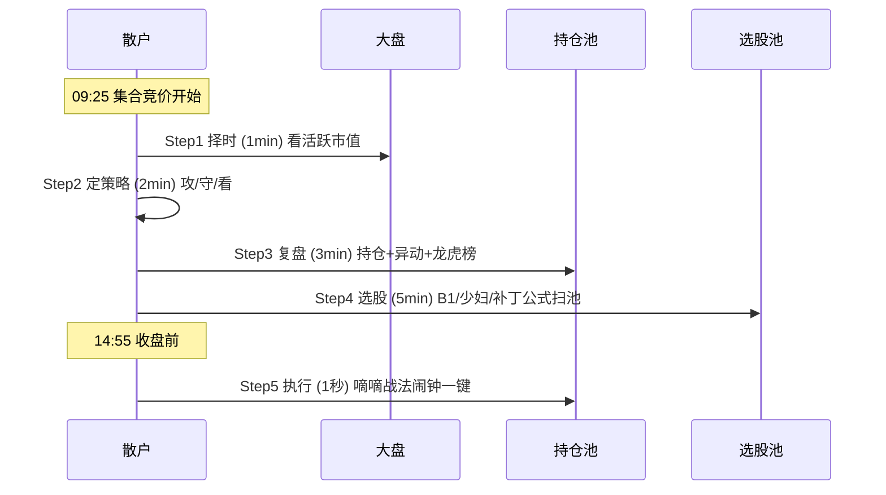

## 定义

> [!abstract] 一句话定义
> Z家军每日五步工作流是 Z 哥粉丝群"Z 家军"的日内执行闭环 — **择时 1 分钟 + 定策略 2 分钟 + 复盘 3 分钟 + 选股 5 分钟 + 执行 1 秒**,共约 11 分钟,是 [[知行交易模块]] 的日常落地版。

## 关键信息

### 五步详解

- **Step 1 择时(1 分钟)**:看 [[活跃市值]] 大盘 4% / -2.3% 阀值,判断当日多空环境。
- **Step 2 定策略(2 分钟)**:依据择时结果选当日策略 — 攻 / 守 / 看(空仓观望)。
- **Step 3 复盘(3 分钟)**:看昨日持仓盈亏、今日早盘异动、龙虎榜资金动向。
- **Step 4 选股(5 分钟)**:用 [[B1建仓波]] / [[少妇战法]] / [[B1补丁]] 通达信公式扫池。
- **Step 5 执行(1 秒)**:[[嘀嘀战法]] 14:55 闹钟一键执行(止损 / 减仓 / 加仓)。

### 与上层框架的关系

- 与 [[知行交易模块]] 的关系:五步工作流是知行交易模块的日常落地版,用执行流程封装知识体系。
- 与 [[四块砖交易体系]] 的关系:五步是动作,四块砖是认知框架 — 执行层 vs 体系层。
- 与 [[择时大于选股]] 的关系:Step 1 优先于 Step 4,正是"择时大于选股"的流程化体现。

### 时间分配的哲学

> [!tip] 为什么是 11 分钟?
> Z 哥强调"散户最大的敌人是过度交易",五步压缩到 11 分钟是为了**强制决策纪律化**:看盘越久,情绪干扰越大,严格按流程走比"看一天"更高胜率。

### 五步顺序时序图

## 关联连接

- [[活跃市值]] — Step 1 择时的核心阀值工具
- [[B1建仓波]] — Step 4 选股的核心战法
- [[少妇战法]] — Step 4 选股备选战法
- [[嘀嘀战法]] — Step 5 执行的闹钟工具
- [[知行交易模块]] — 五步是该模块的日常落地版
- [[四块砖交易体系]] — 五步是动作,四块砖是认知框架
- [[择时大于选股]] — Step 1 优先于 Step 4 的底层逻辑
- [[Zettaranc]] — 工作流的提出者
