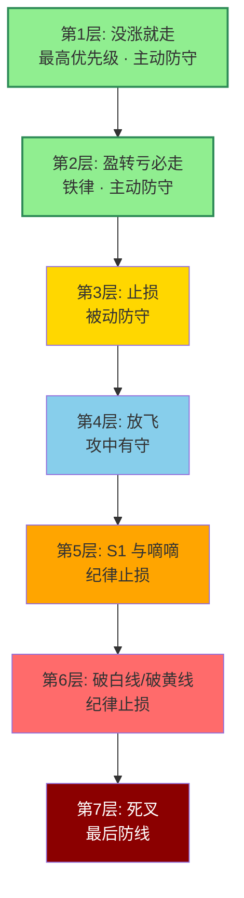
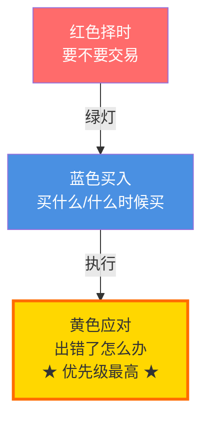

## 定义

> [!abstract] 一句话定义
> 知行交易模块中**黄色应对模块的七层防守体系**，按优先级从高到低排列。核心：**"没涨就走"和"盈转亏必走"是两条不可逾越的铁律，优先级远高于止损**。

## 七层优先级瀑布图

> [!danger] 两条不可逾越的铁律
> **第 1 层"没涨就走" + 第 2 层"盈转亏必走"** 优先级远高于第 3 层止损 — 大多数散户的问题不是不止损,而是从不执行前两层的主动防守。

## 七层应对（优先级从高到低）

### 1. 没涨就走（最高优先级）

- 华尔街幽灵核心法则，避免亏损的最佳方式
- 牛逼的票买进去当天就会脱离成本区
- **市场没有证明你是对的，就说明你错了**，直接拍掉换一个
- 买完在盈亏线附近反复震荡 → 说明市场不认可，走

### 2. 盈转亏必走

- 有浮盈但随后跌回成本线以下 → **无条件卖出**
- 不要抱侥幸心理认为"还会涨回来"

### 3. 止损

- 前两条都没做到时的最后防线
- 止损位：买入 K 线下 3-5 个价位，或横盘区间下沿
- **明确反对越跌越补仓**，建议直接放弃 SB1 买点

### 4. 放飞

> [!tip] 放飞 = 进攻中的防守
- 中阳线放飞：出现 4% 以上中阳线，开始分批放飞
- 第四块砖放飞：**铁律**，专精图走到第四块红砖，至少卖出一半
- 放飞原则：越往后放飞比例越大
  - 第一块砖涨 8% → 卖 10%
  - 第四块砖涨 7% → 卖 50%
  - S1 出现 → 清仓剩余

### 5. S1 与嘀嘀

- **S1**：最经典出货形态，出现后谢主力不杀之恩，立即卖出
- **嘀嘀**：高位阶梯量出货，连续两根大阴线，第二根收盘价低于第一根最低价 → 无条件卖出

### 6. 破白线与破黄线

- **白线**：波段趋势线，"牛股不破白线"，跌破 = 中级波段结束
- **黄线**：主力成本线，"黄线之上大哥在，黄线之下大哥不在"
  - 跌破黄线后允许"击穿对手盘忍一根"
  - 第二根依然收在黄线之下 → **必须清仓**

### 7. 死叉（最后防线）

- 死叉 = 趋势彻底反转
- 建议直接放弃，不要抱任何幻想

## 与三模块的关系

在 [[知行交易模块]] 三层架构中：

**应对模块覆盖一切**：任何模块出问题，后续模块全部停止。

## 与 [[防守哲学]] 的关系

七层应对是防守哲学的**操作化展开**：
- 第一-二层（没涨就走/盈转亏必走）= 主动防守
- 第三层（止损）= 被动防守
- 第四层（放飞）= 攻中有守
- 第五-七层（出货信号/破线/死叉）= 纪律止损

## 关联连接

- [[知行交易模块]] — 七层应对是黄色应对模块的具体内容
- [[防守哲学]] — 七层应对的哲学基础
- [[S1信号]] — 第五层应对的核心信号
- [[嘀嘀战法]] — 第五层应对的核心信号
- [[白线黄线系统]] — 第六层应对的技术基础
- [[击穿对手盘]] — 第六层黄线破位后的"忍一根"纪律
- [[半仓放飞策略]] — 第四层放飞的具体执行
