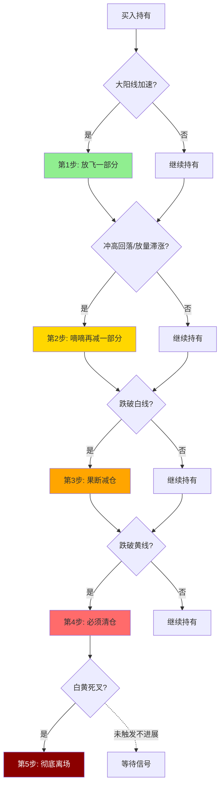

## 定义

> [!abstract] 一句话定义
> 交易闭环是从买入到卖出的完整风控流程,包含 **5 次逃生机会**。核心心法:**赚钱的票绝不能做成亏损的,赢转亏必须走**。

## 关键信息

### 五步逃生法
1. **放飞**:大阳线加速上涨阶段,先放飞一部分仓位
2. **滴滴**:冲高回落、放量滞涨时再减一部分
3. **跌破白线**:果断减仓
4. **跌破黄线**:必须清仓
5. **白线黄线死叉**:彻底离场

### 底线
- 赚钱的票绝不能做成亏损的,赢转亏必须走

## 五步逃生流程图

> [!danger] 闭环铁律
> **赢转亏必走**——赚钱的票不允许做成亏钱的票,任何一步都不要犹豫。

## 关联连接
- [[白线黄线系统]] — 趋势判断标准
- [[DSZ战法]] — 超短版卖出规则
- [[S1信号]] — 卖出预警
