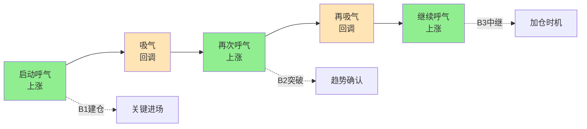

## 定义

> [!abstract] 一句话定义
> 框架式交易是一种基于趋势的弹性交易方法论,核心是**建立规则、严格执行、不预测市场,只做看得懂的信号**。它与机械的网格交易截然相反——本质是"跟随节奏",而非"预测节奏"。

## 关键信息

### 核心思想
- 基于趋势,不猜底不摸顶
- 只在关键点(B1/B2)进场
- 严格止损,走一步看一步
- 高手只做交易纪律,低手总在遗憾

### 执行规则
1. 白线在黄线之下不碰,等金叉才进场
2. 跌破黄线必须走
3. 只持有白线在黄线之上的票
4. 离白线太远的票该放飞就放飞

### 与网格交易的区别
- 框架式交易有弹性、基于趋势
- 网格交易是机械的、死板的

### 节奏与呼吸
- 理解市场的 N 型结构:上涨(呼气)→ 回调(吸气)→ 再上涨(呼气)
- 跟随节奏而非预测节奏
- 结构大于量能:只要 N 型结构保持完美,高位放量也可能是换手

## N 型呼吸节奏图

> [!tip] 框架式 vs 网格交易
> 框架式 = 跟着趋势走,弹性应对;网格 = 价格机械分仓,死板执行。框架式适合 A 股趋势市场,网格容易在单边市场被反复爆仓。

## 关联连接
- [[B1建仓波]] — 框架式交易的进场点
- [[白线黄线系统]] — 趋势判断基础
- [[Zettaranc]] — 交易体系作者
- [[呼吸结构]] — 框架式交易的量价节奏
