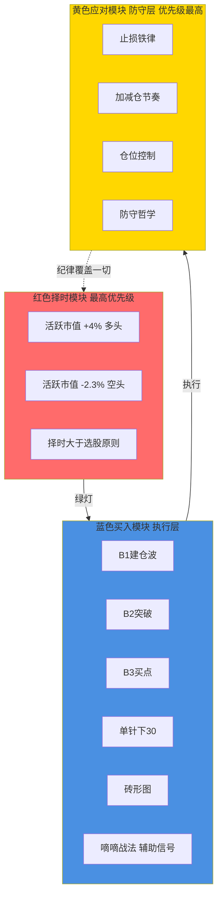

## 定义

> [!abstract] 一句话定义
> 知行交易模块是 Z 哥 2026-04 提出的"散户唯一可执行框架",首次官方定型为**三层架构 — 红色择时模块 / 蓝色买入模块 / 黄色应对模块**。是 4.5 加餐章节的体系总图,也是 [[四块砖交易体系]] 在 AI 控盘时代的升级版。

## 关键信息

### 红色择时模块(最高优先级)
- **核心原则**:[[择时大于选股]] — 大盘不行,选什么股都白搭
- **核心指标**:[[活跃市值]]
  - 多头阈值:**+4%**(可大胆做多)
  - 空头阈值:**-2.3%**(全面防守)
- **作用**:决定"要不要交易"

### 蓝色买入模块(执行层)
五大买入战法**并列存在**,根据市场状态选择:
1. [[B1建仓波]] — 阶段性低点建仓
2. [[B2突破]] — 拉升确认追入
3. [[B3买点]] — 中继加仓
4. [[单针下30]] — 急跌反包战法
5. [[砖形图]] — 趋势工具

辅助信号:[[嘀嘀战法]] 提供过渡区提示
- **作用**:决定"买什么、什么时候买"

### 黄色应对模块(防守层)
- **核心哲学**:参 [[防守哲学]] — 防守 > 进攻
- **铁律**:
  - 止损铁律:跌穿设定位无条件清仓
  - 加减仓节奏:有序加仓 / 无序立即减仓
  - 仓位控制:重仓只在红色模块绿灯 + 蓝色模块共振时
- **作用**:决定"出错了怎么办"

### 橙色支撑工具(筛选层)
六大底层工具，不是用来单独交易的，是用来**筛选完美买点**的：
1. [[关键K]] — 趋势反转/衰竭的标志，大资金进出场信号
2. [[暴力K]] — 带倍量柱的关键K，专用于底部
3. [[量价关系四类]] — 倍量柱异动(当日成交量≥前日2倍)
4. 四分之三阴量线 — 关键K后75%量阴线，暗示突破有假；缩量小阳可能是B3
5. [[筹码三段论]] — 低位筹码峰集中→主力成本区稳固
6. [[三波理论]] — ABC结构(A=资金入场/B=底部过渡/C=趋势确认)

辅助工具:建仓波/拉升波/冲刺波/四块砖/填坑出坑/对称结构

> 同样是B1，有的能涨50%，有的只涨5%。区别就在于有没有叠加这些工具。一个完美B1=ABC结构走完+暴力K+倍量柱异动+筹码集中。

### 模块顺序铁律
**择时 → 选股 → 买入 → 应对**(顺序不可颠倒)
- 应对模块**优先级最高**(即"防守 > 进攻")
- 任何模块出问题,后续模块全部停止
- 与 [[Z家军每日五步工作流]] 的关系:五步工作流是三模块的日常落地版

### 历史演进
- **2024 之前**:[[四块砖交易体系]](择时砖、选股砖、买入砖、卖出砖)
- **2026 升级**:知行交易模块,叠加 [[AI控盘指数论]] 时代的防守层
- 主要变化:
  - "四块砖"是平铺关系,"三模块"是层级关系
  - 新增**应对模块**作为最高优先级,适配 1:99 极化分化的市场环境
  - 防守哲学从隐性原则升级为显性模块

## 三模块层级架构

## 关联连接
- [[择时大于选股]] — 红色模块的核心原则
- [[活跃市值]] — 红色模块的核心指标
- [[B1建仓波]] — 蓝色模块战法之一
- [[B2突破]] — 蓝色模块战法之一
- [[B3买点]] — 蓝色模块战法之一
- [[砖形图]] — 蓝色模块战法之一
- [[单针下30]] — 蓝色模块战法之一
- [[嘀嘀战法]] — 蓝色模块辅助信号
- [[防守哲学]] — 黄色模块的核心哲学
- [[Z家军每日五步工作流]] — 三模块的日常落地版
- [[四块砖交易体系]] — 知行交易模块的前身
- [[AI控盘指数论]] — 升级动因
- [[Zettaranc]] — 体系作者
