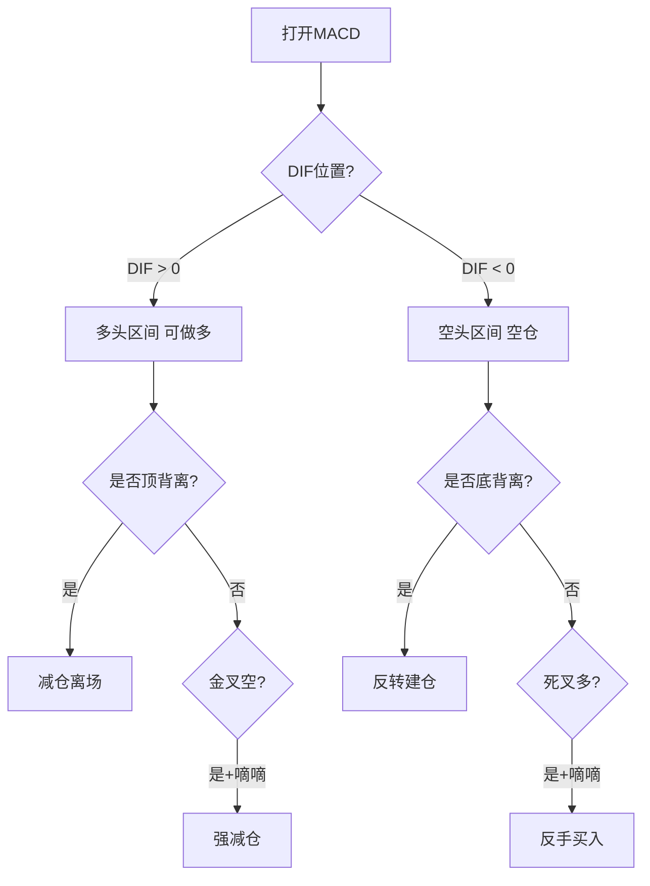

## 定义

> [!abstract] 一句话定义
> MACD 三大用法是 Z 哥总结的 MACD 三种核心用法 — **DIF 0 轴判多空区间 / 顶底背离判顶底 / 金叉空+死叉多判陷阱**,是 [[顶底背离体系]] 的工具版。

## 关键信息

### 用法 1:DIF 上下穿 0 轴 — 判多空区间

- **DIF > 0**:多头区间,可做多,顺势持有。
- **DIF < 0**:空头区间,只能空仓或反弹做(不要逆势做多)。
- 0 轴是多空分界,比金叉死叉更可靠。

### 用法 2:顶 / 底背离 — 判趋势终结

- 价格新高但 DIF 不创新高 → 顶背离,见顶减仓。
- 价格新低但 DIF 不创新低 → 底背离,反转建仓。
- 详细见 [[顶底背离体系]]。

### 用法 3:金叉空 + 死叉多 — 判陷阱(与 [[嘀嘀战法]] 叠加)

- **嘀嘀触发 + MACD 金叉空** = 强减仓信号(双重确认主力出货)。
- **嘀嘀触发 + MACD 死叉多** = 假摔反手买信号(主力假摔吸筹)。
- 单独看金叉死叉容易被骗,叠加嘀嘀战法才是正解。

### 三大用法决策流程

### 一票否决权

MACD 是交易体系里的**最后一道防线**：其他所有战法都支持买入，但 MACD 说"不能买"→ **绝对不买**。
- 好比三家顶级医院会诊都说得了绝症，虽然也可能有误诊，但不能把全部身家押在医学奇迹上
- 守住这道防线，就不会亏大钱

### 不要改参数！默认值(12,26,9)就是最好的

- MACD 的默认参数是经过几十年市场验证的，最符合一个完整波段运行规律
- 对应市场中短期资金的平均持仓周期
- 改参数 = 缩短交易周期 → 操作越频繁 → 越容易被噪音干扰
- 唯一加的标记：白线 DIFF 上穿 0 轴标红点，下穿 0 轴标绿点

### 滞后性的真相：恰恰是 MACD 的灵魂

- 新手追求"实时"，高手追求"确定性"
- MACD 的"慢"过滤掉 90% 市场噪音
- **所谓的滞后性，只有最后一次才是真的**——一波上涨中间可能有十次死叉，只有最后一次是趋势反转

### 背离背后的资金逻辑

- **顺周期上涨 = 大资金建仓波**：真金白银买出来的，量价同步
- **顶背离 = 建仓结束，筹码锁定**：主力不需要再花钱就能拉升，量缩价涨
- **左侧双底 vs 右侧双底**：大资金买左侧（恐慌中进场），散户买右侧（趋势确认后追入）

### 周线 MACD 破 0 轴 = 清仓信号

当大盘的**周线 MACD 跌破 0 轴**时，不管多看好这个市场，都请清仓离场。大顶一定对应大趋势的结束。

- 与 [[顶底背离体系]] 的关系:三大用法是该体系的工具实现版。
- 与 [[白线黄线系统]] 的关系:MACD 是更短周期的趋势判断,白黄是中周期,两者形成多周期共振。
- 与 [[关键K]] 的关系:MACD 信号需要 K 线确认才能触发交易(指标只是辅助)。

## 关联连接

- [[顶底背离体系]] — MACD 三大用法的体系版
- [[嘀嘀战法]] — 用法 3 的叠加伙伴
- [[白线黄线系统]] — 中周期趋势判断的搭档
- [[关键K]] — MACD 信号需关键 K 确认
- [[Zettaranc]] — 用法的总结者
