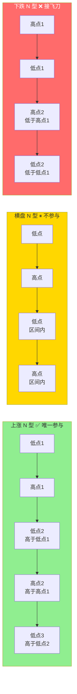

## 定义

> [!abstract] 一句话定义
> N 型结构是 Z 哥交易体系的**底层基石** — 市场里任何品种的走势本质上都是 N 型结构,没有例外。它是判断趋势、持股、止损的最基础框架。

## 关键信息

### 三种趋势形态
- **上涨趋势**:连续的波段中,高点比前一个高点高,低点也比前一个低点高
- **下跌趋势**:高点不断降低,低点也不断降低
- **横盘趋势**:高点和低点在固定区间内震荡,没有明确方向

### 核心铁律
- **一律只做上涨趋势的票**,只做高点和低点不断抬高的 N 型结构
- 横盘趋势不要参与,没有任何赚钱效应
- 下跌趋势更不要碰,抄底就是接飞刀,A 股 90% 散户亏损来自于在下跌趋势里盲目抄底

### 持股心法
- 再牛的股票也不可能一根直线拉上天,一定是涨一波、回调一波、再涨一波的 N 型结构
- 上涨波段买入后,只要 N 型上涨结构没被破坏、没跌破止损位,就安心拿着
- 不要被盘中短期波动吓破胆,交易的核心是赚趋势的钱,不是赚分时波动的钱

### 散户常见错误(SB 战法)
- 上涨波段买入,回调时没到止损位就慌张卖出
- 一卖就拉升,涨起来又追高买回,刚好买在回调起点
- 陷入"高买低卖"的死循环

## 三种 N 型结构对比图

> [!danger] 唯一参与铁律
> 只做**高点低点双双抬高**的上涨 N 型,横盘观望、下跌远离 — 90% 的散户亏损都来自在下跌 N 型里"抄底"。

## 关联连接
- [[框架式交易]] — N型结构是框架式交易的底层判断依据
- [[少妇战法]] — 等B1就是等N型结构中的回调低点
- [[B1建仓波]] — B1信号出现在N型结构的回调末端
- [[交易心理]] — 理解N型结构才能克服回调恐惧
- [[止损]] — N型结构被破坏即触发止损
