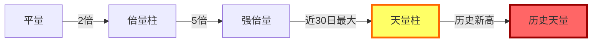

# 天量柱

> [!abstract]+ 一句话定义
> **天量柱**是近 30~60 日的最大单日成交量,在 Z 哥体系中是**主升浪启动**或**主升浪见顶**两种极端信号的标志,必须结合位置判断方向。

## 核心定义

- **数学定义**:今日成交量 = 近 30 日(或 60 日)最大值
- **极端属性**:天量柱是市场情绪的极值表达
- **必须看位置**:同样是天量,在底部和顶部含义完全相反

## 天量柱 = 转折点

> [!important]+ 天量必有变盘
> 天量柱出现后**未来 1~5 个交易日内必有方向选择**——要么加速向上(主升浪启动),要么加速向下(主升浪见顶)。**绝对不会横盘**。

## 位置判断对照

| 位置 | 天量柱含义 | 操作 |
|------|------------|------|
| **底部破位** | [[B1建仓波]] 终极信号 | 满足 [[两个30%原则]] 后,正常买入 |
| **B2 突破** | 主升浪启动确认 | 突破后回踩不破前高即可加仓 |
| **主升浪中段** | 加速期 | 持有不动,等 [[S1信号]] 出现后逃离 |
| **历史新高** | [[S1信号]] 顶部预警 | 启动 [[七层应对]],半仓放飞 |
| **下跌中途** | 主力出货 | 立即清仓,不抱有幻想 |

## 实战策略

### 底部天量柱

- 配合 [[白线黄线系统]] 黄线企稳
- 配合 [[砖形图]] 绿砖转红砖
- 配合 [[MACD三大用法]] 底背离
- 三重共振 → 极高胜率买入信号

### 顶部天量柱

- 股价已涨幅 50% 以上
- 出现长上影或长阴的天量
- 配合 [[逃顶艺术]] 五种 S1~S5 形态识别
- 必须严格执行 [[七层应对]]

## 与倍量柱的层级关系

## 历史经验

> [!quote]+ Z 哥的天量铁律
> "天量见天价,这是 A 股 20 年颠扑不破的规律。但天量也可以是新的起点——关键是看在哪里出。"

## 关联连接

- [[倍量柱]] — 天量柱的兄弟概念
- [[关键K]] — 天量柱的母概念
- [[量价关系四类]] — 量能分类体系
- [[暴力K]] — 天量配合突兀位置形成
- [[S1信号]] — 顶部天量的报警
- [[逃顶艺术]] — S1~S5 顶部识别
- [[七层应对]] — 天量见顶后的应对
- [[B1建仓波]] — 底部天量的买入应用
- [[B2突破]] — 突破天量的应用
