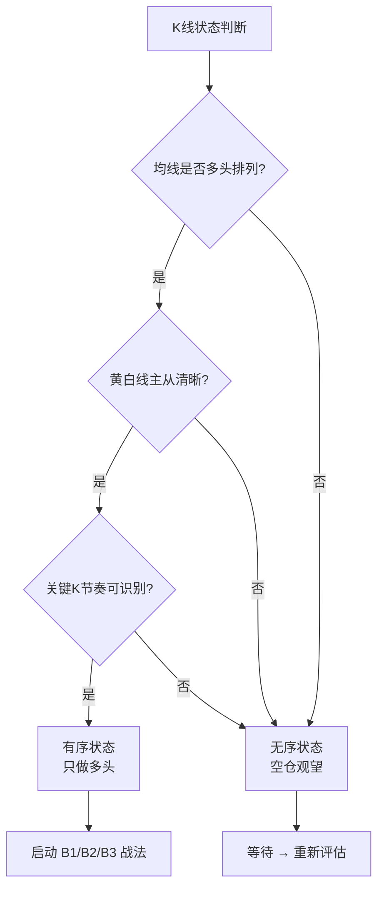

## 定义

> [!abstract] 一句话定义
> 有序与无序是 Z 哥独创的 K 线二元状态元理论:**有序 = 主力控盘 + 均线生效 + 关键 K 主导**;**无序 = 筹码松散 + 均线全废 + 散户互砍**。技术分析第一性原理是:**只做有序多头**,无序状态下所有指标失效,必须回避。

## 关键信息

### 有序状态特征
- **多周期多头排列**:周线、日线、小时线均线同向向上
- **[[白线黄线系统]] 主从清晰**:黄线(主力线)与白线(散户线)关系明确,黄上白下或黄白共振
- **[[关键K]] 节奏可识别**:有明确的 K 线信号(B1/B2/B3、单针下、砖形图等)主导走势
- **筹码集中**:[[筹码战争]] 中筹码峰收敛,主力锁仓痕迹清晰
- **均线生效**:5/10/20/60 日线作为支撑或压力清晰可辨

### 无序状态特征
- **均线纠缠**:多周期均线粘合、反复穿越,无明确多空方向
- **筹码发散**:[[筹码战争]] 筹码峰扁平化,无主力痕迹
- **K 线毫无逻辑**:阴阳线随机分布,纯散户互砍
- **指标全废**:KDJ、MACD、量价等所有技术指标在无序中完全失灵

### 三悟:从无序到有序穿越牛熊
1. **识别有序入场**:多周期共振 + 关键 K 出现 → 重仓买入
2. **识别有序退出**:均线开始走平 + 关键 K 失效 → 兑现离场
3. **识别无序回避**:均线纠缠 + 筹码松散 → 空仓观望

### 核心元规则
- "均线系统的终极奥义" = **有序时一切有效,无序时一切无效**
- 所有战法(B1/B2/B3、嘀嘀、砖形图、单针下)都建立在"有序"前提上
- 散户最大错误:**在无序状态用有序时代的指标**
- 与 [[N型结构]] 的关系:N 型是"有序"的具体形态;无序状态下没有 N 型可言

### AI 控盘时代延伸
- [[AI控盘指数论]] 让"有序"被极致放大:控盘股极致有序,非控盘股极致无序
- 1:99 分化使无序股完全废纸化,只能在 1% 控盘股里找有序
- 这反过来强化了"只做有序多头"的元规则

## 有序/无序识别流程

## 关联连接
- [[N型结构]] — 有序状态的具体形态
- [[白线黄线系统]] — 有序判断的核心工具
- [[关键K]] — 有序状态下主导节奏的 K 线信号
- [[筹码战争]] — 有序/无序的筹码侧表征
- [[AI控盘指数论]] — AI 时代有序/无序的极化放大
- [[B1建仓波]] — 有序状态下的核心买点
- [[Zettaranc]] — 元理论作者
