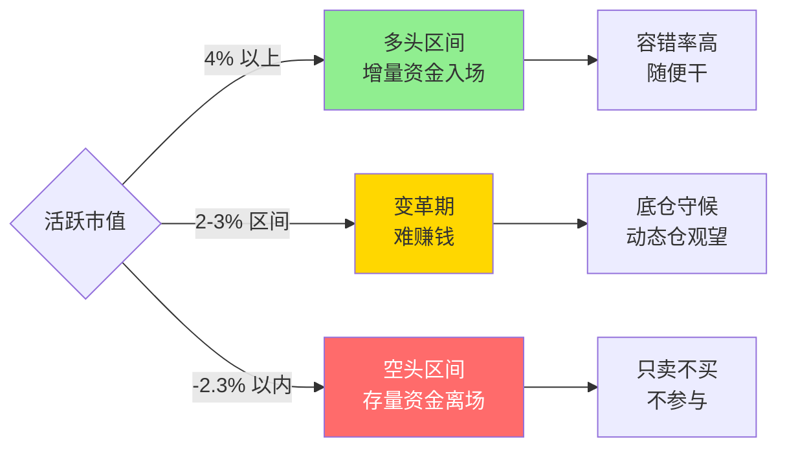

## 定义

> [!abstract] 一句话定义
> 活跃市值是判断市场多空环境的**核心择时指标**,反映增量资金入场程度,是整个交易体系的根基。Z 哥铁律:**择时永远大于选股**。

## 关键信息

### 多头区间(4% 以上)
- 场外增量资金疯狂入场
- 容错率极高,随便干
- 买错第二天可能高开回本

### 空头区间(-2.3 以内)
- 场内存量资金疯狂离场
- 易跌难涨,只卖不买
- 敢拉涨停就有人敢砸

### 核心原则
- 择时永远大于选股
- 先学会择时,再学选股,再学买卖点
- 活跃市值没有连续 2-3% 的增量资金入场时,很难赚钱(变革期)

## 多空区间决策图

> [!warning] 择时铁律
> **没有增量资金的市场不要交易** — 活跃市值跌破 -2.3% 即进入空头区间,场内只有存量博弈,任何短线信号都会失效。

## 关联连接
- [[框架式交易]] — 择时是框架的前提
- [[底仓与动态仓]] — 空头区间动态仓只卖不买
- [[顺周期轮动]] — 增量资金入场是轮动的前提
- [[少妇战法]] — 择时是少妇战法第一步
