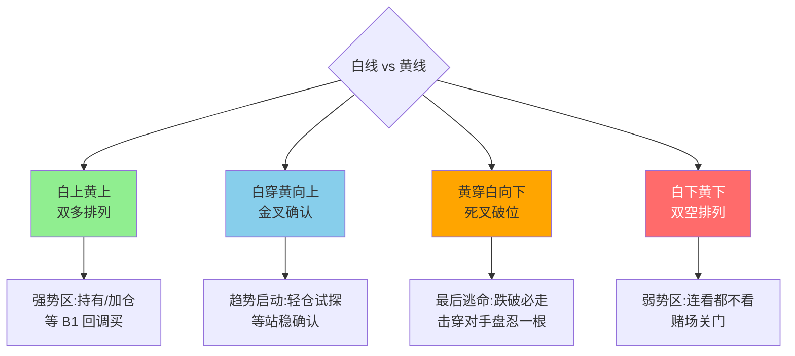

## 定义

> [!abstract] 一句话定义
> 知行趋势线是对少妇战法中 BBI 的**重大升级** — 通过白线/黄线两条趋势线的配合使用,在右侧行情中更好地把握波段机会,为买入点和止损点提供更强的现实依据。

## 关键信息
- **本质**:双线战法的趋势线系统,是少妇战法 BBI 的重大升级
- **核心**:白线(短期趋势/牵牛绳)+ 黄线(多空分界/大哥线)
- **代码原理**:两条线各有特定的计算逻辑和代码含义
- **四种情形**:白上黄上、白下黄下、白穿黄、黄穿白(不同情形对应不同操作)
- **终极 B1 选股**:将趋势线与 B1 信号结合形成终极选股代码
- **止损依据**:黄线是最终止损线,跌破且收不回必须离场

## 四种情形决策图

> [!tip] 终极 B1 选股口诀
> **白上黄上 + B1 信号 = 终极买点**;白下黄下连看都不看,等金叉再说。黄线是最后底线 — 跌破且收不回必走,不要心存侥幸。

## 关联连接
- [[双线战法]] — 知行趋势线的实战应用
- [[白线黄线系统]] — 趋势线的技术基础
- [[少妇战法]] — 趋势线升级了其中的BBI指标
- [[框架式交易]] — 基于趋势规则严格执行
