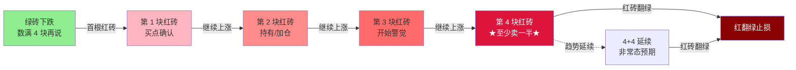

## 定义

> [!abstract] 一句话定义
> 砖形图是基于 **A 股 4 天情绪循环**的 K 线压缩图表工具,参数 4 和 6,将 K 线压缩为红砖(上涨)和绿砖(下跌),用于判断变盘点。Z 哥超短战法的底层视觉密码。

## 关键信息

### 底层逻辑
- 源自威尔斯·威尔德的 **三角洲战法(Delta)**,基于潮汐/天体循环规律
- A 股每 **4 天** 完成一次短期情绪循环,是变盘点
- 砖形图参数 4 和 6 经 A 股历史数据回测得出

### 四块砖交易体系
- **红砖上涨**:从第一块红砖开始数,数满 4 块必须减仓(至少卖一半)
- **绿砖下跌**:绝不抄底,先数 4 块再说
- 4 块砖后可能出现 4+4 趋势延续,但不作为常态预期
- 超短规则:3 天不涨就走,最多拿 4 天

### 铁律
1. 不数 K 线,只数砖
2. 红砖翻绿立刻止损
3. 股价跌破黄线立刻止损
4. 买入当天被套,次日 9:33/9:37 止损
5. 买入后 3 天不涨立刻止损

### 避坑指南
- 锤子图(长下影线)绝对不做
- 缩量涨停的庄股绝对不做
- 开盘 30 秒冲高 5 个点绝对不追
- 高开 4 个点以上不打底仓

## 四块砖循环图

> [!danger] 砖形图三大铁律
> 1. **不数 K 线,只数砖** — 砖形已过滤噪音,K 线是干扰
> 2. **红砖翻绿立刻止损** — 不要寄希望"再等一下"
> 3. **3 天不涨就走** — 占用资金的机会成本就是最大风险

## 关联连接
- [[DSZ战法]] — 基于砖形图的超短卖出战法
- [[B1建仓波]] — 与砖形图共振时是最佳买点
- [[白线黄线系统]] — 配合使用
