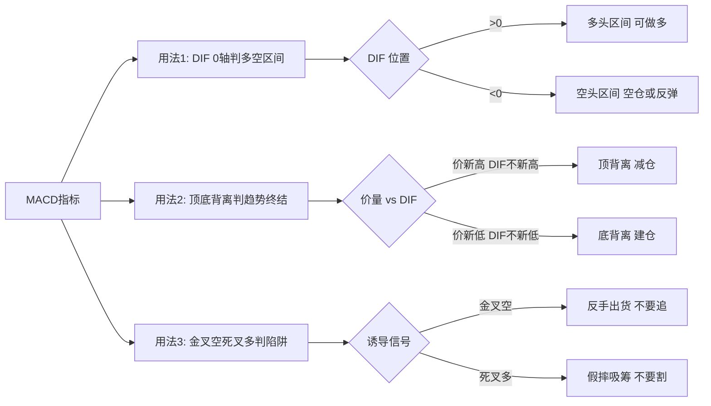

## 定义

> [!abstract] 一句话定义
> 顶底背离体系是 Z 哥 2026-04 在 4.7.2 章提出的 MACD 完整方法论 — **90% 行情是顺周期(MACD 顺向),背离仅判异常**,配合"金叉空 / 死叉多"的诱导信号识别主力陷阱。

## 关键信息

### MACD 顺周期主战场(占 90% 行情)

- **DIF 上 0 轴 + 红柱放大** = 主升浪进行中,持有不动。
- **DIF 下 0 轴 + 绿柱放大** = 主跌浪进行中,空仓或反弹做。
- 顺周期下盲目找背离 = 自找麻烦。

### 顶背离 / 底背离(占 10% 行情,判异常)

- **顶背离**:价格新高但 DIF 不创新高 → 趋势衰竭,见顶减仓。
- **底背离**:价格新低但 DIF 不创新低 → 反转在即,底部建仓。

### 金叉空 / 死叉多 — 主力最恶毒的陷阱

> [!danger] 金叉空 / 死叉多 不是入场信号,是主力陷阱
> - **金叉空**:金叉次日马上死叉的诱多 K 线结构 — 散户冲进去就被套,主力反手出货。
> - **死叉多**:死叉次日反包的诱空 K 线结构 — 散户割肉,主力假摔吸筹。
> 见到这两种结构,**反向操作**才是正解。

### 白线高危区 vs 黄线机会区

- **白线之上是高危区**:对应 MACD 顺周期顶部,临近顶背离。
- **黄线附近是机会区**:对应 MACD 底背离,反转启动点。

### 与其他体系的耦合

- 与 [[白线黄线系统]] 的强耦合:顶底背离 + 黄线战法是同一体系的两个角度(指标 vs 均线)。
- 与 [[嘀嘀战法]] 的叠加用法:嘀嘀触发时若 MACD 同时金叉空 → 强减仓信号(双重确认)。

### MACD 三大用法流程

## 关联连接

- [[白线黄线系统]] — 顶底背离 + 黄线战法是同一体系两个角度
- [[MACD三大用法]] — 顶底背离体系的工具版
- [[嘀嘀战法]] — 与金叉空叠加形成强减仓信号
- [[关键K]] — 背离需关键 K 线确认才能触发
- [[N型结构]] — 背离常出现在 N 型结构的转折点
- [[主力出货五种经典方式]] — 金叉空是其中之一
- [[Zettaranc]] — 体系的提出者
