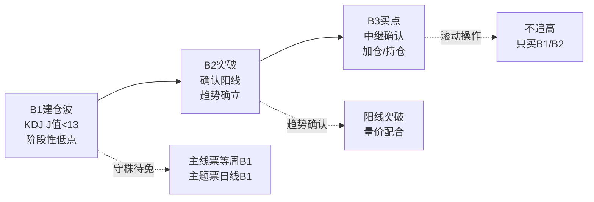

## 定义

> [!abstract] 一句话定义
> B1建仓波是识别主力建仓痕迹的核心买入信号，用于发现潜在的牛股启动点。判断标准是KDJ指标的J值（勾）必须打到13以下，不同周期的J<13对应不同级别的B1（日线/周线）。

## 关键信息

### B1的本质定义
- **B1不是"绝对底"**，是某个周期内的"阶段性低点"
- **核心指标**：KDJ的J值（勾）<13，数值越低越好（-10、-14都算）
- **周期越大信号越稳**：周线B1 > 日线B1
- **主线票**：优先等周B1，日线+周线共振最完美
- **主题票**：日线B1就够了，不要看周线（一波流过了就没了）

> [!tip] 两个30%原则（真假B1筛选）
> 1. **涨幅原则**：建仓波涨幅一般在 **30%左右**（正态分布的高概率区间）。40%以上偏多，斜率过高疑似一波流出货。
> 2. **换手率原则**：中阳线、大阳线的 **累计换手率不超过30%**（几根阳线加起来，非单根）。高于40%一律视为废B1。
>
> **背后逻辑**：建仓是主力收集筹码（筹码集中），而非对倒出货（筹码发散）。换手率过高说明筹码已多次交换，主力可能已离场。

### 建仓图形态识别
- **完美建仓图**：底部堆大量，上方量能递减；股价创新高反而缩量（筹码锁定好）
- **娜娜图**：极品建仓形态——股价创新高但阳线缩量、次高点阴线也突然缩量，说明主力还在里面没卖
- **不喜欢的形态**：
  - 跳空建仓（跳空是进攻信号，不是建仓信号）
  - 连续堆量但股价滞涨（智障无功图/蜈蚣图）
  - 高位放量上影线
  - 建仓波位置太高（底部起来已75%+）
  - 连续阶梯量放下来

> [!danger] B1后持仓纪律
> - **3天内必须恢复上涨**：低位不涨必有妖，主力不会让低位筹码停留太久
> - **3天不涨但没大跌**：最多再看1-2天，不行就减仓
> - **跌穿止损**：直接全卖，别犹豫

### B1止损方法
1. 买入K线最低点
2. 向下3-5个价位
3. 前N型结构低点
核心：幅度控制在3%以内，适合"开超市"撒网

### B1标准模型（最强B1十张图体系）

> [!tip] 从分歧到一致的信号
> 知行小菜鸟在2026年提炼出"最强B1"的标准量化模型，来源于"十张图"体系对主力建仓与洗盘的终极解构。

- **当日涨跌幅**：-2% 到 +1.8% 之间（不夸张，不引人注目）
- **当日振幅**：< 4%（窄幅震荡，主力不想暴露）
- **核心特征**：从分歧走向一致——建仓初期市场有分歧（有卖有买），但随着主力持续吸筹，卖盘越来越少，量能递减
- **标准模型**：
  1. 底部出现异动放量（主力试探性介入）
  2. 随后缩量回调（洗盘，但主力不大量卖出）
  3. 再次放量突破（主升浪启动）

### 进场点位
- B1是关键进场点之一，与 **[[B2突破]]** 同为"守株待兔"的核心买点
- 除B1/B2外，其他位置追高均无依据
- B1第二天开盘使用 [[量比战法]] 精细化建仓

## B1→B2→B3买点递进关系

## 知识冲突

> [!caution] 冲突点：J值阈值标准
> - **精水流深（202603）**：J值 < 13，数值越低越好（-10、-14都算）
> - **空谷幽兰（202601）**：在少妇战法语境下，要求J值大幅负值（-10以下）
> - **差异原因**：精水流深讲B1的通用标准（<13），空谷幽兰在少妇战法中对B1做了更严格的筛选，要求-10以下以确保更高的安全边际
> - **采用方案**：通用场景采用精水流深的 <13 标准；少妇战法/补票场景可采用 <-10 的严格标准。两者不矛盾，是不同风险偏好下的细化

## 牛市语境别名(2026 年知行小菜鸟版)

> [!info] 挖掘牛 = B1
> 在 [[牛市策略]] 叙事下,B1 等同于"挖掘牛阶段" — 主力静悄悄吸筹,媒体/散户尚未察觉,是牛市第一阶段的最佳建仓窗口。配合 [[斗牛士三属性]] 的"勇气"。
> 出处:[[三波理论]]、4.1.0 磨底不死。

## 关联连接
- [[B2突破]] — B1的确认阳线
- [[B3买点]] — B2后的中继确认
- [[超级B1]] — B1的高级形态
- [[S1信号]] — 卖出信号，与B1构成买卖闭环
- [[砖形图]] — 配合B1使用
- [[框架式交易]] — B1是框架式交易的关键进场点
- [[两个30%原则]] — B1筛选的核心量化标准
- [[娜娜图]] — 完美建仓图形态
- [[量比战法]] — B1后第二天的精细化买法
- [[三波理论]] — B1 在三波框架中即"建仓波/挖掘牛"
- [[斗牛士三属性]] — B1 对应"勇气"
- [[Zettaranc]] — 交易体系作者
