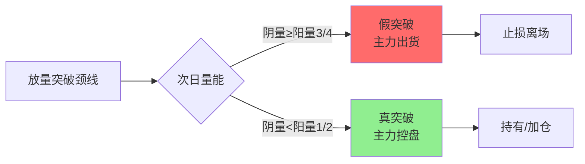

## 定义

> [!abstract] 一句话定义
> B2 是接在 B1 后面、用来**确认 B1 有效性**的阳线 — B1 只是"疑似低点",只有 B2 出现才能给 B1"盖章"。配合**五条铁律 + 三大暴力图形**才算完整 B2 战法。

## B2五条铁律(缺一不可)

| 铁律 | 标准 | 逻辑 |
|------|------|------|
| 1. 必须在B1之后 | KDJ的J值已拐头向上 | B2是B1的确认信号，无根之涨不可靠 |
| 2. 涨幅≥4% | 中长阳，差0.04%也不行 | 4%是主力力度的"坎"，低于4%说明主力意愿不强 |
| 3. 比前一日放量 | 今日量 > 昨日量（不必倍量） | 资金进场的证明，缩量说明主力没进场 |
| 4. J值 < 55 | 核心中的核心 | J>55说明拉升消耗过多动能，上方抛压重 |
| 5. 无上影线最好 | 光头阳线最佳 | 代表主力从早买到晚的决绝与自信 |

## 三大暴力图形

### 平行重炮（双枪战法）
- **形态**：两根（或多根）大阳线在**相对平行位置**放量起爆
- **主力逻辑**：主力不愿给散户低位吸筹机会，直接在平行位置再次拉放量长阳——"时不我待"
- **变种**：底部双枪（出现在阶段性低点+底部放量涨停）= 极品形态

### 灾后重建
- **形态**：连续上涨后缩量长阴短柱快速下杀15%-20%，精准打到**黄线（主力成本线）**后止跌，迅速拉放量中长阳
- **逻辑**：黄线确认了主力对成本线的有效防守，是连续拉升前最后的**极限买点**

### 跃跃欲试（红肥绿瘦）
- **形态**：横盘期间阳线多且实体长、阴线少且实体短，上涨放量下跌缩量
- **逻辑**："事不过三"，第三次或第四次放量突破往往是真实启动信号

## B1/B2/B3三件套对比

| 维度 | B1 | B2 | B3 |
|------|----|----|-----|
| **盈亏比** | 最高（底部，止损3%空间翻倍） | 次之（约2:1） | 不确定（看大盘板块） |
| **确定性** | 最低（没经过确认可能是半山腰） | 次之（真金白银买出来） | **最稳**（经过两层筛选） |
| **止损幅度** | 最小（3%以内） | 最大（前N型低点，约5%） | 看承受力（保守设最低点/激进设B2中值） |
| **持有纪律** | 3天内必须恢复上涨 | 2天内必须大幅拉升 | 不破止损就一直拿 |

> [!tip] B2止损特别提醒
> 别设B2阳线最低点（容易被洗出去），要设**之前N型结构的低点**。N型低点一旦跌穿说明底部逻辑不存在。

## B2持有纪律

- **2个交易日内必须大幅拉升**！买入当天算第1天，第2天必须涨
- 两天都没涨 → 先卖50%，第3天不涨全清
- 跌穿N型低点 → 直接全卖

## 四分之三阴量假突破识别法

> [!danger] 追突破站岗是散户最常见的死法
> 牛市突破五五开，熊市/震荡市十次突破九次假。四分之三阴量是判断突破真假的核心工具，回溯验证成功率90%+。

### 定义

突破颈线位的**放量阳线**次日，收阴线且阴量约为前一天阳量的 **1/2 ~ 3/4** → 大概率**假突破**。

### 判断四步法

1. **识别有效突破**：放量阳线站上颈线位，成交量比近期均量大50%+
2. **观察次日走势**：重点看K线形态和成交量
3. **量能对比下结论**：
   - 阴量 ≈ 阳量的3/4 → **假突破**，立刻设止损
   - 阴量 < 阳量的1/2 → **真洗盘**，可持有甚至加仓
4. **止损执行**：止损位设在次日阴线最低点，跌破即走

### 底层逻辑

- **真突破**：主力控盘 → 洗盘必缩量（散户筹码少，卖不出大成交量）→ 阴量应远小于阳量
- **假突破**：主力诱多 → 次日趁接盘出货 → 阴量不缩（主力在卖）→ 四分之三阴量

### 不同市场环境

| 环境 | 真突破概率 | 策略 |
|------|-----------|------|
| 牛市 | 较高（~50%） | 出现四分之三阴量先离场，确认真突破再回来 |
| 熊市/震荡市 | 极低（~10%） | 宁错过不做错，出现即止损，不追高 |

## 关联连接

- [[B1建仓波]] — B2是B1的确认信号，必须先有B1
- [[B3买点]] — B3是B2之后的中继接力点
- [[三波理论]] — B1/B2/B3是建仓波→拉升波→冲刺波的叙事框架
- [[双枪战法]] — 平行重炮的另一种叫法
- [[暴力K]] — B2中涨幅≥4%中长阳的典型表现
- [[量比战法]] — B2确认日的量比辅助判断
- [[白线黄线系统]] — 真假突破的辅助判断工具
- [[两个30%原则]] — B1筛选标准，与B2确认形成完整链条
