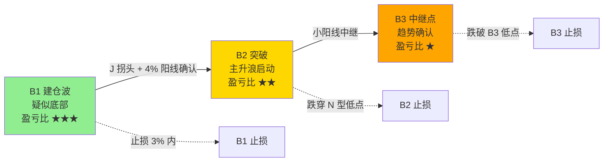

## 定义

> [!abstract] 一句话定义
> B3 是 B2 之后的**趋势中继确认点**,代表上涨趋势没有被破坏 — B1→B2→B3 三件套的最后一环。**确定性最高,但盈亏比最低**(成本最高)。

## 关键信息
- **定义**:B2 放量中长阳确认后,再出现一根小阳线(不管缩量放量,只要保持上涨)即为 B3
- **三件套铁律**:B1→B2→B3 必须依次出现,一个确认一个,缺一不可
- **按确定性排名**:B3 > B2 > B1(经过两层筛选,主力控盘强)
- **按盈亏比排名**:B1 > B2 > B3(B3 成本最高,盈亏比不确定)
- **持仓纪律**:不破 B3 最低点(或 B2 大阳线中值)就一直拿,要有钝感力
- **止损**:保守派设 B3 阳线最低点,激进派设 B2 大阳线中间值
- **建仓**:2w 一个仓位,当天不能高开太多,平开最佳(说明多头守住趋势)

## B1B2B3 三件套信号链

> [!tip] B1/B2/B3 选谁
> **小资金高弹性 → B1**(盈亏比高,止损浅);**稳健资金 → B2**(确认后再上车);**追涨型资金 → B3**(确定性最高,但需要钝感力)。

## 牛市语境别名(2026 年知行小菜鸟版)

> [!info] 不得不发牛 = B3
> 在 [[牛市策略]] 叙事下,B3 等同于"不得不发牛阶段" — 加速拉升,情绪沸腾,主力开始派发。是 [[斗牛士三属性]] "决心"的考验:决心减仓而非加仓。
> 出处:[[三波理论]]、431 挥杆与持仓。

## 关联连接
- [[B1建仓波]] — 三件套的起点
- [[B2突破]] — B3的前置确认
- [[双枪战法]] — B2后的小十字星即B3
- [[三波理论]] — B3 在三波框架中即"冲刺波/不得不发牛"
- [[斗牛士三属性]] — B3 对应"决心"(决心减仓)
