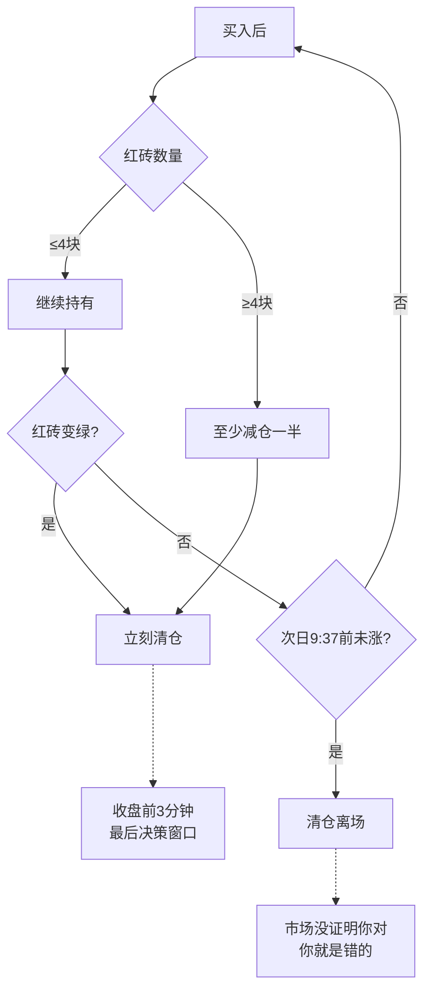

## 定义

> [!abstract] 一句话定义
> DSZ（砖形图）战法是基于砖形图的超短线卖出战法，核心是三条不可逾越的卖出铁律，用"数砖"的方式量化持仓风险。

## 关键信息

> [!danger] 三条铁律
> 1. **数完四块红砖必须减仓**：至少卖一半，红砖变绿立刻走，不做4+4
> 2. **收盘前三分钟红砖变绿立刻走**：覆盖所有持仓情况，是最后决策窗口
> 3. **买入后不涨次日9:37前清仓**：市场没证明你对，你就是错的

### 止损设置
- 买入当天被套：止损位设在买入K线最低价往下3-5个价位
- 跌破止损位立刻卖，不等收盘确认

### 选股标准
- 只做N型结构（下跌-下蹲-爆发）
- 白线之上，黄线在白线之上
- 长上影线的票不买
- 跳空的票不做
- 三波不做（走了两波上涨的第三波不碰）

## DSZ卖出决策流程

## 关联连接
- [[砖形图]] — DSZ的底层工具
- [[S1信号]] — 补充卖出信号
- [[四块砖交易体系]] — DSZ的上层理论
