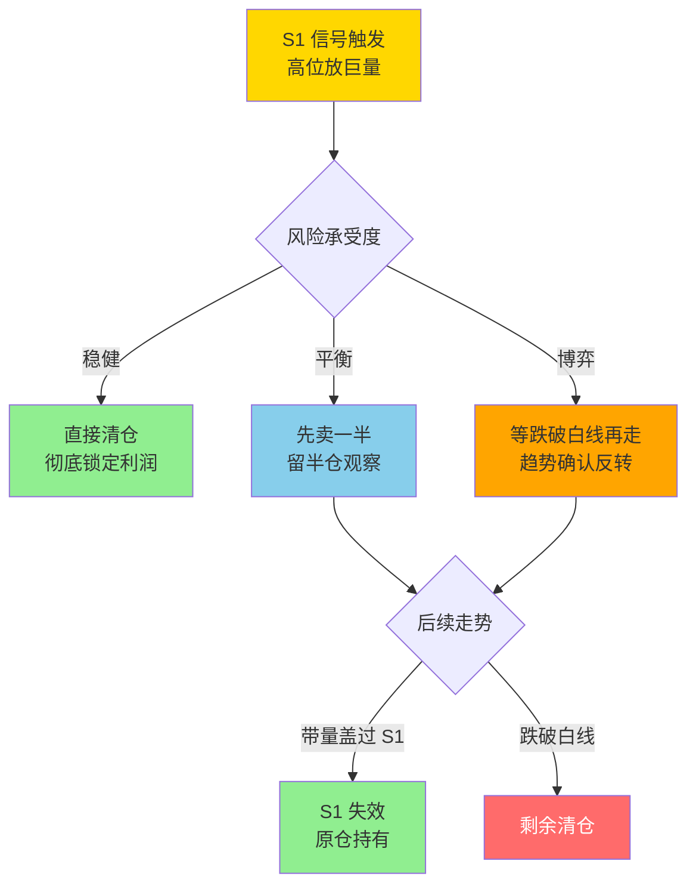

## 定义

> [!abstract] 一句话定义
> S1 信号是阶段性顶部的**预警信号** — 高位放巨量的 K 线(无论阴阳)提示主力可能在出货。Z 哥心法:**宁可信其有,不可信其无**。

## 关键信息

### 识别标准
- 在相对高位出现不该放的量(放巨量)
- 无论是阳线还是阴线,只要在高位放量就是预警
- 放量后股价滞涨更是确认信号

### 处理方式
1. **先卖一半**:锁定一半利润,留一半观察
2. **跌破白线再走**:等趋势确认反转再离场
3. **直接清仓**:彻底锁定利润

### 例外情况
- 如果后续股价带量把 S1 放量阴线"盖过去",S1 信号失效
- 但对于普通交易者,一律按 S1 处理最稳妥

### 核心原则
- **宁可信其有,不可信其无**
- **控制风险永远是第一位的,不要赌**
- 半仓放飞策略配合 S1 使用效果最佳

## S1 三档处理决策图

> [!danger] S1 优先级最高
> S1 是整个体系**优先级最高的保命信号** — 比 MACD、比砖形图、比任何买点信号都高。看到 S1 不要找理由,先卖再说。

## 关联连接
- [[B1建仓波]] — 买入信号，与S1构成买卖闭环
- [[半仓放飞策略]] — 遇到S1时的持仓管理方法
- [[白线黄线系统]] — S1配合趋势线使用
- [[DSZ战法]] — S1是卖出规则的重要补充
