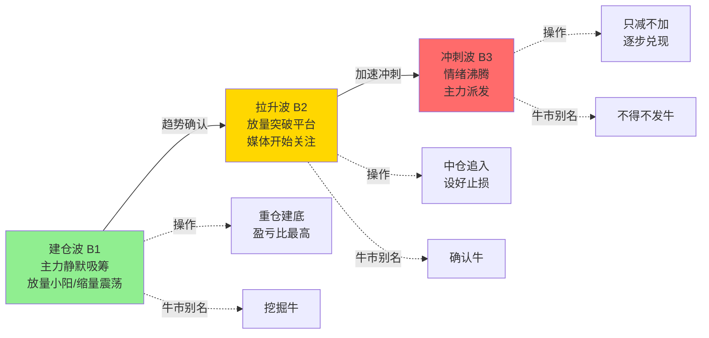

## 定义

> [!abstract] 一句话定义
> 三波理论是 Z 哥对 [[B1建仓波]]/[[B2突破]]/[[B3买点]] 的叙事化总框架:**建仓波(最安全) → 拉升波(谨慎追) → 冲刺波(别碰)**。是大富翁小菜鸟"路径规划第二阶段"的核心知识点,也是 B1B2B3 信号体系的高阶语义层。

## 关键信息

### 三波递进结构
- **建仓波 = B1**(最佳建仓)
  - 主力安静吸筹,放量小阳/缩量震荡
  - 散户最佳入场点,盈亏比最高
  - 操作纪律:重仓建底
- **拉升波 = B2**(谨慎追入)
  - 主力开始拉升,放量突破前期平台
  - 可追入但需仓位控制
  - 操作纪律:中等仓位,设好止损
- **冲刺波 = B3**(只减不加)
  - 加速拉升后段,情绪过热
  - 主力开始派发,散户最容易追高被套
  - 操作纪律:**只减不加**,逐步兑现

### 关键说明
- 三波之间**不是必经关系**:可能 B1 直接到 B3,跳过 B2
- 也可能反复出现 B1(主力多次洗盘),需结合 [[N型结构]] 判断
- 三波理论 ≠ 艾略特波浪(澄清):
  - **三波理论**:主力行为驱动(吸筹→拉升→派发)
  - **艾略特波浪**:心理周期驱动(5 浪上 + 3 浪下)
  - 二者维度不同,不可混用

### 牛市叙事化别名
三波理论与 [[牛市策略]] 的牛市三阶段是**同一信号体系**的不同语境表达:
- **挖掘牛 = B1 = 建仓波**
- **确认牛 = B2 = 拉升波**
- **不得不发牛 = B3 = 冲刺波**

### 与其他体系的关系
- 与 [[N型结构]]:N 型上涨段对应 B2/B3,横盘段对应 B1
- 与 [[嘀嘀战法]]:嘀嘀信号常出现在 B1→B2 的过渡区
- 与 [[斗牛士三属性]]:勇气(建仓)、技巧(拉升)、决心(冲刺减仓)三层心法对应

## 三波递进与操作纪律

## 关联连接
- [[B1建仓波]] — 建仓波 / 挖掘牛
- [[B2突破]] — 拉升波 / 确认牛
- [[B3买点]] — 冲刺波 / 不得不发牛
- [[N型结构]] — 三波在 N 型中的具体定位
- [[嘀嘀战法]] — 配合三波使用的过渡信号
- [[牛市策略]] — 三波在牛市叙事中的别名版本
- [[斗牛士三属性]] — 三波对应的心法三层
- [[Zettaranc]] — 三波理论提出者
