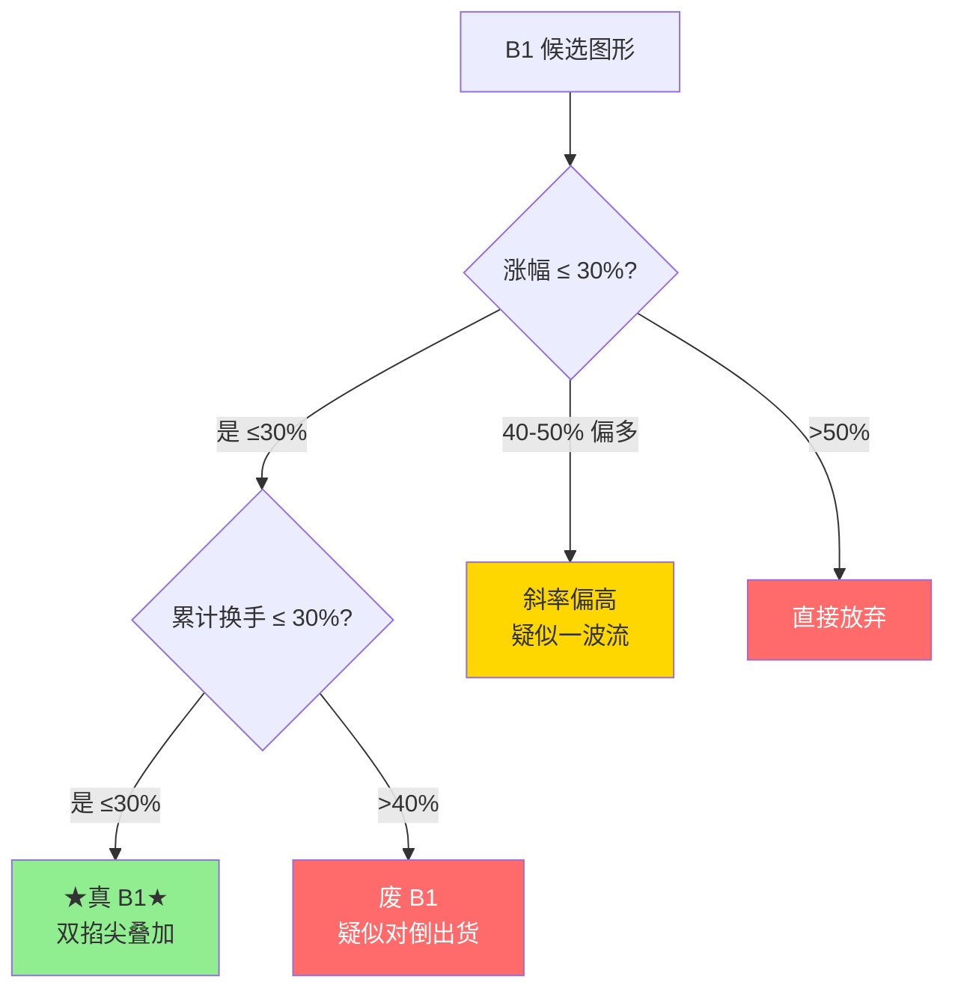

## 定义

> [!abstract] 一句话定义
> 两个 30% 原则是筛选真假 B1 建仓波的**两个量化标准**,基于正态分布规律得出 — 涨幅 30% + 累计换手率 30%,双掐尖叠加确认。

## 关键信息

### 涨幅30%
- 建仓波涨幅一般在 30% 左右(正态分布大概率区间)
- 40% 以上偏多,斜率高疑似一波流
- 50% 以上直接放弃

### 换手率30%
- 中阳线、大阳线的累计换手率不超过 30%(几根加起来)
- 高于 40% 视为废 B1
- 背后逻辑:建仓是收集筹码,不是对倒出货

### 双掐尖效应
- 两个条件同时满足,成功概率叠加

## 双掐尖筛选图

> [!tip] 双掐尖逻辑
> 30% 涨幅 + 30% 换手 = 主力收筹但未对倒。任何一个超标都说明结构变质,优先放弃。

## 关联连接
- [[B1建仓波]] — 应用对象
- [[娜娜图]] — 完美建仓形态
- [[Zettaranc]] — 交易体系作者
