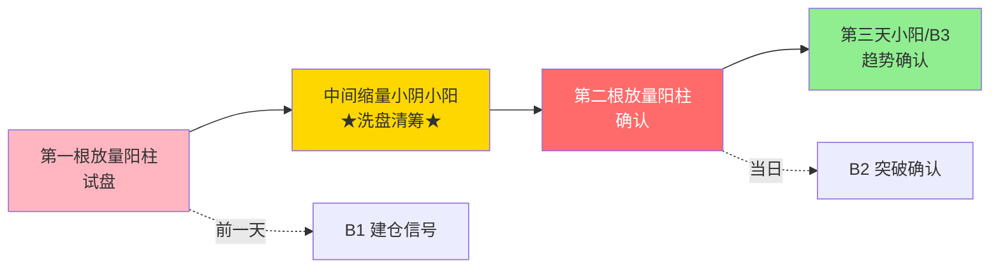

## 定义

> [!abstract] 一句话定义
> 双枪战法是**两根放量阳柱中间夹一堆缩量阴线**的图形形态,本质是主力建仓的确认信号 — 第一根试盘、中间洗盘、第二根确认。

## 关键信息
- **图形特征**:两根放量阳柱,中间夹大量缩量小阴小阳
- **核心逻辑**:第一根放量是试盘,中间缩量是洗盘,第二根放量是确认
- **与 B1B2B3 的关系**:第二根放量阳柱前一天是 B1,紧接着 B2 确认,最强的是第三天小阳线/B3 确认
- **确定性排序**:阳线 B3 > 阴线 B3(阳线确认性更高)
- **止损**:完美图形设白线为止损,大盘暴跌允许被误杀下来但第二天直接反包
- **完美案例**:世运(标准双枪 + 完整 B1B2B3 确认)

## 双枪图形结构

> [!tip] 双枪 = B2 的别名
> 双枪战法本质是 [[B2突破]] 的"平行重炮"形态 — 两根阳柱在相对平行位置放量起爆,主力"时不我待"。

## 关联连接
- [[B1建仓波]] — 双枪图形中的第一次买点
- [[B2突破]] — 双枪图形的确认阳线
- [[B3买点]] — 双枪图形的中继确认
- [[呼吸结构]] — 中间缩量的洗盘节奏
