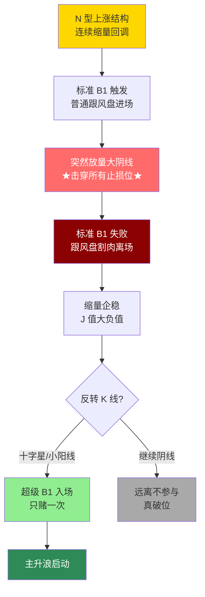

## 定义

> [!abstract] 一句话定义
> 超级 B1 是 B1 战法的**高级形态** — N 型上涨中缩量回调到极致后,突然放量下跌击穿所有止损位,再继续缩量企稳且 J 值大负值。这是**主升浪启动前的终极洗盘**。

## 关键信息
- **核心逻辑**:通过空间和时间双重折磨,逼迫所有跟风盘离场,清空不坚定筹码
- **形态特征**:
  1. N 型上涨结构中连续缩量回调
  2. 突然出现放量破位大阴线(击穿止损位)
  3. 继续缩量企稳,J 值出现大负值
  4. 可能伴随反转小十字星确认
- **只赌一次**:不可重复博弈,以放量下跌 K 线最低点或更前 N 型低点为止损
- **破位阴线不急着进**:等反转 K 线(小十字星)确认 N 型底部
- **止损必须坚决**:越是"超级"的 B1,越考验严格止损能力
- **心理层面**:让所有按标准 B1 买入的投资者怀疑人生,只有理解主力意图的资金才能坚持

## 超级 B1 极致洗盘流程图

> [!danger] 超级 B1 心理铁律
> 超级 B1 = **让所有按标准 B1 买入的人怀疑人生** — 主力故意击穿止损位制造恐慌。如果你拿不住前一波的标准 B1 止损,就别想吃到超级 B1 这口肉。**先服从纪律止损,才有资格再上车。**

## 关联连接
- [[B1建仓波]] — 超级B1的基础形态
- [[呼吸结构]] — 超级B1的量价前提
- [[交易心理]] — 极致洗盘的心理博弈
- [[筹码战争]] — 收集筹码的终极手段
