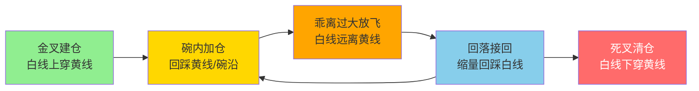

## 定义

> [!abstract] 一句话定义
> 双线战法是少妇战法的 **Pro 版升级** — 通过白线(短期趋势线/BBI)和黄线(多空分界线/大哥线)的配合使用,在强趋势行情中把握完整波段。**铁律:只做白线在黄线之上的票**。

## 关键信息
- **白线(牵牛绳)**:原 BBI 线,负责跟踪短期情绪,流畅波段中一般不会被跌破
- **黄线(大哥线)**:多空分界线,是主力入场标志和极限洗盘位
- **铁律**:只做白线在黄线之上的票,黄线之下的上涨都是耍流氓
- **金叉**:白线金叉黄线 = 上涨趋势确立,可买入(概率大,非 100%)
- **死叉**:白线死叉黄线 = 主力弃盘,最后离场时机
- **"黄金碗"**:白线与黄线之间的区域,N 型上涨中掉进碗里就可以买
- **极致买点**:放量金叉后缩量回踩黄线,往往是连续拉升前的最后震仓
- **循环操作**:金叉建仓→碗内加仓→乖离过大放飞→回落接回→死叉清仓

## 双线循环操作图

> [!tip] 黄金碗心法
> 白线和黄线之间形成的"碗"是最佳加仓区 — 掉进碗里就买,出了碗(死叉)就走。**循环操作的核心:乖离过大要放飞,回落接回再加仓。**

## 关联连接
- [[知行趋势线]] — 双线战法的趋势线体系
- [[白线黄线系统]] — 技术工具层面的双线指标
- [[少妇战法]] — 双线战法是在此基础上的升级
- [[B1建仓波]] — 碗内的具体买点
- [[半仓放飞策略]] — 乖离过大时的减仓策略
