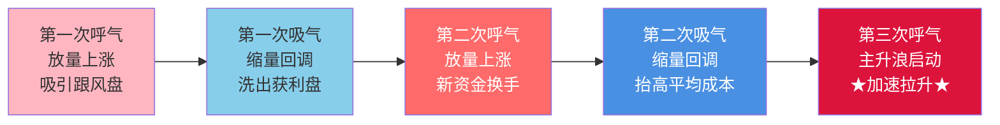

## 定义

> [!abstract] 一句话定义
> 呼吸结构是股价在 N 型上涨过程中的**量价节奏** — 放量上涨(呼气)→ 缩量回调(吸气)→ 再放量上涨(呼气)。这是主力资金运作的自然呼吸,也是"麒麟会"换手抬高跟风盘成本的密码。

## 关键信息
- **本质**:麒麟会通过呼吸式拉升,让外盘交换筹码,不断抬高跟风盘的成本价
- **运作机制**:
  1. 第一波拉升吸引跟风盘
  2. 回调洗盘让获利盘出局
  3. 新资金换手提高市场平均成本
  4. 收集足够筹码后开启主升浪
- **缩量难作假**:放量可以对倒作假,缩量意味着多空平衡,无法人为制造
- **N 型上涨找缩量**:缩量代表卖盘枯竭,稍微有人买就涨
- **N 型下跌找放量**:下跌缩量意味着买盘枯竭,不能碰
- **结构大于量能**:只要 N 型结构保持完美(底高顶高),高位放量也可能是换手

## 呼吸节奏图

> [!tip] 呼吸结构核心心法
> **N 型上涨找缩量,N 型下跌找放量** — 缩量难作假,是判断主力意图的金标准。结构 > 量能:N 型完美的高位放量也可能是换手不是出货。

## 关联连接
- [[超级B1]] — 极致洗盘后的买点
- [[B1建仓波]] — 呼吸结构中的低吸点
- [[四块砖交易体系]] — 4天情绪循环的呼吸节奏
- [[N型结构]] — 技术分析的基础形态
