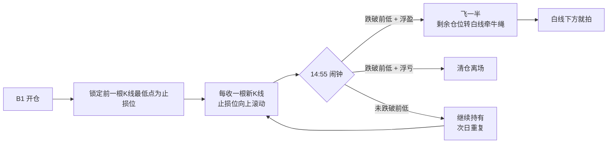

## 定义

> [!abstract] 一句话核心定义
> 嘀嘀战法是 Z 哥独创的 [[B1建仓波]] 执行层动态止损战法,核心是"嘀=止损 / 嘀=止盈"的双信号机制——以 B1 开仓后前一根 K 线最低点作为动态滚动止损位,爆发减仓后剩余仓位用 [[白线黄线系统|白线]] 牵牛绳,把"何时下车"这件事彻底机械化。

## 关键信息

### 拼写正名
Z 哥原文统一使用"**嘀嘀**"(双"嘀")作为标准拼写,粉丝群里常见的"滴滴"是俗写。本 Wiki 沿用 Z 哥原版拼写。

### 动态止损位:前一根 K 线最低点
B1 开仓后,把止损位锚定在**前一根 K 线的最低点**,每收一根新 K 线,止损位就向上滚动一次(只上移、不下移)。这一规则把"主观恐慌"压缩成一根 K 线幅度的客观信号。

> [!tip] 实操要点
> - 止损位只滚动上移,绝不下移(防"被假摔骗下车"则参考 [[SB1假摔战法]] 三铁律)
> - 最大回撤被锁死在"前一根 K 线幅度"以内
> - 适用于 B1 开仓后的持有阶段,不适用于追高接力

### 14:55 闹钟纪律(TANGOO 版本)
TANGOO 笔记给出的执行版:**尾盘 14:55 设闹钟**,统一在收盘前 5 分钟做判断:
- **跌破前低**:浮盈飞一半(锁定利润),浮亏直接清仓
- **未跌破**:继续持有到次日

这一条把"嘀嘀"从理论降维成可执行的闹钟程序。

### 爆发减仓后的白线牵牛绳
当 B1 兑现"爆发"后,先按 [[半仓放飞策略]] 减半,**剩余仓位改用 [[白线黄线系统|白线]] 作为止损依据**——白线下方就拍。这一步把"嘀嘀"从短线动态止损平滑切换到趋势级跟踪。

### 盈亏同源心法
Z 哥反复强调:嘀嘀战法的盈和亏来自同一个机制——**靠系统赚钱,也会因违背系统亏钱**。最大单次损失被严格框死在"前一根 K 线幅度"内,这是战法能长期跑赢的数学基础。

> [!danger] 风控铁律
> - 止损位只能上移,不能下移
> - 14:55 闹钟到点必须执行,不许"再看一眼"
> - 违背系统的盈利是负债,迟早连本带利还回去

## Mermaid 流程图

## 关联连接
- [[B1建仓波]]
- [[白线黄线系统]]
- [[半仓放飞策略]]
- [[关键K]]
- [[盈亏比与胜率]]
- [[SB1假摔战法]]
- [[Zettaranc]]
