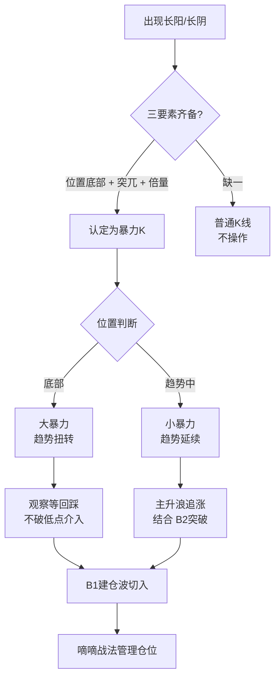

## 定义

> [!abstract] 一句话核心定义
> 暴力 K 是 [[关键K]] 的高阶形态——出现在**底部、突兀、伴随倍量/天量**的破坏性长阳或长阴,是趋势扭转或主升浪启动的"战术冲锋"信号,等同于主力在 K 线图上摔出的明牌。

## 关键信息

### 必要条件三件套
一根 K 线被定性为"暴力 K",必须同时具备:
1. **位置在底部**:相对前期累计跌幅充分(顶部破坏性长阴另算)
2. **突兀**:打破前期 K 线节奏,与前几根明显不同步
3. **倍量 / 天量**:量能至少是前期均量 2 倍以上,极端可达天量(详见 [[倍量柱]])

> [!tip] 实操要点
> - 三要素缺一不可,缺位置就是普通放量 K,缺倍量就是普通长阳
> - 暴力 K 当日不追,等回踩不破其 50% 位置或低点再出手
> - 配合 [[B1建仓波]] / [[B2突破]] 节点效果最佳

### 大暴力 vs 小暴力
| 维度 | 大暴力 | 小暴力 |
|---|---|---|
| 位置 | 底部、长期下跌后 | 趋势中、回踩后 |
| 量能 | 倍量到天量 | 倍量为主 |
| 含义 | **趋势扭转**(从空头转多头) | **趋势延续**(主升浪加速) |
| 操作 | 观察等回踩,不追 | 可直接追,主升浪追涨 |

### 价值三阶
Z 哥从战略价值层面把暴力 K 划分为三阶:
1. **趋势扭转**:在底部出现,从根本上改变方向(对应大暴力)
2. **趋势改变**:在中继位置出现,改变运行节奏(从震荡转单边)
3. **趋势延续**:在主升浪中出现,加速既有方向(对应小暴力)

> [!info] 一根暴力 K 的"暴力"程度,不取决于阳线长度,而取决于它打破了多大尺度的旧节奏。

### 迈为案例:6 阶段完整样本
TANGOO 笔记给出迈为科技作为典型样本,完整呈现底部暴力 K → 回踩 → 二次确认 → 主升 → 中继暴力 → 加速六个阶段,是研究暴力 K 实战的最佳教科书案例(详见 sources)。

> [!danger] 风控铁律
> - **不追当天**:暴力 K 当日已被市场充分识别,追入即站岗;Z 哥铁律是等回踩
> - **跌破暴力 K 低点 = 战法作废**:无条件按 [[嘀嘀战法]] 离场
> - **没有倍量的"长阳"不是暴力 K**:量能是暴力 K 的唯一身份证

### 核心心法："莫名其妙"的突兀感（知行小菜鸟 2026-01）
- 最好的暴力K线，往往没有明确利好消息配合
- 越土越好，越看不懂越好
- **让你感到害怕的位置，才是安全的位置**——当所有人都恐慌割肉时，盘面最轻，主力只需花很少钱就能拉出大阳线
- 主力不是在反人性，主力是在看盘面

### 选股四要素（极简执行清单）
1. **位置**：必须是底部（绝对底部或相对底部），绝不在高位使用
2. **力度**：倍量柱是标配，量能越大越好，"平地惊雷"
3. **形态**：阳线实体越大越好，最好光头光脚涨停板
4. **心理**：莫名其妙——出现的时间点和位置让你感到意外

### 警惕"阶梯量"
- 股价上涨但成交量像下台阶一样一根比一根低
- 意味着主力边拉边撤或买盘动能不足
- 应对：底部买入的看到阶梯量可减仓；做B1突破看到前几根阶梯量下来，B1可能要失败

### 黄线铁律
- 股价在黄线之下，暴力K也定义为"反弹"或"建仓"，不重仓参与
- 只有白线稳稳站上黄线且黄线走平或上翘，才是趋势延续的黄金击球点

### 空谷幽兰：完美图形的稀缺性
- 完美的暴力K图形（低位+倍量+无长上影+板块共振）如"空谷幽兰"般稀缺
- 每天复盘能找到一两个就不错了
- 找不到就休息，千万别在"烂图"里找机会

## Mermaid 流程图

## 知识冲突

> [!caution] 与 [[关键K]] 的差异
> 所有暴力 K 都是关键 K,但不是所有关键 K 都是暴力 K。关键 K 强调"位置 + 量能 + 实体"三要素的**临界状态**,暴力 K 在此基础上额外要求**底部 + 突兀 + 倍量**的"破坏性强度"。可以把暴力 K 理解为关键 K 的"满配版"。

## 关联连接
- [[关键K]]
- [[倍量柱]]
- [[B1建仓波]]
- [[B2突破]]
- [[嘀嘀战法]]
- [[Zettaranc]]
