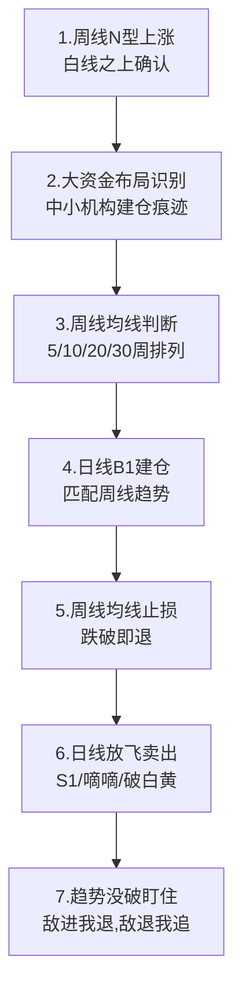

## 定义

> [!abstract] 一句话定义
> 波段战法关键 7 步是 Z 哥在 2026-02-19 直播中首次系统化提炼的中线波段 SOP——以**周线决定趋势/格局、日线决定时机/止损**为核心,从识别中小机构建仓痕迹一直到趋势没破"敌进我退/敌退我追"的完整动作树。

## 关键信息

### 7 步完整 SOP

### 7 步详细分解

| 步骤 | 动作 | 关键工具 | 决策标准 |
|---|---|---|---|
| **1.趋势识别** | 周线 N 型上涨判定 | [[N型结构]]、白线 | 高点/低点不断抬高,价格在白线之上 |
| **2.建仓痕迹** | 大资金布局检测 | 周线异动、量价 | 持续放量回踩缩量,中小机构建仓特征 |
| **3.均线确认** | 周线均线多头排列 | 5/10/20/30 周线 | 至少 3 条均线已转头向上 |
| **4.B1 建仓** | 日线 B1 入场点 | [[B1建仓波]]、KDJ J<13 | 与周线趋势同向的日线 B1 |
| **5.止损位** | 周线均线作为离场底线 | 周线均线 | 周线收盘跌破关键均线即止损 |
| **6.止盈卖出** | 日线放飞卖出信号 | [[S1信号]]、[[嘀嘀战法]] | 日线 S1 或破白黄线触发 |
| **7.趋势跟踪** | 敌进我退 / 敌退我追 | 砖形图、N 型 | 周线趋势不破就持有,加仓在回踩 |

### "看长做短"双周期分工

> [!tip] 双周期决策原则
> - **周线**:决定**做不做**(趋势/格局),决定止损位
> - **日线**:决定**何时做**(时机/进出场点位)
> - 周线不漏 → 不踏空大趋势;日线灵活 → 不被短期波动干扰

### 三种波段方式对比

| 方式 | 难度 | 时间成本 | 推荐度 |
|---|---|---|---|
| **左侧低估** | 高 | 输时间不输钱(年单位) | 不推荐 |
| **超跌反弹** | 极高 | 走横后反弹 | 仅老手 |
| **右侧主升浪** | 中 | N型白线之上,主推 | ⭐⭐⭐ |

## 进场条件
- **必须**:周线 N 型上涨、白线之上、日线 B1 信号同步
- **优先级**:看长做短 > 单纯日线 B1
- **替代关系**:与 [[少妇战法]] 同为中线 SOP,前者周日双周期,后者更聚焦日内 B1

## 关联连接
- [[少妇战法]] — 同为完整 SOP,本战法更突出周日双周期分工
- [[N型结构]] — 第 1 步的核心识别工具
- [[B1建仓波]] — 第 4 步的入场信号
- [[白线黄线系统]] — 周线趋势的判定基础
- [[嘀嘀战法]] — 第 6 步的日线卖出落地
- [[四不原则]] — 第 7 步"敌进我退/敌退我追"的心法对应
- [[择时大于选股]] — 第 1-3 步对应"择时优先"
- [[长线交易操作手册]] — 该 SOP 是其中线版本
- [[Zettaranc]] — 战法作者
