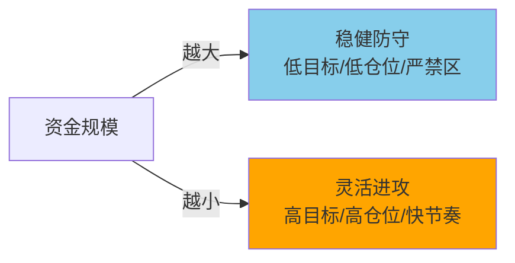

## 定义

> [!abstract] 一句话定义
> 资金规模越小，盈利目标越高、操作越灵活进攻；资金规模越大，盈利目标越稳健、侧重风险防控。不同资金量有不同的仓位配比、止损标准和禁区。

## 五档资金规模执行清单

### 第一档：5000万+（机构级）

| 维度 | 标准 |
|------|------|
| **盈利目标** | 大于无风险收益率(1.8%)，超额由市场决定 |
| **仓位策略** | 长线满仓+分批建仓/止盈，优先指数增强型ETF+低波动蓝筹 |
| **单票上限** | ≤20% |
| **止盈线** | 年化20%-30%主动止盈 |
| **禁区** | 禁追涨停板/高波动小票/杠杆/紧缩周期重仓 |

### 第二档：500-1000万（中大型）

| 维度 | 标准 |
|------|------|
| **盈利目标** | 年化10-20% |
| **仓位策略** | 底仓60-70%(低波动核心资产) + 动态仓30-40%(主线波段) |
| **止损** | 单票最大亏损≤5%，买入K线低点下3-5价位 |
| **禁区** | 禁日换手率>50%小票/盲目抄底高位破位/单一板块>40%/杠杆 |

### 第三档：300-500万（中型）

| 维度 | 标准 |
|------|------|
| **盈利目标** | 年化20-30% |
| **仓位策略** | 底仓50%(港股大科技+A股券商) + 动态仓50%(A股波段) |
| **执行要点** | 宽松周期不空仓，紧缩周期降仓至20%以下；动态仓参与券商/有色周线B1 |
| **禁区** | 禁满仓短线/无基本面题材/股权质押率>50%/忽视季度复盘 |

### 第四档：100-300万（中小型）

| 维度 | 标准 |
|------|------|
| **盈利目标** | 年化30-50% |
| **仓位策略** | 底仓40-50%(宁子/队长等) + 动态仓50-60%(分2-3份轮动) |
| **执行要点** | 上涨满仓/横盘低吸高抛/下跌空仓；盈利达30%提取本金用利润操作 |
| **禁区** | 禁短线做成长线/重仓单一小票(≤动态仓50%)/忽视止损/追热门题材 |

### 第五档：50-100万（小型）

| 维度 | 标准 |
|------|------|
| **盈利目标** | 年化50-70% |
| **仓位策略** | 底仓50%(台子/宁子等) + 动态仓50%(波段) |
| **执行要点** | 聚焦确定性强的板块机会 |

### 第六档：10万以下（微型）

| 维度 | 标准 |
|------|------|
| **盈利目标** | 年化70-100% |
| **仓位策略** | 可满仓动态，灵活进攻 |
| **执行要点** | 专注1-2个最熟悉的板块，快进快出 |

## 核心规律

- **底仓比例**：资金越大底仓越重(60-70%)，资金越小底仓越轻(40-50%)
- **止损严格度**：所有规模都必须止损，但大资金止损幅度更窄
- **禁区扩展**：资金越大禁区越多（杠杆/小票/追高），资金越小越灵活

## 关联连接
- [[底仓与动态仓]] — 底仓+动态仓是所有资金规模的通用框架
- [[开超市策略]] — 中大型资金的分散配置方法
- [[交易松紧手]] — 多头手松/空头手紧的仓位纪律
- [[空仓策略]] — 下跌阶段的核心防守动作
- [[防守哲学]] — 所有资金规模的底层哲学
- [[新曼城阵容]] — 核心资产配置的参考模型
