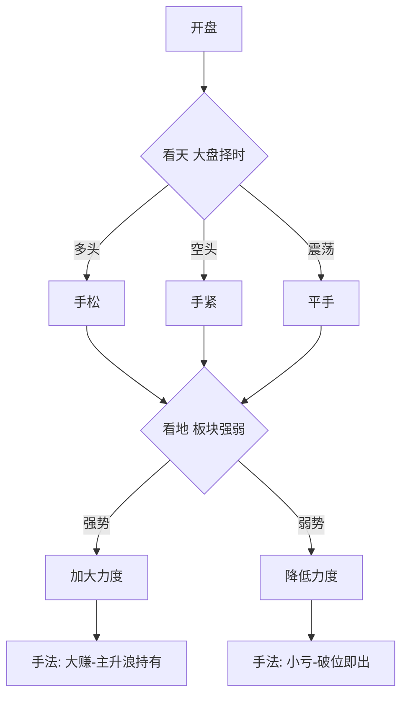

## 定义

> [!abstract] 一句话定义
> 交易松紧手是 Z 哥借自德州扑克的仓位 / 选股纪律比喻 — **多头趋势"手松"(B1B2B3 补票全开、80-100 仓);空头趋势"手紧"(只 B1、0-50 仓、扥起就卖)**,核心是用择时调节激进度。

## 关键信息

### 三看维度

- **看天**(大盘择时):多头手松 / 空头手紧 / 震荡平手。
- **看地**(板块 / 个股):热点强势手松 / 弱势手紧。
- **手法**:大赚=手松+主升浪持有;小亏=手紧+破位即出。

### 松手 vs 紧手对照

| 维度 | 手松(多头) | 手紧(空头) |
|---|---|---|
| 仓位 | 80-100% | 0-50% |
| 战法 | B1+B2+B3+补票全开 | 只做 B1 |
| 持仓周期 | 主升浪持有 | 扥起就卖 |
| 心态 | 容忍小回调 | 见风就跑 |

### 知行小菜鸟版本的硬指标（2026-01）

#### 手紧判断信号
- **大盘在黄线之下**：存量博弈/内部充分博弈，没有增量
- **活跃市值在 -2.3% 波段之内**：单根跌幅 > 2.3% 或连续下跌进入该区间

#### 手松判断信号
- **大盘在白线之上**：顺势而为
- **活跃市值在 +4% 波段之内**：单根红柱 > 4% 或两三天累计涨幅 > 4%

#### 手紧五原则
1. **市场没有证明你是对的，就说明你错了**：买入没涨（哪怕没跌）也是错的
2. **不涨就拍**：第二天开盘不是直接上攻就卖
3. **弹起就卖**：空头趋势中反弹是逃命机会
4. **盈转亏的点必须卖**：绝对不能让赚钱的票变成亏钱的票
5. **感觉不好也卖**：盘感/玄学，但很有用

### 与体系的耦合

- 与 [[择时大于选股]] 的关系:松紧手是择时的执行细节 — 择时给方向,松紧手给力度。
- 与 [[B1建仓波]] / [[B2突破]] / [[B3买点]] 的关系:松手时三波都做,紧手时只做 B1(最安全的建仓波)。
- 与 [[牛市策略]] 的关系:牛市永远手松,熊市永远手紧,不要混淆。

### 决策流程

> [!tip] 德州扑克的智慧
> Z 哥强调:好牌(多头)就 all-in,烂牌(空头)就弃牌 — 不要拿烂牌跟人梭哈,这是散户最大的死法。

## 关联连接

- [[择时大于选股]] — 松紧手是择时的执行细节
- [[B1建仓波]] — 紧手时唯一允许的战法
- [[B2突破]] — 松手时才做的进攻波
- [[B3买点]] — 松手时才做的延续波
- [[活跃市值]] — 看天的核心工具
- [[牛市策略]] — 牛市永远手松
- [[Zettaranc]] — 比喻的提出者
