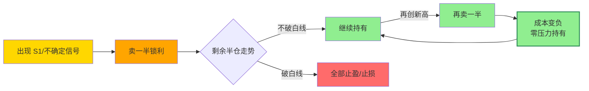

## 定义

> [!abstract] 一句话定义
> 半仓放飞策略是遇到不确定信号时的持仓管理方法——**卖一半锁定利润,剩下一半用白线当牵牛绳**博取更大收益。**跌了不崩,涨了不踏空**,根本性解决"拿不住票"的问题。

## 关键信息

### 使用方法
- 遇到S1信号或不确定图形时，卖一半
- 剩下的一半用白线当牵牛绳，不跌破白线就不走
- 再涨再卖一半，成本变成负的，完全没压力

### 优势
- 跌了：已锁定一半利润，心态不崩
- 涨了：还有仓位在里面，不踏空
- 解决"拿不住票"的根本问题

## 放飞循环流程

> [!tip] 心法
> **白线就是牵牛绳**,绳没断就不松手。再涨再卖一半,**成本归零的票最敢拿**。

## 关联连接
- [[S1信号]] — 触发半仓放飞的时机
- [[底仓与动态仓]] — 仓位管理的不同维度
