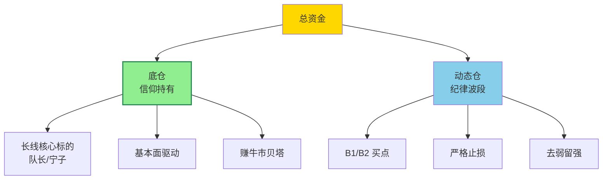

## 定义

> [!abstract] 一句话定义
> 底仓与动态仓是 Z 哥的**二维仓位管理体系**——**底仓靠信仰长期持有**(赚整个牛市的贝塔),**动态仓靠纪律做波段**(赚市场波动的钱)。类似穆里尼奥 4231 阵型,分工明确。

## 关键信息

### 底仓
- 看好行业/公司的长期价值，准备拿完整个牛市周期
- 除非基本面根本性变化，否则不管短期涨跌都不动
- 赚的是整个牛市的贝塔收益
- 示例：队长、宁子等核心标的

### 动态仓
- 用来做波段、做短线，赚市场波动的钱
- 必须严格遵守交易纪律，走坏了立刻拍掉
- 不能跟票有感情

### 资产配置
- 类似穆里尼奥4231阵型，分工明确
- 长线底仓 + 动态仓短线轮动
- 牛市配置：主线票（科技、半导体等进攻型）+ 防守票（白酒、银行等）
- 熊市配置：像泽连斯基一样在夹缝中求生存，严格选股

### 持仓结构
- 类似穆里尼奥4231阵型，分工明确
- 长线底仓 + 动态仓短线轮动
- 空头区间：动态仓只卖不买

## 二维仓位结构

> [!tip] 4231 阵型
> 底仓 = 后防线(不破不动) + 动态仓 = 中前场(快速轮转)。**牛市看底仓,熊市看动态**。

## 关联连接
- [[去弱留强]] — 动态仓的管理原则
- [[活跃市值]] — 判断多空区间的依据
- [[双线战法]] — 动态仓在双线区间内操作
- [[Zettaranc]] — 交易体系作者
