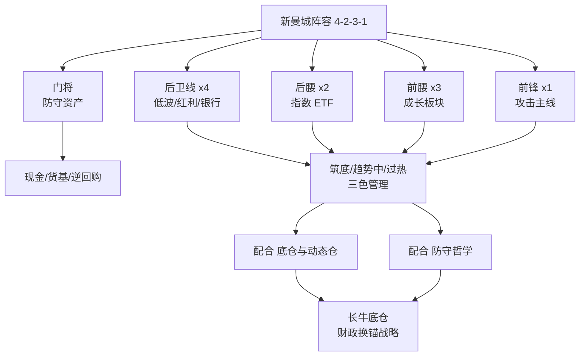

## 定义

> [!abstract] 一句话核心定义
> 新曼城阵容是 Z 哥的核心长期组合配置体系,模仿英超 4231 阵容把持仓拟人化为足球队员;2025Q4 由"老曼城"升级为"新曼城",最大变化是**标的从个股升级为板块/主题**,与 [[底仓与动态仓]]、[[防守哲学]] 共同构成完整配置闭环。

## 关键信息

### 4231 配置思路
| 位置 | 角色 | 仓位职能 |
|---|---|---|
| 门将 | 防守资产 | 现金 / 货币基金 / 国债逆回购 |
| 4 后卫 | 低波红利 / 银行 / 高股息 | 防御底仓,提供股息现金流 |
| 2 后腰 | 指数 ETF | 沪深 300 / 中证 A50 等宽基锚 |
| 3 前腰 | 成长板块 | AI / 算力 / 创新药等趋势中板块 |
| 1 前锋 | 攻击性主题 | 当期最强主线 / [[绝对主线]] |

> [!tip] 实操要点
> - 阵容是**仓位结构**,不是选股清单——每个位置随市场轮动换"球员"
> - 门将永远在场上(防御不可弃)
> - 前锋只设 1 个,集中度防止"火力分散"

### 老曼城 vs 新曼城
| 维度 | 老曼城(2025前) | 新曼城(2025Q4 起) |
|---|---|---|
| 标的层级 | **个股**(米儿/迪迪/台子/低波红利/赵姨/德德等) | **板块/主题** |
| 选股压力 | 高,需要持续跟踪个股基本面 | 低,板块/ETF 自带分散 |
| 容错率 | 个股黑天鹅一击致命 | 板块平滑了个股波动 |
| 适配资金量 | 中小资金 | 中大资金 / 长期账户 |

升级核心动机:**从"押对个股"升级为"押对方向"**,把策略边际从选股能力转移到周期判断。

### 三色分类(仓位状态管理)
- 🟢 **筑底**:伏击仓,小仓位试探,等待右侧
- 🟡 **趋势中**:持有仓,主仓位持有,纪律执行
- 🔴 **过热**:减仓信号,大仓位逐步兑现

每个位置(后卫/后腰/前腰/前锋)单独打三色标签,组合状态一目了然。

### 财政换锚战略背景
新曼城阵容的宏观锚点是 Z 哥反复强调的"**财政换锚**":
- 楼市作为旧蓄水池被战略放弃(土地财政退场)
- 股市顶上做新蓄水池(慢牛护航产业升级)
- 居民资产从房产向权益迁移,长牛底仓需求爆发

新曼城阵容正是**为这一长周期资产再配置量身定制的工具**——把"长期持有"这件事从口号变成可执行的 4231 结构。

> [!danger] 风控铁律
> - 门将仓位不允许低于总仓 10%(任何时候)
> - 前锋仓位不允许超过总仓 20%(单一主题集中度上限)
> - 三色全红时强制启动 [[半仓放飞策略]] / [[防守哲学]] 减仓预案

## Mermaid 流程图

## 关联连接
- [[底仓与动态仓]]
- [[防守哲学]]
- [[牛市策略]]
- [[绝对主线]]
- [[半仓放飞策略]]
- [[Zettaranc]]
