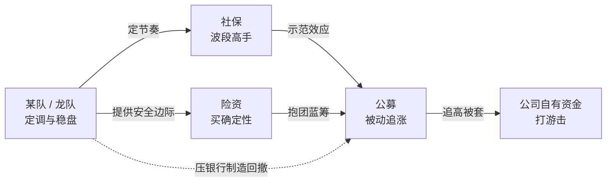

## 定义

> [!abstract]
> Z 哥 2025-09 给出的 A 股市场五类机构资金画像 — **某队(国家队)/ 社保 / 险资 / 公募 / 公司自有资金**,各自 KPI 与行为模式互不相同,理解资金画像才能看懂主力博弈与盘面节奏。

## 关键信息

### 五类资金各自的 KPI 与行为

- **某队(龙队)**:即 [[国家队]],2015 股灾后成立,KPI 是"一月一百点"稳盘,是 A 股的定海神针;924 行情后是 [[牛市策略]] 的总司令,负责定调与节奏控制
- **社保**:典型代表 [[百岁山]]。波段高手,长期主义但价位敏感,只在便宜时进、贵了就走
- **险资**:最输不起的钱,只买确定性,典型代表 [[村委会]]。负债端刚性,容错率最低
- **公募**:典型代表 [[麒麟会]]。被赎回逼到绝境,924 后被动加仓最难受的群体,常常追在山顶
- **公司自有资金**:部分 924 后进场,谨慎但灵活,是边际资金而非主力

### 各方博弈关系

- **总司令**:某队定调
- **稳定军**:社保 / 险资跟随
- **追兵**:公募被迫追
- **游击队**:公司自有打游击

### 实战意义

- 看懂哪类资金在主导,才能判断当下行情属于哪条线(参 [[绝对主线]])
- 险资的进场位往往是 [[活跃市值]] 的下沿
- 公募被动加仓的拥挤交易是 [[S1信号]] 的温床

## 关联连接

- [[国家队]] — 某队/龙队的别名与组织背景
- [[百岁山]] — 社保资金的代号
- [[麒麟会]] — 公募基金抱团的代号
- [[村委会]] — 险资的代号
- [[筹码战争]] — 五类资金博弈的本质是筹码转移
- [[绝对主线]] — 不同资金主导对应不同主线
- [[牛市策略]] — 924 后某队的总司令角色
- [[Zettaranc]] — 知识体系作者
